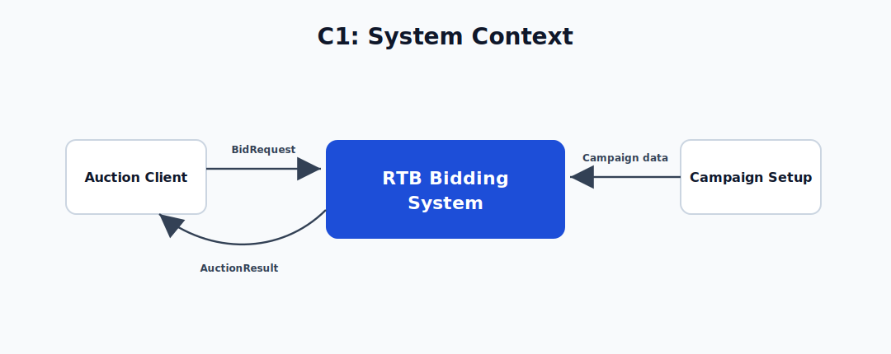
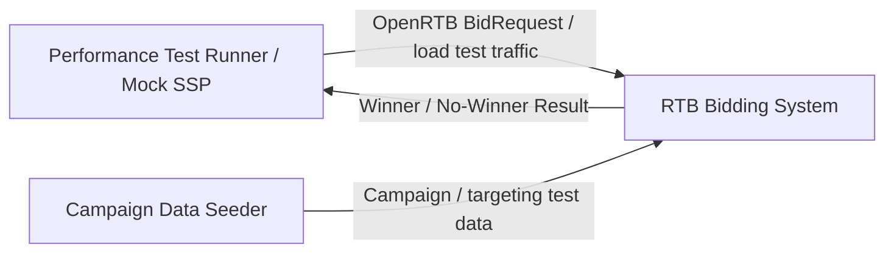
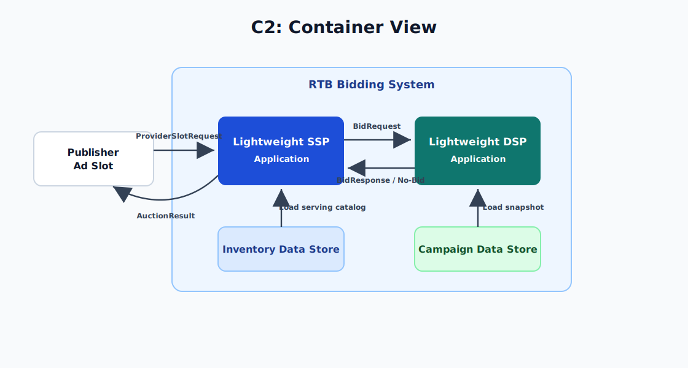
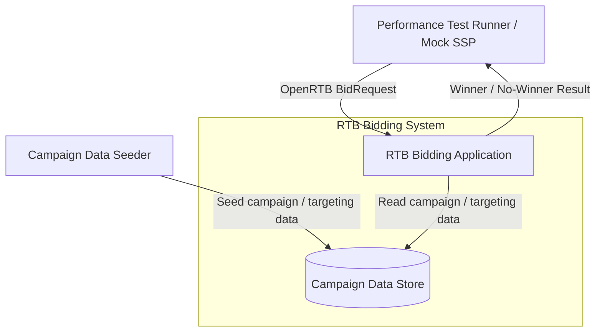

# Architecture: OpenRTB 기반 저지연 RTB 입찰 시스템

이 문서는 PRD의 요구사항을 바탕으로 시스템의 아키텍처 특성, 품질 시나리오, 시스템 경계, 주요 런타임 흐름을 정의한다.

API 세부 계약, OpenRTB subset 필드 범위, 내부 컴포넌트 상세 설계, 데이터 모델, 테스트 구현 방식은 Tech Spec에서 다룬다.

## 1. Introduction, Context & Scope

### 1.1 Purpose

이 문서는 PRD에서 정의한 RTB 입찰 시스템을 어떤 구조로 바라볼지 정리한다.

여기서는 시스템이 OpenRTB 흐름에서 어떤 역할을 축소 모델링하는지, 어디까지를 시스템 범위로 볼지, 이후 아키텍처 품질 기준과 런타임 흐름을 어떤 관점에서 다룰지 정의한다.

API 세부 계약, OpenRTB subset 필드 범위, 내부 컴포넌트 상세 설계, 데이터 모델, 테스트 구현 방식은 Tech Spec에서 다룬다.

### 1.2 OpenRTB Context

OpenRTB는 Sell-Side의 SSP/Exchange와 Buy-Side의 DSP/Bidder가 실시간 입찰 요청과 응답을 주고받기 위한 프로토콜이다.

이 프로젝트는 OpenRTB 생태계 전체를 구현하지 않는다. 대신 입찰 요청이 들어오고, Bidder가 bid 또는 no-bid로 응답하며, 유효한 bid 중 낙찰자를 결정하는 핵심 흐름을 축소 모델링한다.

실제 시스템에서 Sell-Side는 매체 인벤토리를 판매하고 경매를 수행하며, Buy-Side는 광고 구매자를 대신해 입찰 여부와 가격을 결정한다. 이 프로젝트는 두 진영의 전체 플랫폼을 구현하지 않고, OpenRTB 요청/응답 흐름을 기반으로 한 RTB 입찰 hot path만 다룬다.

### 1.3 Scope & Boundaries

이 아키텍처는 RTB 입찰 시스템의 핵심 hot path만 다룬다.

포함하는 범위:

- OpenRTB BidRequest 수신
- BidRequest 검증
- 입찰 판단에 필요한 요청 정보 해석
- Bidder의 bid/no-bid 판단
- BidResponse 생성
- 여러 BidResponse 수집
- winner/no-winner 결정
- 성능 측정 지표 수집

제외하는 범위:

- 실제 광고 렌더링
- impression, click, conversion tracking
- billing
- reporting
- 광고 운영 백오피스
- 실제 외부 DSP/SSP 연동
- Kubernetes 기반 운영 검증

이 문서에서 말하는 컴포넌트는 책임을 설명하기 위한 논리적 경계다. 실제 물리 실행 단위와 기술 스택은 Tech Spec 또는 ADR에서 결정한다.

제한 시간 내 응답, Bidder timeout, invalid bid, late bid, 관측 가능성처럼 구조에 영향을 주는 품질 기준은 다음 섹션에서 정의한다.

## 2. Quality Attributes & Scenarios

이 섹션은 RTB 입찰 시스템에서 중요하게 다뤄야 할 품질 속성을 정의한다. 품질 속성은 추상적인 목표가 아니라, RTB 도메인의 제약과 시스템 구조를 연결하는 기준이다.

### 2.1 Priority Quality Attributes

| 우선순위 | 품질 속성 | 비즈니스/도메인 이유 | 아키텍처 관점 |
|---|---|---|---|
| 1 | 제한 시간 내 응답 | RTB 경매에서는 응답 제한 시간이 지나면 bid의 가격이 높더라도 경매에 사용할 수 없다. | deadline을 시스템의 중요한 경계로 보고, 제한 시간 이후 도착한 응답은 낙찰 후보에서 제외한다. |
| 2 | 낮은 지연 시간 | 광고 요청 처리 시간이 길어질수록 auction deadline을 넘길 가능성이 커지고, 유효한 bid가 있어도 사용할 수 없게 된다. | 입찰 요청 처리부터 낙찰자 결정까지의 hot path를 작게 유지하고, p95/p99 latency를 측정한다. |
| 3 | 낙찰 결과의 일관성 | 잘못된 bid가 낙찰되면 유효하지 않은 광고가 선택되어 시스템 신뢰성이 떨어질 수 있다. | winner selection 전에 bid 유효성을 검증하고, invalid bid는 낙찰 후보에서 제외한다. |
| 4 | 실패 격리 | 일부 Bidder의 timeout이나 잘못된 응답이 전체 auction 실패로 번지면 안 된다. | Bidder별 응답 결과를 분리해 처리하고, 유효한 bid가 없으면 no-winner를 정상 결과로 반환한다. |
| 5 | 관측 가능성 | 지연, timeout, invalid bid가 발생했을 때 원인을 설명할 수 있어야 성능 분석과 개선이 가능하다. | latency, deadline 내 응답률, timeout 수, invalid bid 수, no-winner 비율을 측정 가능한 지표로 남긴다. |

### 2.2 Quality Attribute Scenarios

#### QA-001: 일부 Bidder가 제한 시간 안에 응답하지 않는 경우

- 도메인 상황: RTB 경매에서는 여러 Bidder가 동시에 응답할 수 있지만, 모든 Bidder가 제한 시간 안에 응답한다는 보장은 없다.
- 시스템 응답: 제한 시간 안에 응답하지 않은 Bidder는 timeout으로 분류하고, deadline 안에 도착한 응답만으로 winner 또는 no-winner를 결정한다.
- 관찰 지표: deadline 내 응답률, auction latency p95/p99, bidder timeout 수

#### QA-002: 제한 시간 이후 가장 높은 bid가 도착하는 경우

- 도메인 상황: 가장 높은 가격을 제시한 bid라도 deadline 이후 도착하면 RTB 경매에서는 사용할 수 없다.
- 시스템 응답: 해당 bid를 late bid로 분류하고 낙찰 후보에서 제외한다.
- 관찰 지표: late bid 수, winner decision log

#### QA-003: 잘못된 BidResponse가 도착하는 경우

- 도메인 상황: Bidder가 반환한 응답이 원 요청의 impression과 일치하지 않거나, bidfloor보다 낮은 가격을 제시할 수 있다.
- 시스템 응답: 잘못된 BidResponse는 invalid bid로 분류하고 낙찰 후보에서 제외한다.
- 관찰 지표: invalid bid 수, invalid reason

#### QA-004: 유효한 bid가 하나도 없는 경우

- 도메인 상황: 모든 Bidder가 no-bid를 반환하거나 timeout될 수 있다.
- 시스템 응답: 시스템은 이를 장애로 보지 않고 no-winner 결과를 반환한다.
- 관찰 지표: no-winner 비율, no-bid 수, timeout 수

#### QA-005: 동시 요청 수 또는 Bidder 수가 증가하는 경우

- 도메인 상황: 광고 입찰 시스템은 요청량 증가와 Bidder 수 증가에 따라 응답 지연이 커질 수 있다.
- 시스템 응답: 시스템은 동시 요청 수와 Bidder 수 변화에 따른 latency와 deadline 내 응답률을 측정할 수 있어야 한다.
- 관찰 지표: auction latency p95/p99, deadline 내 응답률, observed throughput

## 3. Architectural Views

이 섹션은 C4 모델의 C1/C2 관점으로 시스템 경계와 큰 실행 단위를 설명한다.

C1은 외부 actor와 시스템 경계를 보여준다. C2는 시스템 내부의 큰 실행 단위와 데이터 저장 경계를 보여준다.

이 문서에서 말하는 Container는 C4 모델의 실행 단위를 의미하며, Docker/Kubernetes 컨테이너를 의미하지 않는다. 실제 물리 실행 단위, 배포 방식, 기술 스택은 Tech Spec 또는 ADR에서 결정한다.

### 3.1 C1: System Context View

`RTB Bidding System`은 OpenRTB 기반 입찰 요청을 받아 bid/no-bid 판단, BidResponse 생성/수집, 낙찰자 결정을 수행하는 시스템이다.

`Performance Test Runner / Mock SSP`는 실제 SSP를 구현하지 않고, OpenRTB BidRequest와 부하 요청을 생성하는 외부 역할이다.

`Campaign Data Seeder`는 campaign과 targeting 테스트 데이터를 시스템에 준비하는 외부 역할이다. 실제 운영 백오피스나 광고주 캠페인 관리 시스템은 이 프로젝트 범위에 포함하지 않는다.

Mermaid source

### 3.2 C2: Container View

`RTB Bidding Application`은 입찰 요청 처리부터 낙찰자 결정까지의 핵심 hot path를 담당한다.

주요 책임:

- OpenRTB BidRequest 수신 및 검증
- 입찰 판단에 필요한 요청 정보 해석
- Bidder 역할의 bid/no-bid 판단
- BidResponse 생성 및 수집
- invalid bid, late bid, timeout 분류
- winner/no-winner 결정
- latency, timeout, invalid bid, no-winner 지표 노출

`Campaign Data Store`는 bid/no-bid 판단에 필요한 campaign과 targeting 데이터를 제공한다.

이 문서에서는 저장소의 구체적인 구현 기술을 확정하지 않는다. 초기 데이터 적재 방식, 저장소 종류, 인메모리 캐시 전략은 Tech Spec 또는 ADR에서 결정한다.

실제 OpenRTB 생태계에서 DSP/Bidder는 외부 buy-side 시스템이다. 이 프로젝트는 RTB 입찰 hot path를 작게 검증하기 위해 Bidder 역할을 `RTB Bidding Application` 내부 논리 책임으로 축소 모델링한다.

Mermaid source

## 4. Runtime Architecture

이 섹션은 OpenRTB BidRequest 한 건이 들어왔을 때, 시스템이 winner 또는 no-winner를 결정하기까지의 실행 흐름을 설명한다.

### 4.1 Core Runtime Flow

1. `Performance Test Runner / Mock SSP`가 OpenRTB BidRequest를 보낸다.
2. `RTB Bidding Application`은 요청 형식과 필수 필드를 검증한다.
3. 요청에서 impression, bidfloor, site/app, device, user 등 입찰 판단에 필요한 정보를 추출한다.
4. 사전에 준비된 campaign index에서 요청 조건에 맞는 후보 campaign을 찾는다.
5. 후보 campaign을 기준으로 Bidder 역할의 bid/no-bid 판단을 수행한다.
6. 생성된 BidResponse를 수집하고, timeout, late bid, invalid bid를 낙찰 후보에서 제외한다.
7. 유효한 bid 중 낙찰 기준에 맞는 bid를 winner로 선택한다.
8. 유효한 bid가 없으면 no-winner를 정상 결과로 반환한다.
9. latency, timeout, invalid bid, no-winner 지표를 기록한다.

### 4.2 Performance-Critical Path

성능상 중요한 경로는 BidRequest 수신부터 winner/no-winner 결정까지다.

Hot path에 포함되는 작업:

- BidRequest parsing
- 필수 필드 validation
- 입찰 판단에 필요한 request context 생성
- campaign index 조회
- bid/no-bid 판단
- BidResponse validation
- winner/no-winner 결정
- 핵심 지표 기록

Hot path에서 제외하는 작업:

- campaign 원본 관리
- 광고 심사와 운영 백오피스
- reporting 집계
- billing
- impression/click/conversion tracking
- 외부 DSP/SSP 네트워크 연동

이 프로젝트는 원본 campaign 데이터를 매 요청마다 조회하지 않는다. 실시간 입찰 판단에 필요한 campaign과 targeting 데이터는 사전에 campaign index로 준비되어 있다고 보고, BidRequest 이후에는 해당 index를 기반으로 후보 탐색과 낙찰 판단을 수행한다.

campaign index를 어떻게 구성하고 갱신할지는 이 문서에서 확정하지 않는다. 초기 구현에서는 테스트 데이터를 사전에 적재하는 방식으로 시작하고, 구체적인 데이터 구조와 갱신 전략은 Tech Spec 또는 ADR에서 결정한다.

### 4.3 Failure Boundaries

RTB 경매에서는 일부 실패가 전체 장애를 의미하지 않는다. 시스템은 실패 유형을 분리해 처리한다.

| 상황 | 처리 방식 |
|---|---|
| BidRequest 형식이 잘못됨 | 요청 실패로 처리한다. |
| Bidder가 no-bid 반환 | 정상 응답으로 처리하되 낙찰 후보에서 제외한다. |
| Bidder가 제한 시간 안에 응답하지 않음 | timeout으로 분류하고 낙찰 후보에서 제외한다. |
| BidResponse가 deadline 이후 도착 | late bid로 분류하고 낙찰 후보에서 제외한다. |
| BidResponse가 원 요청과 맞지 않음 | invalid bid로 분류하고 낙찰 후보에서 제외한다. |
| 유효한 bid가 없음 | no-winner를 정상 결과로 반환한다. |

핵심 원칙은 deadline 안에 검증된 bid만 winner selection에 사용한다는 것이다.

## 5. Runtime Measurement Strategy

이 섹션은 RTB hot path의 지연과 실패 원인을 설명하기 위해 무엇을 측정할지 정의한다.

### 5.1 Key Metrics

| 지표 | 의미 |
|---|---|
| p95/p99 latency | 대부분의 요청과 느린 요청의 응답 시간 |
| deadline compliance | 제한 시간 안에 winner/no-winner가 결정된 비율 |
| observed throughput | 테스트 환경에서 관찰된 처리량 |
| timeout count | 제한 시간 안에 응답하지 못한 Bidder 수 |
| late bid count | deadline 이후 도착해 제외된 bid 수 |
| invalid bid count | 검증 실패로 제외된 bid 수 |
| no-winner rate | 유효한 bid가 없어 낙찰자가 없는 비율 |

### 5.2 Measurement Points

- 전체 auction latency
- BidRequest parsing/validation
- campaign index lookup
- bid/no-bid decision
- BidResponse validation
- winner selection

### 5.3 Interpretation Principles

- 절대 성능 수치를 과장하지 않고, 실행 환경을 함께 기록한다.
- 처리량보다 p95/p99 latency와 deadline compliance를 우선 해석한다.
- 성능 평가는 baseline과 개선 후 결과를 비교한다.
- timeout, late bid, invalid bid, no-bid, no-winner를 하나의 실패로 묶지 않는다.

## 6. Deferred Decisions

이 섹션은 현재 아키텍처 단계에서 확정하지 않고, 이후 Tech Spec 또는 ADR에서 결정할 항목을 정리한다.

| 항목 | 지금 확정하지 않는 이유 | 결정 시점 |
|---|---|---|
| 경매에 참여시킬 광고 요청 범위 | 배너, 동영상, 네이티브처럼 어떤 광고 형식을 먼저 지원할지 아직 정하지 않는다. 이 결정은 요청 검증 규칙, 예시 payload, 테스트 케이스와 함께 다뤄야 한다. | Tech Spec |
| 입찰 판단 데이터 출처 | 원본 campaign 데이터를 매 요청마다 조회하지 않는다는 원칙만 정의한다. 입찰 판단에 필요한 데이터를 어디에서 가져오고 어떤 형태로 준비할지는 타겟팅 조건, 캠페인 수, 갱신 방식, 인스턴스 구성에 따라 달라진다. | Tech Spec / ADR |
