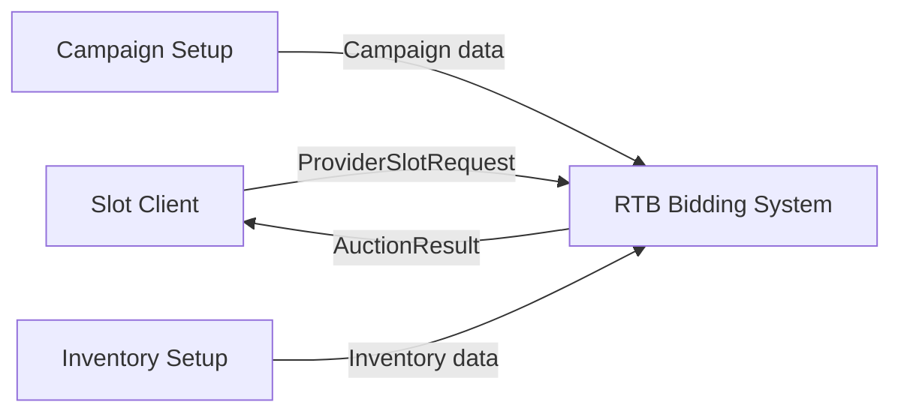
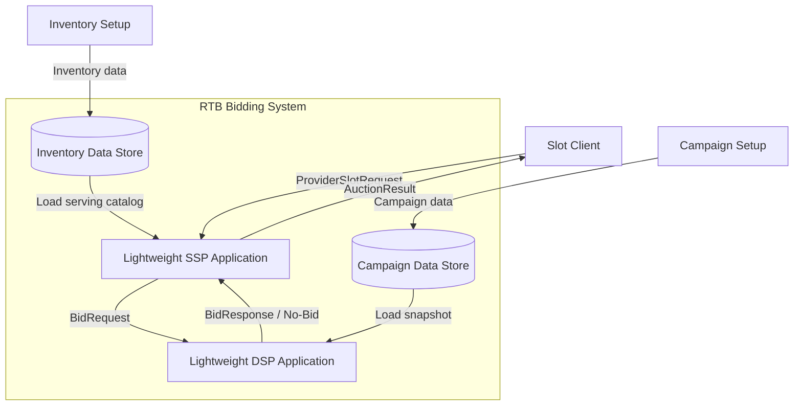

# Architecture: OpenRTB 기반 저지연 RTB 입찰 시스템

이 문서는 PRD의 요구사항을 바탕으로 시스템의 주요 품질 기준, 시스템 경계, 실행 흐름을 정의한다.

API 세부 계약, 지원할 광고 요청 필드, 내부 컴포넌트 상세 설계, 데이터 상태 분류, 테스트 구현 방식은 Tech Spec과 Data State Architecture에서 다룬다.

## 1. Introduction, Context & Scope

### 1.1 Purpose

이 문서는 PRD에서 정의한 RTB 입찰 시스템을 어떤 구조로 바라볼지 정리한다.

여기서는 시스템이 OpenRTB 흐름에서 어떤 역할을 축소해서 다루는지, 어디까지를 시스템 범위로 볼지, 이후 품질 기준과 실행 흐름을 어떤 관점에서 다룰지 정의한다.

API 세부 계약, 지원할 광고 요청 필드, 내부 컴포넌트 상세 설계, 데이터 상태 분류, 테스트 구현 방식은 Tech Spec과 Data State Architecture에서 다룬다.

### 1.2 OpenRTB Context

OpenRTB는 게시자(Publisher)의 광고 지면을 판매하는 쪽과 광고주(Advertiser)를 대신해 광고 지면을 구매하는 쪽이 실시간 입찰 요청과 응답을 주고받기 위한 표준 규약이다. 이 문서에서는 판매 측을 경량 SSP, 구매 측을 경량 DSP라고 부른다.

이 프로젝트는 OpenRTB 생태계 전체를 구현하지 않는다. 대신 provider slot request가 들어오면 SSP가 inventory 설정을 조회해 OpenRTB BidRequest를 만들고, DSP의 입찰 여부와 입찰가 판단을 거쳐 유효한 입찰 응답 중 낙찰자와 낙찰가를 결정하는 핵심 흐름을 축소해서 다룬다.

이 프로젝트는 운영 수준의 SSP와 DSP 전체를 구현하지 않는다. 대신 광고 판매 측의 경매 흐름과 광고 구매 측의 입찰 판단 흐름을 작게 구현해, OpenRTB 요청/응답 기반 경매 핵심 경로를 검증한다.

실제 시스템에서 판매 측은 광고 지면을 판매하고 경매를 수행하며, 구매 측은 광고주를 대신해 입찰 여부와 가격을 결정한다. 이 관계는 `Publisher -> 경량 SSP <-> 경량 DSP <- Advertiser`로 볼 수 있다.

### 1.3 Scope & Boundaries

이 아키텍처는 RTB 입찰 시스템의 핵심 실행 경로만 다룬다.

포함하는 범위:

- provider slot request 수신
- inventory 설정 조회
- OpenRTB BidRequest 생성
- BidRequest 검증
- 입찰 판단에 필요한 요청 정보 해석
- 입찰 여부 판단
- BidResponse 생성
- 여러 BidResponse 수집
- 낙찰자/낙찰가 또는 낙찰 없음 결정
- 성능 측정 지표 수집

제외하는 범위:

- 실제 광고 렌더링
- 실제 browser SDK, mobile SDK, ad tag 구현
- impression, click, conversion tracking
- billing
- reporting
- 광고 운영 백오피스
- 실제 외부 DSP/SSP 연동
- 어떤 DSP에 요청을 보낼지 고르는 라우팅 최적화
- Kubernetes 기반 운영 검증

이 문서에서 말하는 컴포넌트는 책임을 설명하기 위한 논리적 경계다. 실제 코드 구조와 세부 기술 선택은 구현 단계에서 최소 범위로 확정한다.

제한 시간 내 응답, 응답 시간 초과(timeout), 잘못된 입찰 응답(invalid bid), 늦게 도착한 입찰 응답(late bid), 관찰 가능성처럼 구조에 영향을 주는 품질 기준은 다음 섹션에서 정의한다.

## 2. Quality Attributes & Scenarios

이 섹션은 RTB 입찰 시스템에서 중요하게 다뤄야 할 품질 기준을 정의한다. 품질 기준은 추상적인 목표가 아니라, RTB 도메인의 제약과 시스템 구조를 연결하는 기준이다.

### 2.1 Priority Quality Attributes

| 우선순위 | 품질 기준 | 비즈니스/도메인 이유 | 아키텍처 관점 |
|---|---|---|---|
| 1 | 제한 시간 내 응답 | RTB 경매에서는 응답 제한 시간이 지나면 입찰가가 높더라도 경매에 사용할 수 없다. | 제한 시간을 시스템의 중요한 경계로 보고, 제한 시간 이후 도착한 응답은 낙찰 후보에서 제외한다. |
| 2 | 낮은 지연 시간 | 광고 요청 처리 시간이 길어질수록 응답 제한 시간을 넘길 가능성이 커지고, 유효한 입찰 응답이 있어도 사용할 수 없게 된다. | 입찰 요청 처리부터 낙찰자/낙찰가 결정까지의 핵심 실행 경로를 작게 유지하고, p95/p99 응답 시간을 측정한다. |
| 3 | 낙찰 결과의 일관성 | 잘못된 입찰 응답이 낙찰되면 유효하지 않은 광고가 선택되어 시스템 신뢰성이 떨어질 수 있다. | 낙찰자/낙찰가 결정 전에 입찰 응답을 검증하고, 잘못된 응답은 낙찰 후보에서 제외한다. |
| 4 | 실패 격리 | 일부 경량 DSP의 응답 시간 초과나 잘못된 응답이 전체 경매 실패로 번지면 안 된다. | 입찰 참여자별 응답 결과를 분리해 처리하고, 유효한 입찰 응답이 없으면 낙찰 없음 결과를 정상적으로 반환한다. |
| 5 | 관찰 가능성 | 지연, 응답 시간 초과, 잘못된 입찰 응답이 발생했을 때 원인을 설명할 수 있어야 성능 분석과 개선이 가능하다. | 응답 시간, 제한 시간 내 응답률, 응답 시간 초과(timeout) 수, 잘못된 입찰 응답(invalid bid) 수, 낙찰 없음(no-winner) 비율을 측정 가능한 지표로 남긴다. |

### 2.2 Quality Attribute Scenarios

#### QA-001: 일부 입찰 참여자가 제한 시간 안에 응답하지 않는 경우

- 도메인 상황: RTB 경매에서는 여러 입찰 참여자가 동시에 응답할 수 있지만, 모든 참여자가 제한 시간 안에 응답한다는 보장은 없다.
- 시스템 응답: 제한 시간 안에 응답하지 않은 참여자는 응답 시간 초과(timeout)로 분류하고, 제한 시간 안에 도착한 응답만으로 낙찰 또는 낙찰 없음을 결정한다.
- 관찰 지표: 제한 시간 내 응답률, 전체 경매 응답 시간 p95/p99, 입찰 참여자 timeout 수

#### QA-002: 제한 시간 이후 가장 높은 입찰 응답이 도착하는 경우

- 도메인 상황: 가장 높은 가격을 제시한 입찰 응답이라도 제한 시간 이후 도착하면 RTB 경매에서는 사용할 수 없다.
- 시스템 응답: 해당 응답을 늦게 도착한 입찰 응답(late bid)으로 분류하고 낙찰 후보에서 제외한다.
- 관찰 지표: late bid 수, 낙찰 결정 로그

#### QA-003: 잘못된 BidResponse가 도착하는 경우

- 도메인 상황: 입찰 응답이 원 요청의 광고 노출 기회와 일치하지 않거나, 최소 입찰가보다 낮은 가격을 제시할 수 있다.
- 시스템 응답: 잘못된 BidResponse는 잘못된 입찰 응답(invalid bid)으로 분류하고 낙찰 후보에서 제외한다.
- 관찰 지표: invalid bid 수, invalid reason

#### QA-004: 유효한 입찰 응답이 하나도 없는 경우

- 도메인 상황: 모든 입찰 참여자가 입찰하지 않거나 제한 시간 안에 응답하지 못할 수 있다.
- 시스템 응답: 시스템은 이를 장애로 보지 않고 낙찰 없음(no-winner) 결과를 반환한다.
- 관찰 지표: no-winner 비율, no-bid 수, timeout 수

#### QA-005: 동시 요청 수 또는 입찰 참여자 수가 증가하는 경우

- 도메인 상황: 광고 입찰 시스템은 요청량 증가와 입찰 참여자 수 증가에 따라 응답 지연이 커질 수 있다.
- 시스템 응답: 시스템은 동시 요청 수와 입찰 참여자 수 변화에 따른 응답 시간과 제한 시간 내 응답률을 측정할 수 있어야 한다.
- 관찰 지표: 전체 경매 응답 시간 p95/p99, 제한 시간 내 응답률, 관찰된 처리량

#### QA-006: 광고 타입별 지연 영향이 다른 경우

- 도메인 상황: 배너 광고는 페이지 콘텐츠와 분리되어 늦게 채워질 수 있지만, 동영상 광고는 광고 이후 콘텐츠를 볼 수 있는 경우가 있어 지연이 사용자 경험에 더 직접적인 영향을 준다.
- 시스템 응답: 시스템은 광고 타입별로 다른 timeout 정책을 적용할 수 있어야 한다.
- 관찰 지표: 광고 타입별 응답 시간 p95/p99, 제한 시간 내 응답률, timeout 비율

## 3. Architectural Views

이 섹션은 C4 모델의 C1/C2 관점으로 시스템 경계와 큰 실행 단위를 설명한다.

C1은 외부 역할과 시스템 경계를 보여준다. C2는 시스템 내부의 큰 실행 단위와 데이터 저장 경계를 보여준다.

이 문서에서 말하는 Container는 C4 모델의 실행 단위를 의미하며, Docker/Kubernetes 컨테이너를 의미하지 않는다. 경량 SSP와 경량 DSP는 별도 애플리케이션으로 분리한다.

이 장의 저장소 경계는 Data State Architecture의 원칙을 따른다. 기준 데이터의 source of truth와 입찰 hot path에서 읽는 serving copy를 구분하고, 현재 아키텍처는 매 경매 요청마다 외부 저장소를 동기 조회하는 구조를 기본으로 두지 않는다.

### 3.1 C1: System Context View

`RTB Bidding System`은 provider slot request를 받아 경량 SSP 내부에서 OpenRTB BidRequest를 만든 뒤 여러 경량 DSP로 요청을 전달하고, BidResponse를 수집해 낙찰자와 낙찰가를 결정하는 시스템이다. C1에서는 이 시스템을 경량 SSP와 경량 DSP의 핵심 경로를 함께 구현하는 하나의 시스템 경계로 본다.

`Publisher / Slot Client`는 광고 슬롯 요청이 발생하는 쪽이다. 실제 게시자 플랫폼, browser SDK, mobile SDK, ad tag를 구현하지 않고, 이 프로젝트에서는 테스트 가능한 slot request 생성 주체로 간주한다.

`Advertiser / Campaign Setup`은 광고주 캠페인과 타겟팅 데이터를 준비하는 쪽이다. 실제 광고주 캠페인 관리 시스템은 구현하지 않고, 테스트 데이터 준비 역할로만 다룬다.

Mermaid source

### 3.2 C2: Container View

`Lightweight SSP Application`은 provider slot request를 검증하고 inventory 설정을 조회해 OpenRTB BidRequest를 만든 뒤 경량 DSP로 전달하고, BidResponse를 수집해 낙찰자와 낙찰가를 결정한다.

SSP inventory는 단순 테스트 fixture가 아니라 SSP가 소유하는 공급 지면 기준 데이터다. 현재 구현은 외부 기준 저장소 제품을 아직 정하지 않았기 때문에 프로세스 내부 in-memory catalog를 사용하지만, 아키텍처상 원본 저장소와 hot path serving copy는 분리해서 본다.

SSP와 DSP 사이의 요청/응답 경계는 OpenRTB subset을 따른다. provider-facing 입력은 프로젝트 계약이고, OpenRTB 표준 경계는 SSP가 생성해 DSP에 보내는 `BidRequest`부터 시작한다. 광고 타입은 SSP-DSP 경계 객체에서 커스텀 `mediaType` 필드로 표현하지 않고, `Imp.banner`, `Imp.video` 계열 객체의 존재로 표현한다. 각 애플리케이션 내부에서는 이 구조를 `BANNER`, `VIDEO` 같은 내부 enum으로 정규화해 사용한다.

주요 책임:

- provider slot request 수신 및 검증
- inventory 설정 조회
- OpenRTB BidRequest 생성
- 경량 DSP로 BidRequest 전달
- BidResponse 수집
- timeout, late bid, invalid bid 분류
- 낙찰자/낙찰가 또는 낙찰 없음 결정

`Lightweight DSP Application`은 BidRequest를 평가해 입찰 여부와 입찰가를 결정한다.

주요 책임:

- 광고 타입별 BidRequest 해석
- 캠페인 후보 조회
- bid 또는 no-bid 결정
- 입찰가 산정
- BidResponse 생성

경량 DSP는 입찰 판단에 필요한 캠페인 데이터를 내부 Campaign Repository 또는 인메모리 인덱스로 조회한다. 이 데이터 구조는 C2 컨테이너가 아니라 DSP 애플리케이션 내부 컴포넌트로 보고, Tech Spec의 C3/데이터 모델에서 다룬다.

`Campaign Data Store`는 광고주 캠페인 원본 데이터를 보존하는 데이터 저장 컨테이너다. 경량 DSP는 이 데이터를 매 BidRequest마다 동기 조회하지 않고, 사전에 로드한 snapshot 또는 인메모리 인덱스를 통해 입찰 판단을 수행한다.

`Inventory Data Store`는 provider/placement별 공급 지면 원본 데이터를 보존하는 데이터 저장 컨테이너다. 경량 SSP는 이 데이터를 매 ProviderSlotRequest마다 동기 조회하지 않고, 사전에 로드한 Inventory Catalog serving copy를 통해 placement를 해석한다.

SSP inventory와 DSP campaign 원본 데이터를 어떤 저장소 기술로 둘지는 이 문서에서 확정하지 않는다. 단, 입찰 hot path에서 매 요청마다 외부 저장소를 동기 조회하는 구조는 전제로 두지 않는다. 현재 in-memory 구현은 fixture가 아니라 향후 외부 기준 저장소에서 로드될 serving copy의 최소 구현으로 본다.

실제 OpenRTB 생태계에서 DSP는 광고 구매 측 외부 시스템이다. 이 프로젝트는 RTB 입찰 핵심 경로를 작게 검증하기 위해 경량 DSP를 시스템 내부 컨테이너로 둔다.

어떤 DSP에 요청을 보낼지 고르는 라우팅 최적화는 다루지 않는다. 등록된 모든 경량 DSP에게 동일한 BidRequest를 전달하고, 각 경량 DSP는 서로 다른 설정과 캠페인 데이터로 bid, no-bid, timeout, invalid bid, late bid를 재현할 수 있다.

Mermaid source

## 4. Runtime Architecture

이 섹션은 provider slot request 한 건이 들어왔을 때, 시스템이 OpenRTB BidRequest를 만들고 낙찰자/낙찰가 또는 낙찰 없음을 결정하기까지의 실행 흐름을 설명한다.

### 4.1 Core Runtime Flow

1. `Publisher / Slot Client`가 provider slot request를 보낸다.
2. `Lightweight SSP Application`은 provider id, placement id, 광고 타입, 슬롯 조건을 검증한다.
3. 경량 SSP는 inventory 설정에서 bidfloor, 통화, 지원 광고 조건을 조회한다.
4. 경량 SSP는 DSP에 전달할 OpenRTB BidRequest와 내부 AuctionRequest를 생성한다.
5. 경량 SSP는 동일한 BidRequest를 등록된 여러 경량 DSP에게 전달한다.
6. 각 경량 DSP는 사전에 준비된 데이터에서 요청 조건에 맞는 후보 광고 캠페인을 찾는다.
7. 각 경량 DSP는 후보 광고 캠페인을 기준으로 입찰 여부와 입찰가를 판단하고 BidResponse 또는 no-bid를 반환한다.
8. 경량 SSP는 생성된 BidResponse를 수집하고, timeout, late bid, invalid bid를 낙찰 후보에서 제외한다.
9. 유효한 입찰 응답 중 경매 규칙에 맞는 응답을 낙찰자(winner)로 선택하고 낙찰가(auction price)를 결정한다.
10. 유효한 입찰 응답이 없으면 낙찰 없음(no-winner)을 정상 결과로 반환한다.
11. latency, timeout, invalid bid, no-winner 지표를 기록한다.

### 4.2 Performance-Critical Path

성능상 중요한 경로는 provider slot request 수신부터 OpenRTB BidRequest 생성, 낙찰자/낙찰가 또는 낙찰 없음 결정까지다.

성능 핵심 경로(hot path)에 포함되는 작업:

- ProviderSlotRequest parsing
- 필수 필드 validation
- inventory lookup
- OpenRTB BidRequest construction
- 입찰 판단에 필요한 request context 생성
- 후보 광고 캠페인 조회
- 입찰 여부 판단
- BidResponse validation
- 낙찰자/낙찰가 또는 낙찰 없음 결정
- 핵심 지표 기록

성능 핵심 경로(hot path)에서 제외하는 작업:

- inventory 원본 관리
- campaign 원본 관리
- 광고 심사와 운영 백오피스
- reporting 집계
- billing
- impression/click/conversion tracking
- 외부 DSP/SSP 네트워크 연동

이 프로젝트는 원본 inventory 데이터와 원본 광고 캠페인 데이터를 매 요청마다 조회하지 않는다. 실시간 입찰 판단에 필요한 placement, 캠페인, 타겟팅 데이터는 사전에 serving copy 또는 snapshot으로 준비되어 있다고 보고, BidRequest 이후에는 해당 데이터를 기반으로 후보 탐색과 낙찰 판단을 수행한다.

입찰 판단에 필요한 데이터는 매 요청마다 원본 저장소에서 조회하지 않는다. 구체적인 메모리 자료구조와 최적화 방식은 구현과 성능 측정 결과를 바탕으로 개선한다.

### 4.3 Data State Boundaries

아키텍처상 데이터 경계는 다음 원칙을 따른다.

| Data boundary | Architectural rule |
|---|---|
| Inventory source of truth | provider/placement 원본은 SSP hot path catalog와 분리한다. |
| Inventory serving catalog | Slot Ingress가 읽는 hot-path 조회 구조이며, 장애 또는 재시작 후 원본에서 다시 구성 가능해야 한다. |
| Campaign source of truth | 광고주 캠페인 원본은 DSP 내부 Campaign Snapshot과 분리한다. |
| Campaign Snapshot / Index | DSP hot path가 읽는 serving copy이며, BidRequest 처리 중 Campaign Data Store를 동기 조회하지 않는다. |
| AuctionCommand | Slot Ingress 이후 auction execution 동안 의미가 바뀌지 않는 실행 컨텍스트다. |
| DspCallResult vs valid candidate | DSP 호출 관찰 결과와 낙찰 후보를 분리하고, Bid Judgment를 통과한 후보만 Winner Selector에 전달한다. |
| Money / ledger | 현재 구현 범위 밖이며, observability나 cache로 대체하지 않는다. |
| Observability | metrics/logs/traces는 시스템 진단 자료이며 business event나 ledger의 대체물이 아니다. |

### 4.4 Failure Boundaries

RTB 경매에서는 일부 실패가 전체 장애를 의미하지 않는다. 시스템은 실패 유형을 분리해 처리한다.

| 상황 | 처리 방식 |
|---|---|
| ProviderSlotRequest가 잘못되었거나 BidRequest를 생성할 수 없음 | 요청 실패로 처리한다. |
| 입찰 참여자가 입찰하지 않음(no-bid) | 정상 응답으로 처리하되 낙찰 후보에서 제외한다. |
| 입찰 참여자가 제한 시간 안에 응답하지 않음 | 응답 시간 초과(timeout)로 분류하고 낙찰 후보에서 제외한다. |
| BidResponse가 제한 시간 이후 도착 | 늦게 도착한 입찰 응답(late bid)으로 분류하고 낙찰 후보에서 제외한다. |
| BidResponse가 원 요청과 맞지 않음 | 잘못된 입찰 응답(invalid bid)으로 분류하고 낙찰 후보에서 제외한다. |
| 유효한 입찰 응답이 없음 | 낙찰 없음(no-winner)을 정상 결과로 반환한다. |

핵심 원칙은 제한 시간 안에 검증된 입찰 응답만 낙찰자/낙찰가 결정에 사용한다는 것이다.

## 5. Runtime Measurement Strategy

이 섹션은 RTB 핵심 실행 경로의 지연과 실패 원인을 설명하기 위해 무엇을 측정할지 정의한다.

성능 테스트 도구는 C1/C2 다이어그램의 별도 actor로 표현하지 않는다. 성능 테스트에서는 k6 같은 부하 테스트 도구가 `Slot Client` 역할로 provider slot request를 반복 전송한다고 본다. 기존 `/openrtb/auction` 직접 입력 경로는 비교용 benchmark path로 유지한다.

### 5.1 Key Metrics

| 지표 | 의미 |
|---|---|
| p95/p99 latency | 대부분의 요청과 느린 요청의 응답 시간 |
| deadline compliance | 제한 시간 안에 낙찰자/낙찰가 또는 낙찰 없음이 결정된 비율 |
| observed throughput | 테스트 환경에서 관찰된 처리량 |
| timeout count | 제한 시간 안에 응답하지 못한 입찰 참여자 수 |
| late bid count | 제한 시간 이후 도착해 제외된 입찰 응답 수 |
| invalid bid count | 검증 실패로 제외된 입찰 응답 수 |
| no-winner rate | 유효한 입찰 응답이 없어 낙찰자가 없는 비율 |

### 5.2 Measurement Points

- 전체 경매 응답 시간
- ProviderSlotRequest parsing/validation
- inventory lookup과 BidRequest construction
- 후보 광고 캠페인 조회
- 입찰 여부 판단
- BidResponse validation
- 낙찰자/낙찰가 결정

### 5.3 Interpretation Principles

- 절대 성능 수치를 과장하지 않고, 실행 환경을 함께 기록한다.
- 처리량보다 p95/p99 latency와 deadline compliance를 우선 해석한다.
- 성능 평가는 baseline과 개선 후 결과를 비교한다.
- timeout, late bid, invalid bid, no-bid, no-winner를 하나의 실패로 묶지 않는다.

## 6. Deferred Decisions

이 섹션은 현재 아키텍처 단계에서 확정하지 않고, Tech Spec 또는 구현/측정 단계에서 구체화할 항목을 정리한다.

| 항목 | 지금 확정하지 않는 이유 | 결정 시점 |
|---|---|---|
| provider-facing 광고 범위 확장 | 현재 기본 범위는 배너와 단순 동영상이다. native, audio, pmp, multi-imp 같은 확장은 현재 hot path 목표 밖이다. | 별도 목표 수립 시 |
| SSP inventory 기준 저장소 | source of truth와 serving catalog를 분리한다는 원칙만 정의한다. 저장소 제품은 아직 성능, 운영, 복구 요구사항이 충분히 좁혀지지 않았다. | 데이터 저장소 리서치/ADR |
| DSP campaign 기준 저장소 | source of truth와 Campaign Snapshot/index를 분리한다는 원칙만 정의한다. 저장소 제품은 아직 확정하지 않는다. | 데이터 저장소 리서치/ADR |
| serving copy 구현 방식 | process memory, Redis/Valkey 계열, managed memory store 중 어디에 둘지는 아직 확정하지 않는다. | 성능/장애 모델 검토 |
| 입찰 판단 데이터 최적화 | 원본 campaign 데이터를 매 요청마다 조회하지 않는다는 원칙만 정의한다. 후보 캠페인 조회 구조는 캠페인 수와 성능 측정 결과에 따라 달라질 수 있다. | 구현/측정 |
| 레이턴시 목표와 테스트 환경 | 배너, 동영상처럼 광고 형식마다 허용 가능한 지연 시간이 다를 수 있다. 따라서 단일 목표 수치를 먼저 정하지 않고, 테스트 시나리오와 실행 환경을 기록하며 측정한다. | 구현/측정 |
