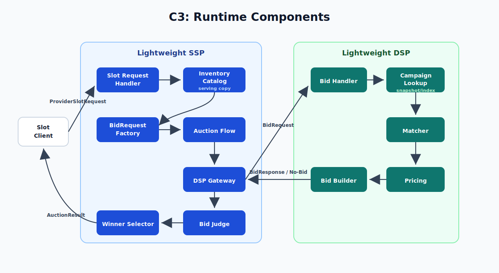
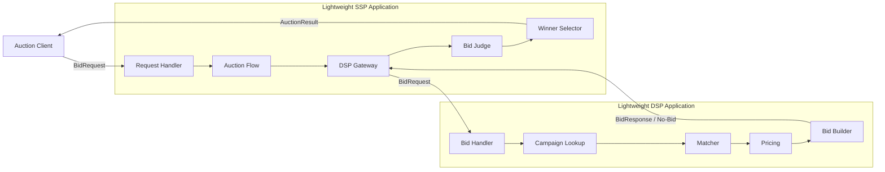

# Tech Spec: OpenRTB 기반 저지연 RTB 입찰 시스템

이 문서는 PRD와 Architecture에서 정의한 RTB 입찰 시스템을 실제 구현으로 옮기기 위한 세부 명세를 다룬다.

PRD가 무엇을 해결할지 정의하고, Architecture가 어떤 구조로 바라볼지 정의한다면, Tech Spec은 개발자가 같은 기준으로 구현할 수 있도록 API 계약, 지원 필드, 실행 흐름, 데이터 모델, 실패 처리, 테스트 기준을 구체화한다.

## 1. Purpose & Scope

### 1.1 Purpose

이 문서의 목적은 경량 SSP와 경량 DSP로 구성된 RTB 입찰 시스템을 실제 구현으로 옮기기 위한 세부 기준을 정의하는 것이다.

경량 SSP는 입찰 요청(`BidRequest`)을 받아 여러 경량 DSP로 전달하고, 제한 시간 안에 도착한 입찰 응답(`BidResponse`)을 수집해 낙찰자와 낙찰가를 결정한다.

경량 DSP는 전달받은 BidRequest를 해석하고, 자신의 캠페인 데이터와 비교해 입찰 여부와 입찰가를 결정한 뒤 BidResponse 또는 no-bid를 반환한다.

특히 다음 질문에 답한다.

- 어떤 OpenRTB 요청/응답 필드를 이 시스템의 지원 범위로 삼을 것인가?
- 경량 SSP는 요청 검증, DSP 전달, 응답 수집, 낙찰 결정을 어떤 순서로 실행하는가?
- 경량 DSP는 어떤 설정과 캠페인 데이터를 바탕으로 bid 또는 no-bid를 결정하는가?
- 응답 시간 초과(timeout), 늦게 도착한 입찰 응답(late bid), 잘못된 입찰 응답(invalid bid), 입찰하지 않음(no-bid)을 어느 책임에서 어떻게 구분하는가?
- 구현이 요구사항을 만족하는지 어떤 테스트와 지표로 확인할 것인가?

### 1.2 Scope

이 문서는 현재 시스템 범위에서 필요한 구현 명세를 다룬다. 범위의 중심은 운영 수준의 광고 플랫폼 전체가 아니라 `게시자 -> 경량 SSP <-> 경량 DSP <- 광고주` 흐름의 성능 핵심 경로다.

포함하는 범위:

- OpenRTB BidRequest/BidResponse의 지원 필드
- 경량 SSP의 BidRequest 검증, DSP fan-out, 응답 수집
- 경량 SSP의 timeout, late bid, invalid bid, no-winner 처리
- 경량 SSP의 낙찰자와 낙찰가 결정 규칙
- 경량 DSP의 캠페인 데이터 모델
- 경량 DSP의 광고 타입별 요청 해석
- 경량 DSP의 bid/no-bid 결정과 입찰가 산정
- 경량 DSP의 BidResponse 생성
- 경매 결과 응답 형식
- timeout, late bid, invalid bid, no-bid, no-winner 처리
- 기능 테스트와 부하 테스트 기준

제외하는 범위:

- 전체 OpenRTB 2.6 스펙 구현
- 실제 외부 SSP/DSP 연동
- 광고 렌더링
- 노출/클릭/전환 추적
- 과금, 정산, 리포팅
- 광고 운영 백오피스
- Kubernetes 기반 운영 검증
- 클라우드 배포 환경에서의 절대 성능 보장

### 1.3 Relationship to Other Documents

이 문서는 다른 문서의 책임을 반복하지 않는다.

- PRD는 문제, 사용자 시나리오, 기능 요구사항, 성공 기준을 정의한다.
- Architecture는 시스템 경계, 품질 기준, C1/C2 관점, 큰 실행 흐름을 정의한다.
- Tech Spec은 구현자가 따라야 할 API 계약, 내부 컴포넌트, 데이터 모델, 처리 규칙, 테스트 기준을 정의한다.
- ADR은 여러 선택지가 있는 중요한 기술 결정을 별도로 기록한다.

### 1.4 Responsibility Boundary

이 문서는 경량 SSP와 경량 DSP의 책임을 분리해서 정의한다.

| 영역 | 책임 |
|---|---|
| 경량 SSP | BidRequest 수신/검증, 경량 DSP 호출, 응답 제한 시간 적용, BidResponse 수집/검증, 낙찰자/낙찰가 결정 |
| 경량 DSP | BidRequest 해석, 캠페인 후보 평가, 광고 타입별 입찰 가능 여부 판단, 입찰가 산정, BidResponse 또는 no-bid 생성 |
| 공통 | OpenRTB 객체 모델, 실패 분류, 성능 지표, 테스트 기준 |

외부 실제 SSP/DSP와의 네트워크 연동은 다루지 않는다. 이 프로젝트에서 경량 SSP와 경량 DSP는 OpenRTB 요청/응답 기반 경매 핵심 경로를 검증하기 위한 내부 구현 단위다.

## 2. RTB 요청/응답 계약

이 장은 경매가 진행되는 동안 오가는 요청과 응답의 계약을 정의한다. OpenRTB 표준 객체와 프로젝트 내부 객체를 구분해, 구현자가 각 경계에서 어떤 데이터를 검증하고 반환해야 하는지 명확히 한다.

### 2.1 계약 경계

| 흐름 | 계약 | 성격 |
|---|---|---|
| `Auction Client -> SSP` | 테스트용 경매 시작 요청 | 프로젝트 입력 |
| `SSP -> DSP` | `BidRequest` | OpenRTB 표준 입찰 요청 |
| `DSP -> SSP` | `BidResponse` 또는 `No-Bid` | OpenRTB 표준 입찰 응답 |
| `SSP -> Auction Client` | `AuctionResult` | 프로젝트 검증용 결과 |

OpenRTB 표준 계약은 `SSP -> DSP`의 `BidRequest`와 `DSP -> SSP`의 `BidResponse`다. `Auction Client -> SSP`와 `SSP -> Auction Client`는 이 프로젝트를 실행하고 검증하기 위한 프로젝트 계약이다.

### 2.2 Auction Client -> SSP: 테스트용 경매 시작 요청

OpenRTB 표준에서 `BidRequest`는 SSP가 DSP에게 보내는 입찰 요청이다. 이 프로젝트에서는 실제 게시자 서버나 광고 서버를 구현하지 않으므로, `Auction Client`가 경량 SSP에 경매 시작을 요청한다.

테스트용 경매 시작 요청은 다음 역할만 가진다.

- 테스트할 OpenRTB BidRequest payload를 제공한다.
- 동일한 입력으로 기능 테스트와 부하 테스트를 반복할 수 있게 한다.
- 경량 SSP가 경매를 시작할 수 있는 API 진입점이 된다.

이 요청은 OpenRTB 표준 구간이 아니다. 경량 SSP는 이 입력에서 OpenRTB `BidRequest` payload를 읽고, DSP로 전달할 `BidRequest`를 구성한다.

### 2.3 SSP -> DSP: BidRequest

`BidRequest`는 경량 SSP가 경량 DSP에게 보내는 OpenRTB 표준 입찰 요청이다. 경량 SSP는 이 요청을 검증하고, 처리 가능한 요청만 경량 DSP에게 전달한다.

지원하는 요청 형태:

- 하나의 `BidRequest`는 정확히 하나의 `Imp`를 가진다.
- `Imp`는 `banner`, `video`, `native` 중 정확히 하나의 광고 타입 객체를 가진다.
- `site`는 지원하고, `app`은 지원하지 않는다.
- `audio`, `pmp`, multi-imp 요청은 지원하지 않는다.
- 통화는 `USD`만 지원한다.

공통 필드:

| 객체 | 필드 | 필수 | 사용 목적 |
|---|---|---:|---|
| `BidRequest` | `id` | Y | 경매 요청 식별자 |
| `BidRequest` | `imp` | Y | 광고 노출 기회. 이 시스템에서는 1개만 허용 |
| `BidRequest` | `tmax` | N | 응답 제한 시간. 없으면 시스템 기본값 사용 |
| `BidRequest` | `at` | N | 경매 방식. 없으면 시스템 기본값 사용 |
| `BidRequest` | `site` | N | 지면 정보 |
| `BidRequest` | `device` | N | 디바이스/지역 정보 |
| `Imp` | `id` | Y | 광고 노출 기회 식별자 |
| `Imp` | `bidfloor` | N | 최소 입찰가. 없으면 0 |
| `Imp` | `bidfloorcur` | N | 최소 입찰가 통화. 값이 있으면 `USD`여야 함 |

광고 타입별 필드:

| 타입 | 필드 | 필수 | 사용 목적 |
|---|---|---:|---|
| `banner` | `w`, `h` | Y | 배너 크기 매칭 |
| `video` | `mimes` | Y | 지원 가능한 MIME 타입 |
| `video` | `minduration`, `maxduration` | Y | 허용 가능한 재생 시간 |
| `video` | `protocols` | Y | 지원 가능한 동영상 응답 프로토콜 |
| `native` | `request` | Y | Native Ad Specification JSON 문자열 |
| `native` | `ver` | N | Native API 버전 |

검증 규칙:

- `BidRequest.id` 또는 `Imp.id`가 없으면 `INVALID_REQUEST`다.
- `imp`가 없거나 1개가 아니면 `UNSUPPORTED_REQUEST`다.
- `Imp`가 지원 광고 타입 중 정확히 하나를 갖지 않으면 `UNSUPPORTED_REQUEST`다.
- 광고 타입별 필수 필드가 없으면 `INVALID_REQUEST`다.
- `Native.request`가 JSON 문자열로 파싱되지 않으면 `INVALID_REQUEST`다.
- `bidfloorcur`가 있고 `USD`가 아니면 `UNSUPPORTED_REQUEST`다.

### 2.4 DSP -> SSP: BidResponse / No-Bid

경량 DSP는 `BidRequest`를 평가한 뒤 `BidResponse` 또는 `No-Bid`를 반환한다.

정상 입찰 응답은 제한된 OpenRTB `BidResponse` 형태를 사용한다.

| 객체 | 필드 | 필수 | 사용 목적 |
|---|---|---:|---|
| `BidResponse` | `id` | Y | 원본 `BidRequest.id` |
| `BidResponse` | `seatbid` | Y | 입찰 묶음 |
| `BidResponse` | `cur` | N | 입찰 통화. 값이 있으면 `USD` |
| `SeatBid` | `seat` | N | 경량 DSP 또는 광고주 seat 식별자 |
| `SeatBid` | `bid` | Y | 이 시스템에서는 1개만 사용 |
| `Bid` | `id` | Y | 입찰 식별자 |
| `Bid` | `impid` | Y | 원본 `Imp.id` |
| `Bid` | `price` | Y | CPM 기준 입찰가 |
| `Bid` | `cid` | N | 캠페인 식별자 |
| `Bid` | `crid` | N | 광고 소재 식별자 |
| `Bid` | `adomain` | N | 광고주 도메인 |
| `Bid` | `mtype` | Y | 배너 `1`, 동영상 `2`, 네이티브 `4` |
| `Bid` | `adm` | 조건부 | 동영상/네이티브 응답의 광고 마크업 |

SSP의 BidResponse 검증 기준:

- `BidResponse.id`는 원본 `BidRequest.id`와 같아야 한다.
- `Bid.impid`는 원본 `Imp.id`와 같아야 한다.
- `Bid.price`는 원본 `Imp.bidfloor` 이상이어야 한다.
- `cur`가 있으면 `USD`여야 한다.
- `mtype`은 원본 요청의 광고 타입과 일치해야 한다.
- 동영상/네이티브 응답은 `adm`을 가져야 한다.

`No-Bid`는 DSP가 해당 요청에 입찰하지 않는 정상 결과다. 내부 구현에서는 `NO_BID` 결과로 표현한다. OpenRTB 응답 형태가 필요한 테스트에서는 빈 `seatbid`를 사용할 수 있다.

`timeout`과 `late bid`는 DSP가 반환하는 값이 아니다. SSP가 응답 마감 시각을 기준으로 관찰해 분류하는 상태다.

### 2.5 SSP -> Auction Client: AuctionResult

`AuctionResult`는 OpenRTB 표준 객체가 아니다. 경량 SSP가 여러 DSP 응답을 수집하고 낙찰자와 낙찰가를 결정한 뒤, 테스트 클라이언트가 결과를 확인할 수 있도록 반환하는 프로젝트 검증용 응답이다.

| 필드 | 설명 |
|---|---|
| `requestId` | 원본 `BidRequest.id` |
| `impId` | 경매 대상 `Imp.id` |
| `mediaType` | `BANNER`, `VIDEO`, `NATIVE` 중 하나 |
| `status` | `WINNER`, `NO_WINNER`, `INVALID_REQUEST`, `UNSUPPORTED_REQUEST` 중 하나 |
| `winnerDspId` | 낙찰된 경량 DSP 식별자 |
| `winningBidId` | 낙찰된 `Bid.id` |
| `winningPrice` | 낙찰 응답의 입찰가 |
| `auctionPrice` | 경매 규칙에 따라 결정된 최종 가격 |
| `currency` | `USD` |
| `elapsedMs` | 요청 처리 시작부터 결과 결정까지 걸린 시간 |
| `dspResultCounts` | bid, no-bid, timeout, late bid, invalid bid 개수 |

실제 OpenRTB 연동에서는 SSP가 낙찰 이후 광고 전달, win notice, billing notice 같은 후속 흐름을 처리할 수 있다. 이 프로젝트는 광고 렌더링과 notice 호출을 범위에 포함하지 않으므로, 낙찰 결과 확인을 `AuctionResult`로 마무리한다.

### 2.6 지원하지 않는 요청과 응답

| 항목 | 처리 |
|---|---|
| multi-imp 요청 | `UNSUPPORTED_REQUEST` |
| `audio` 요청 | `UNSUPPORTED_REQUEST` |
| `pmp` 요청 | `UNSUPPORTED_REQUEST` |
| `app` 요청 | `UNSUPPORTED_REQUEST` |
| `USD` 외 통화 | `UNSUPPORTED_REQUEST` |
| 외부 DSP HTTP 204 no-bid | 범위 밖 |
| win notice / billing notice | 범위 밖 |
| 광고 렌더링용 markup 검증 | 범위 밖 |

## 3. 캠페인 데이터 계약

이 장은 경량 DSP가 입찰 판단과 BidResponse 생성을 위해 사용하는 캠페인 데이터의 범위를 정의한다.

캠페인 데이터는 광고 플랫폼 전체 데이터를 의미하지 않는다. 이 프로젝트에서는 경량 DSP가 BidRequest를 평가하고, bid 또는 no-bid를 결정하고, 유효한 BidResponse를 만들기 위해 필요한 최소 데이터만 다룬다.

이 범위 제한은 Architecture의 우선 품질 기준과 연결된다. Campaign Snapshot이 커지거나 처리 규칙이 복잡해질수록 DSP의 메모리 사용량, 조회 비용, 예외 처리가 늘어나고 제한 시간 내 응답과 낮은 지연 시간을 유지하기 어려워진다.

### 3.1 Campaign Data Scope

Campaign Snapshot은 다음 네 가지 축으로 제한한다.

| 축 | 설명 | 예시 |
|---|---|---|
| 광고 타입 | 어떤 광고 요청에 입찰 가능한지 판단하기 위한 정보 | `banner`, `video`, `native` |
| 타겟 조건 | 요청이 캠페인 조건과 맞는지 판단하기 위한 정보 | 국가, 디바이스, 지면 카테고리, 배너 크기, 동영상 길이 |
| 입찰 조건 | 입찰 가능 여부와 입찰가를 결정하기 위한 정보 | 활성 여부, 기본 입찰가, 통화 |
| 응답 정보 | OpenRTB BidResponse를 만들기 위한 최소 광고 소재 참조 정보 | `crid`, `adomain`, 테스트용 `adm` |

응답 정보는 실제 광고 렌더링 시스템을 구현하기 위한 데이터가 아니다. 이 프로젝트에서는 `crid`, `adomain`, 테스트용 `adm`만 포함하고, 광고 소재 저장, CDN 배포, 노출/클릭/전환 추적은 제외한다.

실시간 예산 차감, 캠페인 운영 이력, 광고 심사 상태, 리포팅용 집계 데이터는 이 장의 캠페인 데이터 범위에 포함하지 않는다.

### 3.2 Campaign Setup -> Campaign Data Store

`Campaign Setup`은 테스트에 사용할 광고주 캠페인 데이터를 준비하는 역할이다. 실제 광고 운영 백오피스나 관리자 화면을 의미하지 않는다.

`Campaign Data Store`는 캠페인 원본 데이터의 기준 저장소다. DSP 프로세스가 재시작되더라도 같은 캠페인 데이터를 다시 읽을 수 있어야 하므로, 캠페인 데이터의 기준 출처를 DSP 내부 메모리에만 두지 않는다.

Campaign Data Store에 저장되는 데이터는 3.1의 범위로 제한한다.

| 필드 | 설명 |
|---|---|
| `campaignId` | 캠페인 식별자 |
| `advertiserId` | 광고주 식별자 |
| `enabled` | 입찰 가능 여부 |
| `mediaType` | 지원 광고 타입 |
| `targeting` | 국가, 디바이스, 지면, 크기, 동영상 길이 같은 타겟 조건 |
| `bid` | 입찰가와 통화 |
| `creative` | `crid`, `adomain`, 테스트용 `adm` 생성에 필요한 정보 |

저장소의 실제 구현 방식은 이 장에서 확정하지 않는다. 초기 구현에서는 재현 가능한 테스트 데이터를 우선하고, 저장소 기술 선택은 hot path나 재현성에 영향을 줄 때 별도 검토한다.

### 3.3 Campaign Data Store -> DSP: Campaign Snapshot

경량 DSP는 시작 시점에 Campaign Data Store에서 캠페인 데이터를 읽어 Campaign Snapshot을 구성한다.

BidRequest 처리 중에는 Campaign Data Store를 동기 조회하지 않는다. 입찰 판단은 사전에 로드된 Campaign Snapshot과 DSP 내부 메모리 Repository/Index를 기준으로 수행한다.

이 결정은 다음 품질 기준을 지키기 위한 것이다.

| 품질 기준 | 연결 |
|---|---|
| 제한 시간 내 응답 | 입찰 중 저장소 조회 지연을 제거한다 |
| 낮은 지연 시간 | hot path를 메모리 조회와 계산으로 제한한다 |
| 실패 격리 | 저장소 장애가 진행 중인 입찰 판단으로 바로 전파되지 않는다 |
| 관찰 가능성 | 지연 원인을 입찰 로직 중심으로 좁혀 측정할 수 있다 |

### 3.4 DSP 내부 Campaign Repository / Index

DSP 내부 Campaign Repository/Index는 BidRequest 처리 중 실제로 조회되는 메모리 구조다.

이 장에서는 인덱스의 존재와 책임만 정의한다. 구체적인 자료구조와 최적화 방식은 구현과 성능 측정 결과를 바탕으로 결정한다.

구현 시작점은 단순 순회가 될 수 있다. 다만 Repository/Index 책임은 성능 테스트 결과에 따라 광고 타입과 타겟 조건 기반 후보 축소 구조로 개선될 수 있도록 분리한다.

DSP 내부 Repository/Index의 책임:

- Campaign Snapshot을 메모리에 보관한다.
- 광고 타입별 후보 캠페인을 빠르게 찾을 수 있어야 한다.
- 타겟 조건과 입찰 조건을 평가할 수 있는 형태로 데이터를 제공한다.
- BidResponse 생성을 위한 creative 참조 정보를 제공한다.

### 3.5 캠페인 데이터 갱신 범위

이 문서의 기본 결정은 단순 스냅샷이다. DSP는 시작 시점에 Campaign Snapshot을 한 번 로드하고, 실행 중 캠페인 변경 반영은 다루지 않는다.

캠페인 갱신은 입찰 hot path가 아니라 운영/관리 흐름에 가깝다. 이 프로젝트에서는 BidRequest 처리 중 데이터 갱신 경로를 섞지 않고, 시작 시점 Snapshot을 기준으로 입찰 판단을 수행한다.

다음 항목은 추후 결정으로 남긴다.

- 실행 중 Campaign Snapshot 주기 갱신
- 기존 Snapshot과 새 Snapshot의 무중단 교체
- 실시간 예산 차감
- 여러 DSP 인스턴스 간 Campaign Snapshot 버전 일치 전략

## 4. Runtime Flow & C3 Components

### 4.1 전체 요청 처리 흐름

이 장은 BidRequest가 들어온 뒤 AuctionResult가 반환될 때까지의 메인 시나리오를 구현 관점에서 설명한다.

상세 검증 규칙, 낙찰가 계산 규칙, 광고 타입별 처리 규칙은 5장과 6장에서 다룬다. 이 장에서는 요청이 어떤 책임을 거쳐 처리되는지만 정의한다.

메인 시나리오:

1. Auction Client가 경량 SSP에 테스트용 경매 시작 요청을 보낸다.
2. 경량 SSP는 OpenRTB BidRequest를 추출하고 처리 가능한 요청인지 확인한다.
3. 경량 SSP는 경매 제한 시간을 정하고 여러 경량 DSP에 같은 BidRequest를 전달한다.
4. 경량 DSP는 Campaign Snapshot을 기준으로 입찰 가능 여부를 판단한다.
5. 경량 DSP는 BidResponse 또는 no-bid를 경량 SSP에 반환한다.
6. 경량 SSP는 제한 시간 안에 도착한 응답만 낙찰 후보로 본다.
7. 경량 SSP는 잘못된 응답을 제외하고 낙찰자와 낙찰가를 결정한다.
8. 경량 SSP는 AuctionResult를 Auction Client에 반환한다.

### 4.2 C3: Runtime Components



이 C3 다이어그램은 C2의 `Lightweight SSP Application`과 `Lightweight DSP Application` 내부 책임을 보여준다.

<details>
<summary>Mermaid source</summary>



</details>

### 4.3 경량 SSP 내부 책임

| 컴포넌트 | 책임 |
|---|---|
| `Request Handler` | Auction Client 요청을 받고 OpenRTB BidRequest payload를 경매 흐름에 넘긴다. |
| `Auction Flow` | 경매 제한 시간 설정, DSP 호출 순서, 응답 수집 흐름을 조율한다. |
| `DSP Gateway` | 경량 DSP에 BidRequest를 전달하고 BidResponse 또는 no-bid를 받는다. |
| `Bid Judge` | timeout, late bid, invalid bid, no-bid를 구분하고 낙찰 후보를 만든다. |
| `Winner Selector` | 유효한 BidResponse 중 낙찰자와 낙찰가를 결정하고 AuctionResult 생성을 준비한다. |

`Bid Judge`와 `Winner Selector`는 분리한다. 전자는 응답이 낙찰 후보가 될 수 있는지 판단하고, 후자는 후보 중 누가 이기는지 판단한다. 이 분리는 잘못된 응답 처리와 낙찰 규칙 변경을 독립적으로 다루기 위한 것이다.

### 4.4 경량 DSP 내부 책임

| 컴포넌트 | 책임 |
|---|---|
| `Bid Handler` | SSP가 보낸 BidRequest를 받고 광고 타입을 해석한다. |
| `Campaign Lookup` | 시작 시점에 로드된 Campaign Snapshot에서 후보 캠페인을 찾는다. |
| `Matcher` | BidRequest와 캠페인의 타겟 조건이 맞는지 평가한다. |
| `Pricing` | bidfloor와 캠페인 입찰 조건을 바탕으로 입찰가를 결정한다. |
| `Bid Builder` | OpenRTB BidResponse 또는 no-bid를 만든다. |

`Campaign Lookup`은 Campaign Data Store를 직접 조회하지 않는다. 이 컴포넌트는 DSP 내부 메모리에 로드된 Campaign Snapshot을 읽는 책임만 가진다.

### 4.5 C3 경계 원칙

C3 컴포넌트 이름은 코드 파일명과 반드시 같을 필요는 없다. 다만 이 프로젝트에서는 C3 컴포넌트 경계를 테스트로 검증하기 위해 주요 컴포넌트를 패키지 경계로 드러낸다.

경량 SSP 패키지 대응:

| C3 컴포넌트 | 코드 패키지 | 경계 의미 |
|---|---|---|
| `Request Handler` | `com.bbororo.rtb.ssp.requesthandler` | OpenRTB 요청을 내부 경매 요청으로 정규화한다. |
| `Auction Flow` | `com.bbororo.rtb.ssp.auctionflow` | deadline 계산, DSP 호출, 응답 수집, 판단 흐름을 조율한다. |
| `DSP Gateway` | `com.bbororo.rtb.ssp.dspgateway` | DSP 호출 결과를 SSP 내부 결과로 표현한다. |
| `Bid Judge` | `com.bbororo.rtb.ssp.bidjudge` | DSP 응답을 낙찰 후보로 사용할 수 있는지 분류한다. |
| `Winner Selector` | `com.bbororo.rtb.ssp.winnerselector` | 유효한 bid 후보 중 낙찰자와 낙찰가를 결정한다. |
| 외부 입출력 | `com.bbororo.rtb.ssp.adapter..` | HTTP, config, 외부 DSP client 같은 기술 경계를 둔다. |

경량 DSP 패키지 대응:

| C3 컴포넌트 | 코드 패키지 | 경계 의미 |
|---|---|---|
| `Bid Handler` | `com.bbororo.rtb.dsp.bidhandler` | SSP 요청을 DSP 내부 입찰 판단 문맥으로 만든다. |
| `Campaign Lookup` | `com.bbororo.rtb.dsp.campaignlookup` | Campaign Snapshot에서 후보 캠페인을 찾는다. |
| `Matcher` | `com.bbororo.rtb.dsp.matcher` | BidRequest와 캠페인의 타겟 조건을 평가한다. |
| `Pricing` | `com.bbororo.rtb.dsp.pricing` | 입찰 가능 가격을 산정한다. |
| `Bid Builder` | `com.bbororo.rtb.dsp.bidbuilder` | BidResponse 또는 no-bid 결과를 만든다. |
| 외부 입출력 | `com.bbororo.rtb.dsp.adapter..` | HTTP, config, campaign store loader 같은 기술 경계를 둔다. |

기존 `domain/application/adapter` 중심 패키지는 사용하지 않는다. 대신 C3 컴포넌트를 코드 패키지로 드러내고, `adapter`는 외부 입출력 기술 경계로만 유지한다.

세부 클래스, 메서드, 자료구조는 5장 경량 SSP 설계와 6장 경량 DSP 설계에서 구체화한다. 성능 지표와 부하 테스트 기준은 8장에서 다룬다.

## 5. 경량 SSP 설계

### 5.1 SSP 책임 요약

경량 SSP는 광고를 직접 고르지 않는다. 경량 SSP의 책임은 경매를 성립시키고, 제한 시간 안에 도착한 유효한 BidResponse만으로 낙찰 결과를 만드는 것이다.

SSP 내부 협력 흐름:

1. `Request Handler`가 테스트 요청에서 OpenRTB BidRequest를 읽고 내부 경매 요청으로 정규화한다.
2. `Auction Flow`가 경매 deadline을 정하고 DSP 호출과 응답 수집을 조율한다.
3. `DSP Gateway`가 경량 DSP에 BidRequest를 전달하고 응답 상태를 수집한다.
4. `Bid Judge`가 응답을 bid, no-bid, timeout, late bid, invalid bid로 분류한다.
5. `Winner Selector`가 유효한 bid 후보 중 낙찰자와 낙찰가를 결정한다.
6. SSP는 AuctionResult를 만들어 Auction Client에 반환한다.

SSP가 판단하는 것:

- 요청이 경매를 시작할 수 있는 형식인지
- 어떤 timeout/deadline을 적용할지
- DSP 응답이 제한 시간 안에 도착했는지
- DSP 응답이 원 요청과 일치하는 유효한 bid인지
- 유효한 bid 중 누가 낙찰되는지

SSP가 판단하지 않는 것:

- 광고주 캠페인이 유저나 지면에 적합한지
- DSP가 어떤 캠페인으로 입찰할지
- DSP가 얼마로 입찰할지
- 어떤 광고 소재를 응답에 포함할지

### 5.2 Request Handler

`Request Handler`는 Auction Client 요청을 받고, OpenRTB BidRequest에서 이 시스템이 지원하는 필드만 검증/정규화한다.

Request Handler는 원본 OpenRTB BidRequest 객체를 전체 SSP 흐름에 그대로 들고 다니지 않는다. 대신 지원 필드만 추출해 내부 경매 요청을 만든다. 이 결정은 지원 범위를 명확히 하고, 검증되지 않은 OpenRTB 필드가 다른 컴포넌트에서 우연히 사용되는 일을 막기 위한 것이다.

내부 경매 요청:

| 필드 | 필요성 | 없을 때 처리 |
|---|---|---|
| `requestId` | 원 요청 식별, BidResponse.id 검증, AuctionResult 추적에 사용 | `INVALID_REQUEST` |
| `impId` | Bid.impid 검증과 AuctionResult 추적에 사용 | `INVALID_REQUEST` |
| `mediaType` | 지원 광고 타입 판단, DSP 응답의 mtype 검증에 사용 | `INVALID_REQUEST` 또는 `UNSUPPORTED_REQUEST` |
| `bidfloor` | 최소 입찰가 검증에 사용 | `0` |
| `bidfloorcur` | 입찰가와 floor price 통화 비교에 사용 | `USD` |
| `tmax` | 경매 제한 시간 계산에 사용 | 시스템 기본 timeout |
| `auctionType` | 낙찰가 계산 방식 결정에 사용 | First Price |
| `site` | DSP가 지면 조건을 판단할 때 사용할 수 있는 정보 | 없으면 빈 값 |
| `device` | DSP가 디바이스/지역 조건을 판단할 때 사용할 수 있는 정보 | 없으면 빈 값 |
| `mediaSpec` | banner/video/native 타입별 필수 조건 | 타입별 필수 필드가 없으면 `INVALID_REQUEST` |
| `receivedAt` | deadline, elapsedMs, late bid 판단의 기준 시각 | 요청 수신 시 기록 |

검증 기준은 2.3의 BidRequest 계약을 따른다. Request Handler는 경매 성립에 필요한 구조 검증까지만 담당하고, 캠페인 적합성 판단은 DSP에 남긴다.

정규화된 내부 요청을 기준으로 DSP Gateway가 DSP에 보낼 OpenRTB BidRequest를 구성한다. 따라서 DSP로 전달되는 요청도 이 시스템이 지원한다고 명시한 범위 안에 머문다.

### 5.3 Auction Flow

`Auction Flow`는 경매의 시간 경계와 전체 진행 순서를 책임진다.

Auction Flow는 Request Handler가 만든 내부 경매 요청을 받아 다음 작업을 수행한다.

- 경매 deadline 계산
- 호출할 DSP 목록 결정
- DSP Gateway 호출
- DSP 응답 수집
- Bid Judge 호출
- Winner Selector 호출
- AuctionResult 생성에 필요한 결과 조합

경매 제한 시간은 다음 원칙으로 계산한다.

```text
mediaType = detectMediaType(request.imp)
baseTimeout = request.tmax or defaultTimeout
effectiveTimeout = applyMediaTypePolicy(baseTimeout, mediaType)
deadline = receivedAt + effectiveTimeout
```

`tmax`가 없으면 시스템 기본 timeout을 사용한다. 이후 광고 타입별 사용자 경험 영향을 고려해 timeout을 조정할 수 있다. 동영상 광고는 배너보다 더 엄격한 timeout 정책이 필요할 수 있다. 실제 timeout 값과 너무 작은 timeout의 보정/거절 기준은 성능 측정 결과를 바탕으로 조정한다.

Auction Flow는 DSP 응답을 무기한 기다리지 않는다. deadline 이후 도착한 응답은 가격이 높더라도 낙찰 후보로 사용하지 않는다.

### 5.4 DSP Gateway

`DSP Gateway`는 경량 DSP 호출을 담당한다. Auction Flow가 지정한 DSP 목록과 deadline을 기준으로 각 DSP에 OpenRTB BidRequest를 전달한다.

DSP Gateway는 응답을 다음 형태로 Auction Flow에 반환한다.

| 상태 | 의미 |
|---|---|
| `BID_RECEIVED` | DSP가 BidResponse를 반환함. 아직 유효성 검증 전 상태 |
| `NO_BID` | DSP가 정상적으로 입찰하지 않음 |
| `TIMEOUT` | deadline 안에 응답하지 않음 |
| `ERROR` | 호출 실패, 예외, 5xx 등 통신 또는 실행 오류 |
| `LATE_BID` | deadline 이후 bid가 관찰됨 |

`NO_BID`는 실패가 아니다. `TIMEOUT`, `ERROR`, `LATE_BID`는 해당 DSP의 응답 실패 또는 지연으로 기록하지만, 경매 전체 실패로 바로 처리하지 않는다.

이 장에서는 HTTP client, thread model, retry 정책을 확정하지 않는다. 다만 DSP 호출은 경매 deadline 안에서 병렬로 수행되어야 한다.

### 5.5 Bid Judge

`Bid Judge`는 DSP 응답이 낙찰 후보가 될 수 있는지 판단한다. Bid Judge는 낙찰자를 고르지 않는다.

Bid Judge 입력:

- 내부 경매 요청
- DSP별 응답 상태
- 응답 도착 시각
- BidResponse payload
- 경매 deadline

Bid Judge 출력:

- 유효한 bid 후보 목록
- no-bid 수
- timeout 수
- late bid 수
- invalid bid 수
- invalid reason

invalid bid 기준:

| 기준 | 처리 |
|---|---|
| `BidResponse.id`가 원본 `requestId`와 다름 | `INVALID_BID` |
| `Bid.impid`가 원본 `impId`와 다름 | `INVALID_BID` |
| `Bid.price < bidfloor` | `INVALID_BID` |
| 응답 통화가 `USD`가 아님 | `INVALID_BID` |
| `Bid.mtype`이 요청 광고 타입과 다름 | `INVALID_BID` |
| video/native 응답에 필요한 `adm`이 없음 | `INVALID_BID` |
| deadline 이후 도착함 | `LATE_BID` |

Bid Judge가 만든 유효 후보만 Winner Selector로 전달한다.

### 5.6 Winner Selector

`Winner Selector`는 유효한 bid 후보 중 낙찰자와 낙찰가를 결정한다.

이 프로젝트는 First Price Auction만 지원한다. `BidRequest.at`가 없으면 First Price로 처리하고, `at=1`만 지원한다. `at=2` Second Price Auction은 범위에서 제외한다.

First Price Auction 규칙:

- 가장 높은 `Bid.price`를 제시한 bid가 낙찰된다.
- `auctionPrice`는 `winningPrice`와 같다.
- 유효한 bid 후보가 없으면 낙찰 없음이다.

동일 가격이 여러 개일 때의 tie-break 규칙은 다음 순서로 적용한다.

1. 먼저 도착한 BidResponse
2. 그래도 같으면 DSP 식별자 사전순

tie-break 규칙은 테스트 재현성을 위해 필요하다. 동일 입력에서 낙찰 결과가 매번 달라지면 기능 테스트와 성능 테스트 결과를 비교하기 어렵다.

### 5.7 SSP 처리 결과

SSP는 경매가 끝나면 AuctionResult를 반환한다. AuctionResult는 OpenRTB 표준 객체가 아니라 테스트 클라이언트가 경매 결과를 검증하기 위한 프로젝트 응답이다.

AuctionResult 상태:

| 상태 | 의미 |
|---|---|
| `WINNER` | 유효한 bid 후보 중 낙찰자가 결정됨 |
| `NO_WINNER` | 모든 DSP가 no-bid, timeout, error, late bid, invalid bid로 끝나 유효 후보가 없음 |
| `INVALID_REQUEST` | 요청 구조가 잘못되어 경매를 시작할 수 없음 |
| `UNSUPPORTED_REQUEST` | 요청은 구조적으로 유효하지만 이 시스템의 지원 범위를 벗어남 |

AuctionResult에는 2.5에서 정의한 필드를 포함한다. 특히 `elapsedMs`와 `dspResultCounts`는 기능 검증뿐 아니라 timeout, late bid, invalid bid 원인 분석에도 사용한다.

## 6. 경량 DSP 설계

### 6.1 DSP 책임 요약

경량 DSP는 SSP가 보낸 BidRequest를 보고, 자신의 Campaign Snapshot 기준으로 입찰할지 말지를 결정한다.

DSP 내부 협력 흐름:

1. `Bid Handler`가 BidRequest를 받고 입찰 판단에 필요한 요청 문맥을 만든다.
2. `Campaign Lookup`이 Campaign Snapshot에서 후보 캠페인을 찾는다.
3. `Matcher`가 요청과 캠페인 조건이 얼마나 잘 맞는지 평가한다.
4. `Pricing`이 매칭 결과와 캠페인 입찰 조건을 바탕으로 최종 입찰가를 계산한다.
5. `Bid Builder`가 BidResponse 또는 no-bid를 만든다.

DSP가 판단하는 것:

- 이 요청이 DSP가 처리할 수 있는 광고 타입인지
- 이 요청에 맞는 캠페인 후보가 있는지
- 후보 캠페인이 요청의 타겟 조건과 맞는지
- 이 광고 기회가 캠페인에 얼마나 가치 있는지
- SSP의 최소 입찰가 이상으로 입찰할 수 있는지

DSP가 판단하지 않는 것:

- 여러 DSP 중 누가 낙찰되는지
- 최종 낙찰가가 얼마인지
- 늦게 도착한 응답을 낙찰 후보로 쓸지
- 전체 경매 결과를 어떻게 반환할지

### 6.2 Bid Handler

`Bid Handler`는 SSP가 보낸 OpenRTB BidRequest를 받고 DSP 내부 입찰 판단에 필요한 `BidContext`를 만든다.

DSP는 SSP가 이미 검증한 요청을 받더라도 최소 검증을 수행한다. DSP는 독립 컴포넌트이며, 잘못된 요청이 캠페인 매칭이나 가격 산정까지 흘러 들어가면 원인 분석이 어려워지기 때문이다.

BidContext:

| 필드 | 필요성 |
|---|---|
| `requestId` | BidResponse.id로 사용 |
| `impId` | Bid.impid로 사용 |
| `mediaType` | 후보 캠페인 조회와 응답 mtype 결정에 사용 |
| `bidfloor` | 최소 입찰가 이상으로 입찰 가능한지 판단 |
| `bidfloorcur` | 통화 검증에 사용. 이 프로젝트는 `USD`만 지원 |
| `site` | 지면 카테고리 또는 도메인 조건 판단에 사용 |
| `device` | 국가, 지역, 디바이스 조건 판단에 사용 |
| `mediaSpec` | 배너 크기, 동영상 길이, 네이티브 요청 조건 판단에 사용 |

Bid Handler는 지원하지 않는 광고 타입, 필수 필드 누락, 지원하지 않는 통화를 발견하면 입찰 판단을 중단한다. 이 경우 DSP는 bid를 만들지 않는다.

### 6.3 Campaign Lookup

`Campaign Lookup`은 시작 시점에 로드된 Campaign Snapshot에서 후보 캠페인을 찾는다.

Campaign Lookup은 Campaign Data Store를 직접 조회하지 않는다. BidRequest 처리 중에는 DSP 내부 메모리에 있는 Snapshot만 사용한다.

초기 후보 축소 기준:

- 캠페인이 활성 상태인지
- 캠페인의 광고 타입이 요청 광고 타입과 같은지
- 캠페인이 이 DSP에 속하는지

초기 구현은 단순 순회가 될 수 있다. 다만 Campaign Lookup의 책임은 성능 테스트 결과에 따라 광고 타입, 배너 크기, 국가 같은 조건 기반 인덱스로 개선될 수 있도록 분리한다.

Campaign Lookup은 최종 입찰 가능 여부를 판단하지 않는다. 후보 캠페인을 줄이고, 세부 타겟 판단은 Matcher에 넘긴다.

### 6.4 Matcher

`Matcher`는 BidContext와 후보 캠페인을 비교해 실제 입찰 가능한 캠페인을 고른다.

Matcher가 평가하는 조건:

| 조건 | 설명 |
|---|---|
| 광고 타입 | 요청의 `banner`, `video`, `native`와 캠페인 광고 타입이 맞는지 |
| 배너 크기 | banner 요청의 `w`, `h`가 캠페인 지원 크기와 맞는지 |
| 동영상 조건 | video 요청의 MIME, 재생 시간, protocol이 캠페인 조건과 맞는지 |
| 네이티브 조건 | native 요청을 캠페인이 처리할 수 있는지 |
| 지역/국가 | device 또는 geo 정보가 캠페인 타겟과 맞는지 |
| 디바이스 | 모바일/데스크톱, OS 같은 조건이 맞는지 |
| 지면 | site category 또는 domain 조건이 맞는지 |

Matcher는 단순히 통과/탈락만 만들지 않는다. 요청이 캠페인과 얼마나 잘 맞는지 `matchScore`를 함께 만든다.

`matchScore`는 복잡한 예측 모델이 아니다. 이 프로젝트에서는 다음 의미만 가진다.

- 잘 맞는 요청이면 기본 입찰가보다 조금 높게 입찰할 수 있다.
- 보통이면 기본 입찰가 수준으로 입찰한다.
- 덜 맞으면 낮게 입찰하거나 no-bid가 될 수 있다.

예시:

| 매칭 정도 | 의미 |
|---|---|
| 높음 | 캠페인 타겟과 여러 조건이 잘 맞음 |
| 보통 | 필수 조건은 맞지만 추가 가점은 적음 |
| 낮음 | 필수 조건은 맞지만 캠페인 가치가 낮음 |

필수 조건이 맞지 않으면 해당 캠페인은 탈락한다.

### 6.5 Pricing

`Pricing`은 Matcher가 남긴 캠페인에 대해 최종 입찰가를 계산한다.

이 프로젝트의 Pricing은 실제 DSP의 예측 입찰 모델을 구현하지 않는다. 대신 캠페인의 기본 가격과 요청-캠페인 매칭 정도를 사용해, 같은 BidRequest라도 캠페인마다 다른 입찰가가 나올 수 있도록 한다.

가격 산정 원칙:

1. 캠페인마다 기본 입찰가를 가진다.
2. 요청이 캠페인 조건에 잘 맞으면 기본 입찰가보다 조금 높게 입찰한다.
3. 요청이 덜 맞으면 기본 입찰가보다 낮게 입찰한다.
4. 광고주가 허용한 최대 입찰가를 넘지 않는다.
5. SSP가 요구한 최소 입찰가보다 낮으면 no-bid로 처리한다.

예시:

| 상황 | 기본 입찰가 | 매칭 정도 | 계산된 입찰가 | SSP 최소 입찰가 | 결과 |
|---|---:|---|---:|---:|---|
| 잘 맞음 | 100 | 높음 | 120 | 90 | bid |
| 보통 | 100 | 보통 | 100 | 90 | bid |
| 덜 맞음 | 100 | 낮음 | 80 | 90 | no-bid |

광고주 최대 입찰가 예시:

| 기본 입찰가 | 매칭 정도 | 계산된 입찰가 | 광고주 최대 입찰가 | 실제 입찰가 |
|---:|---|---:|---:|---:|
| 100 | 매우 높음 | 180 | 150 | 150 |

이 규칙은 “같은 광고 기회도 광고주나 캠페인에 따라 가치가 다를 수 있다”는 DSP의 기본 사고를 단순한 형태로 표현하기 위한 것이다.

제외하는 가격 정책:

- 예산 소진에 따른 입찰가 조정
- pacing
- 빈도 제한
- CTR/CVR 예측 모델
- 사용자 가치 기반 ML 입찰
- Second Price 대응

### 6.6 Bid Builder

`Bid Builder`는 Pricing 결과를 OpenRTB BidResponse 또는 no-bid로 변환한다.

BidResponse 생성 규칙:

| 필드 | 값 |
|---|---|
| `BidResponse.id` | 원본 `BidRequest.id` |
| `BidResponse.cur` | `USD` |
| `SeatBid.seat` | DSP 또는 광고주 seat 식별자 |
| `Bid.id` | DSP가 생성한 bid 식별자 |
| `Bid.impid` | 원본 `Imp.id` |
| `Bid.price` | Pricing이 계산한 입찰가 |
| `Bid.cid` | 캠페인 식별자 |
| `Bid.crid` | 광고 소재 식별자 |
| `Bid.adomain` | 광고주 도메인 |
| `Bid.mtype` | 요청 광고 타입에 맞는 OpenRTB mtype |
| `Bid.adm` | 테스트용 mock markup 또는 creative reference |

`adm`은 실제 광고 렌더링을 위한 완성 마크업이 아니다. 이 프로젝트에서는 BidResponse 형식을 성립시키기 위한 최소 creative 참조로 제한한다.

no-bid 생성 조건:

- 지원하지 않는 요청이다.
- 후보 캠페인이 없다.
- 타겟 조건을 만족하는 캠페인이 없다.
- 계산된 입찰가가 bidfloor보다 낮다.
- BidResponse를 만들 수 있는 creative 정보가 없다.

no-bid는 DSP의 정상 응답이다. SSP는 no-bid를 경매 전체 실패로 보지 않는다.

### 6.7 DSP 처리 결과

DSP는 요청 처리 결과를 다음 중 하나로 반환한다.

| 결과 | 의미 |
|---|---|
| `BID` | BidResponse를 반환함 |
| `NO_BID` | 정상적으로 입찰하지 않음 |
| `ERROR` | DSP 내부 처리 중 예외 발생 |

SSP 관점에서는 `BID`만 낙찰 후보가 될 수 있다. `NO_BID`는 정상 결과이며, `ERROR`는 해당 DSP의 실패로 기록한다.

DSP가 요청 형식을 처리할 수 없다고 판단한 경우도 SSP 관점에서는 DSP 단위 `ERROR`로 기록한다. SSP의 `INVALID_REQUEST`와 `UNSUPPORTED_REQUEST`는 DSP 호출 전에 판단되는 요청 실패 상태로만 사용한다.

## 7. 실패와 비입찰 상태 분류

이 장은 경매가 실패했는지, 정상적으로 입찰자가 없었는지, 일부 DSP만 실패했는지를 구분하기 위한 상태 분류 기준을 정의한다.

이 분류는 다음 목적에 사용한다.

- AuctionResult 상태 결정
- 기능 테스트 기대 결과 정의
- 성능 테스트 결과 해석
- timeout, no-bid, invalid bid 원인 분석

같은 `NO_WINNER` 결과라도 원인은 다를 수 있다. 모든 DSP가 정상적으로 no-bid를 반환한 경우와, 모든 DSP가 timeout된 경우는 같은 방식으로 분석하면 안 된다.

### 7.1 상태 분류 원칙

RTB 경매에서는 성공과 실패를 단순히 둘로 나누지 않는다.

| 상태 | 의미 | 장애 여부 |
|---|---|---|
| `BID` | DSP가 BidResponse를 반환함 | 정상 |
| `NO_BID` | DSP가 정상적으로 입찰하지 않음 | 정상 |
| `NO_WINNER` | 유효한 bid 후보가 없어 낙찰자가 없음 | 정상 결과 가능 |
| `INVALID_REQUEST` | 경매를 시작할 수 없는 잘못된 요청 | 요청 실패 |
| `UNSUPPORTED_REQUEST` | 구조는 유효하지만 지원 범위 밖의 요청 | 요청 실패 |
| `TIMEOUT` | DSP가 제한 시간 안에 응답하지 않음 | DSP 단위 실패 |
| `LATE_BID` | 제한 시간 이후 도착한 bid | DSP 단위 실패 |
| `INVALID_BID` | DSP 응답이 원 요청 또는 검증 규칙과 맞지 않음 | DSP 응답 실패 |
| `ERROR` | 호출 실패 또는 내부 예외 | 실패 |

핵심 원칙:

- `NO_BID`는 실패가 아니다.
- `NO_WINNER`는 항상 장애가 아니다.
- 일부 DSP의 `TIMEOUT`, `ERROR`, `INVALID_BID`는 경매 전체를 중단시키지 않는다.
- `INVALID_REQUEST`, `UNSUPPORTED_REQUEST`는 DSP 호출 전에 끝난다.
- 낙찰 후보는 제한 시간 안에 도착한 유효한 `BID`만 될 수 있다.

### 7.2 요청 실패

요청 실패는 SSP가 경매를 시작하기 전에 판단한다.

| 상태 | 발생 조건 | 처리 |
|---|---|---|
| `INVALID_REQUEST` | 필수 필드가 없거나 요청 구조가 잘못됨 | DSP를 호출하지 않고 AuctionResult 반환 |
| `UNSUPPORTED_REQUEST` | 요청 구조는 유효하지만 지원 범위 밖임 | DSP를 호출하지 않고 AuctionResult 반환 |

예시:

- `BidRequest.id`가 없음
- `Imp.id`가 없음
- `imp`가 없거나 1개가 아님
- 지원하지 않는 광고 타입
- `bidfloorcur`가 `USD`가 아님
- 광고 타입별 필수 필드가 없음

요청 실패는 DSP 결과로 기록하지 않는다. 경매가 시작되지 않았기 때문이다.

### 7.3 DSP 비입찰

DSP 비입찰은 DSP가 요청을 정상적으로 처리했지만 입찰하지 않겠다고 판단한 경우다.

`NO_BID` 발생 조건:

- 후보 캠페인이 없음
- 타겟 조건을 만족하는 캠페인이 없음
- 계산된 입찰가가 bidfloor보다 낮음
- BidResponse를 만들 수 있는 creative 정보가 없음

`NO_BID`는 장애가 아니다. SSP는 다른 DSP의 유효한 bid가 있으면 경매를 계속 진행한다.

모든 DSP가 `NO_BID`를 반환하면 SSP는 `NO_WINNER`를 반환할 수 있다.

### 7.4 DSP 응답 실패

DSP 응답 실패는 특정 DSP의 응답을 낙찰 후보로 사용할 수 없는 경우다.

| 상태 | 발생 조건 | 처리 |
|---|---|---|
| `TIMEOUT` | deadline 안에 응답하지 않음 | 낙찰 후보 제외 |
| `LATE_BID` | deadline 이후 bid가 도착함 | 낙찰 후보 제외 |
| `INVALID_BID` | BidResponse가 검증 규칙을 만족하지 않음 | 낙찰 후보 제외 |
| `ERROR` | DSP 호출 실패 또는 내부 예외 | 낙찰 후보 제외 |

DSP 응답 실패는 경매 전체 실패로 바로 처리하지 않는다. 제한 시간 안에 도착한 다른 유효 bid가 있으면 Winner Selector는 그 후보들만으로 낙찰자를 결정한다.

DSP 응답 실패는 `dspResultCounts`에 집계한다.

### 7.5 낙찰 없음

낙찰 없음은 SSP가 DSP 응답을 모두 정리했지만 유효한 bid 후보가 하나도 없는 경우다.

`NO_WINNER` 발생 조건:

- 모든 DSP가 `NO_BID`
- 모든 DSP가 `TIMEOUT`, `ERROR`, `LATE_BID`, `INVALID_BID`
- 일부는 `NO_BID`, 일부는 실패했지만 유효한 bid가 없음

`NO_WINNER`는 HTTP 500으로 보지 않는다. 경매는 정상적으로 끝났지만 낙찰 가능한 bid가 없었던 결과다.

AuctionResult에는 `NO_WINNER` 상태와 함께 `dspResultCounts`를 포함해 원인을 해석할 수 있게 한다.

## 8. 성능 지표와 테스트 전략

이 장은 RTB hot path가 제한 시간 안에 올바른 경매 결과를 반환하는지 확인하기 위한 측정 지표, 테스트 시나리오, 결과 해석 기준을 정의한다.

테스트 대상은 BidRequest 수신부터 AuctionResult 반환까지다. 광고 렌더링, 노출/클릭/전환 추적, 과금, 리포팅은 테스트 범위에 포함하지 않는다.

### 8.1 측정 원칙

성능 테스트는 절대 RPS 목표를 먼저 약속하지 않는다. 실행 환경에 따라 처리량은 달라지므로, 성능 결과에는 실행 환경과 테스트 조건을 함께 기록한다.

측정 원칙:

- 평균 응답 시간보다 p95/p99 latency를 우선 본다.
- 처리량보다 deadline 안에 결과를 반환한 비율을 우선 본다.
- baseline과 개선 후 결과를 같은 조건에서 비교한다.
- 빠르지만 timeout, invalid bid, no-winner가 증가한 결과는 성공으로 보지 않는다.
- `NO_BID`, `NO_WINNER`, `TIMEOUT`, `LATE_BID`, `INVALID_BID`, `ERROR`를 하나의 실패로 묶지 않는다.
- 캠페인 수, DSP 수, 동시 요청 수 변화가 latency와 deadline 준수율에 미치는 영향을 따로 본다.

성능 결과에 함께 기록할 조건:

- 실행 머신 사양
- Java/JVM 설정
- SSP/DSP 실행 방식
- DSP 수
- 캠페인 수
- 요청 수와 동시성 수준
- 광고 타입 비율
- timeout 설정

### 8.2 성능 지표

핵심 지표:

| 지표 | 의미 |
|---|---|
| `latency p50/p95/p99` | Auction Client 요청 수신부터 AuctionResult 반환까지의 응답 시간 분포 |
| `deadline compliance` | 제한 시간 안에 경매 결과를 반환한 비율 |
| `observed throughput` | 테스트 환경에서 관찰된 초당 처리 요청 수 |
| `winner rate` | 전체 요청 중 낙찰자가 결정된 비율 |
| `no-winner rate` | 유효 bid 후보가 없어 낙찰자가 없었던 비율 |

원인 분석 지표:

| 지표 | 의미 |
|---|---|
| `no-bid count/rate` | DSP가 정상적으로 입찰하지 않은 수와 비율 |
| `timeout count/rate` | DSP가 제한 시간 안에 응답하지 못한 수와 비율 |
| `late bid count` | 제한 시간 이후 도착해 제외된 bid 수 |
| `invalid bid count/rate` | BidResponse 검증 실패 수와 비율 |
| `error count/rate` | DSP 호출 실패 또는 내부 예외 수와 비율 |

진단 지표:

| 지표 | 의미 |
|---|---|
| CPU usage | 부하 증가 시 CPU 병목 여부 확인 |
| memory usage | Campaign Snapshot과 요청 처리 중 메모리 사용량 확인 |
| active threads | DSP fan-out과 동시 요청 처리 시 스레드 사용량 확인 |
| connection usage | SSP-DSP 호출 시 연결 사용량 확인 |
| GC pause | 지연 시간 급증이 GC와 관련 있는지 확인 |

### 8.3 검증과 최적화 사이클

이 프로젝트의 개발 흐름은 테스트 계층을 먼저 완성하는 방식이 아니다. 먼저 동작하는 RTB hot path를 만들고, 측정 결과를 바탕으로 리팩토링과 최적화를 반복하며, 변경된 영역의 회귀 위험에 맞춰 테스트를 보강한다.

기본 사이클:

1. E2E smoke test로 BidRequest부터 AuctionResult까지의 hot path baseline을 만든다.
2. 같은 조건에서 p95/p99 latency, deadline compliance, 상태별 결과 분포를 측정한다.
3. 측정 결과를 바탕으로 병목 후보를 정한다.
4. 병목 개선을 위해 리팩토링 또는 최적화를 수행한다.
5. 변경된 영역의 회귀 위험에 맞춰 unit test 또는 integration test를 추가한다.
6. 같은 조건에서 재측정해 성능 개선과 경매 결과 품질 보존을 함께 확인한다.

테스트 계층의 역할:

| 테스트 | 적용 시점 | 목적 |
|---|---|---|
| E2E smoke test | hot path를 처음 세울 때 | 전체 경매 흐름이 끝까지 동작하는지 확인 |
| Unit test | 판단 로직을 리팩토링하거나 최적화할 때 | Bid Judge, Winner Selector, Matcher, Pricing 같은 핵심 규칙 회귀 방지 |
| Integration test | 컴포넌트 경계나 계약을 바꿀 때 | SSP 내부 협력, DSP 내부 협력, SSP-DSP 계약 검증 |
| Performance test | baseline 측정과 최적화 전후 비교 시 | p95/p99, deadline compliance, 상태별 결과 분포 비교 |

이 프로젝트의 테스트 가드레일은 C2와 C3 레벨을 구분한다.

| 구분 | 테스트 대상 | 목적 |
|---|---|---|
| C2 architecture test | `shared`, `ssp-app`, `dsp-app` 모듈 의존 방향 | SSP/DSP 컨테이너 경계를 코드 의존성으로 무너뜨리지 않게 한다. |
| C3 architecture test | SSP/DSP 내부 C3 컴포넌트 패키지 의존 방향 | C3 다이어그램의 협력 방향을 코드 패키지 경계로 검증한다. |
| C2 contract test | SSP-DSP OpenRTB 요청/응답, Campaign Snapshot | 컨테이너 사이에 오가는 데이터 계약을 검증한다. |
| C3 contract test | 컨테이너 내부 컴포넌트 간 입력/출력 | Request Handler, Auction Flow, Bid Judge 같은 내부 컴포넌트 협력 계약을 검증한다. |

Architecture test는 패키지 의존성을 검증한다. Contract test는 컴포넌트 사이에 오가는 입력과 출력의 의미를 검증한다. 둘은 같은 경계를 다루더라도 목적이 다르므로 분리해서 작성한다.

예시:

| 관찰 또는 변경 | 보강할 테스트 |
|---|---|
| Campaign Lookup 인덱스 도입 | 기존 단순 조회와 같은 후보를 반환하는지 unit/integration test 추가 |
| Winner Selector 변경 | 최고가 낙찰, 동일 가격 tie-break, 후보 없음 unit test 추가 |
| Bid Judge 최적화 | invalid bid, late bid, bidfloor 미만 분류 unit test 추가 |
| DSP fan-out 방식 변경 | timeout, late bid, 일부 DSP 실패 integration test 추가 |
| Pricing 규칙 변경 | 매칭 정도별 가격 계산과 bidfloor 미만 no-bid unit test 추가 |

이 방식의 목적은 테스트를 위한 테스트를 늘리는 것이 아니다. 성능 개선 과정에서 깨지면 안 되는 경매 규칙을 점진적으로 고정하는 것이다.

### 8.4 기능 테스트 시나리오

기능 테스트는 2장의 계약, 5장의 SSP 설계, 6장의 DSP 설계, 7장의 상태 분류가 기대대로 연결되는지 확인한다.

| 시나리오 | 기대 결과 |
|---|---|
| 하나의 DSP가 유효한 BidResponse 반환 | `WINNER` |
| 여러 DSP가 유효한 BidResponse 반환 | 가장 높은 가격의 bid가 낙찰 |
| 동일 가격 BidResponse 여러 개 반환 | tie-break 규칙 적용 |
| 모든 DSP가 `NO_BID` 반환 | `NO_WINNER` |
| 일부 DSP는 `TIMEOUT`, 일부 DSP는 유효 bid 반환 | 유효 bid 중 낙찰 |
| 가장 높은 bid가 deadline 이후 도착 | `LATE_BID`로 제외 |
| `Bid.price < bidfloor` | `INVALID_BID`로 제외 |
| `Bid.impid`가 원본 `Imp.id`와 다름 | `INVALID_BID`로 제외 |
| 지원하지 않는 광고 타입 요청 | `UNSUPPORTED_REQUEST` |
| 필수 필드 누락 요청 | `INVALID_REQUEST` |
| 캠페인 후보 없음 | DSP `NO_BID` |
| 계산된 입찰가가 bidfloor보다 낮음 | DSP `NO_BID` |

각 테스트는 AuctionResult의 `status`, `winnerDspId`, `auctionPrice`, `dspResultCounts`를 검증한다.

### 8.5 부하 테스트 시나리오

부하 테스트는 시스템의 절대 성능을 과장하기 위한 것이 아니라, 어떤 조건에서 latency와 deadline 준수율이 흔들리는지 확인하기 위한 것이다.

테스트 축:

| 축 | 관찰 목적 |
|---|---|
| 동시 요청 수 증가 | SSP 요청 처리와 DSP fan-out이 p95/p99에 미치는 영향 |
| DSP 수 증가 | 호출 대상 증가가 응답 수집 시간과 timeout 비율에 미치는 영향 |
| 캠페인 수 증가 | Campaign Lookup이 p95/p99에 미치는 영향 |
| 광고 타입 혼합 | banner/video/native 요청 처리 차이 확인 |
| no-bid 비율 증가 | 정상 비입찰이 no-winner와 결과 분포에 미치는 영향 |
| timeout DSP 포함 | 일부 DSP 지연이 전체 경매에 미치는 영향 |
| invalid bid 포함 | Bid Judge 검증과 제외 처리가 안정적인지 확인 |

기본 부하 테스트는 같은 입력 조건에서 반복 가능해야 한다. 요청 payload, DSP 설정, 캠페인 데이터는 테스트 fixture로 고정한다.

Campaign Lookup은 초기 구현에서 단순 순회가 될 수 있다. 캠페인 수 증가에 따라 p95/p99가 급격히 악화되면 광고 타입, 크기, 국가 같은 조건 기반 인덱스 개선 후보로 기록한다.

### 8.6 결과 해석 기준

성능 결과는 latency 숫자만으로 판단하지 않는다. 경매 결과의 품질과 상태 분류를 함께 해석한다.

해석 기준:

| 관찰 결과 | 해석 |
|---|---|
| p99가 낮지만 `NO_WINNER`가 증가 | 빠르지만 유효 bid를 얻지 못하는 방향일 수 있음 |
| 처리량은 증가했지만 timeout rate가 증가 | DSP 호출 또는 deadline 정책 병목 가능성 |
| invalid bid rate가 증가 | DSP BidResponse 생성 또는 SSP 검증 규칙 불일치 가능성 |
| 캠페인 수 증가에 따라 p95/p99 급증 | Campaign Lookup 개선 후보 |
| DSP 수 증가에 따라 p99 급증 | DSP fan-out, 응답 수집, thread/connection 사용량 점검 필요 |
| `NO_BID` 증가 | 캠페인 데이터, 타겟 조건, Pricing 규칙 점검 필요 |

성능 개선은 다음 형식으로 비교한다.

```text
같은 테스트 조건에서
baseline -> 변경 후
latency p95/p99, deadline compliance, timeout rate, no-winner rate를 비교한다.
```

개선으로 인정하려면 latency가 낮아지거나 deadline compliance가 올라가야 하며, 동시에 invalid bid, timeout, no-winner 같은 품질 지표가 악화되지 않아야 한다.

## 9. Deferred Decisions & ADR Candidates

이 장은 현재 Tech Spec에서 확정하지 않는 결정을 정리한다. 여기의 항목은 기술명을 먼저 고르는 목록이 아니다. 각 항목은 요구사항, 제약, 측정 결과를 바탕으로 선택지를 좁혀가야 하는 ADR 후보이다.

ADR로 남기는 기준:

- 선택에 따라 시스템 구조나 성능 특성이 달라진다.
- 여러 선택지가 있고, 장단점과 trade-off를 기록할 필요가 있다.
- 지금 확정하면 구현 범위가 불필요하게 커지거나, 아직 측정 근거가 부족하다.
- 이후 구현/성능 테스트 결과를 바탕으로 더 나은 결정을 내릴 수 있다.

ADR 후보는 구현 구조나 성능 특성을 바꿀 수 있는 항목으로 제한한다.

남은 ADR 후보:

| ADR 후보 | 결정해야 할 문제 | 지금 확정하지 않는 이유 | 판단 기준 |
|---|---|---|---|
| Campaign Lookup 개선 방식 | 캠페인 수 증가 시 후보 캠페인을 어떻게 빠르게 줄일 것인가 | 초기 구현은 단순 순회가 가능하다. 실제 병목 여부는 캠페인 수를 늘린 성능 테스트 결과를 봐야 판단할 수 있다. | p95/p99 변화, 캠페인 수별 latency, 메모리 사용량, 구현 복잡도 |
| DSP 병렬 호출 방식 | 여러 DSP 호출을 어떤 동시성 모델로 처리할 것인가 | DSP 수, timeout 분포, 실행 환경에 따라 적절한 방식이 달라질 수 있다. 먼저 baseline을 측정해야 한다. | p95/p99, active threads, connection usage, timeout rate, 구현 단순성 |

이 문서에서 중요한 원칙은 결정을 미루는 것이 아니라, 근거 없이 앞당겨 확정하지 않는 것이다. 위 항목들은 구현과 측정이 진행되면서 ADR로 분리해 선택지, 결정, 결과를 기록한다.
