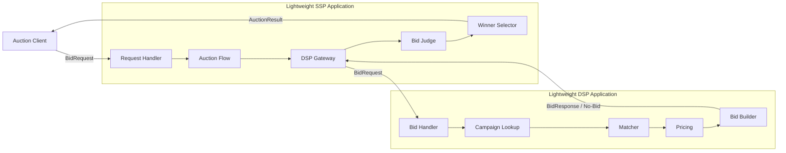

# Tech Spec: OpenRTB 기반 저지연 RTB 입찰 시스템

이 문서는 PRD와 Architecture에서 정의한 RTB 입찰 시스템을 실제 구현으로 옮기기 위한 세부 명세를 다룬다.

PRD가 무엇을 해결할지 정의하고, Architecture가 어떤 구조로 바라볼지 정의한다면, Tech Spec은 개발자가 같은 기준으로 구현할 수 있도록 API 계약, 지원 필드, 실행 흐름, 데이터 모델, 실패 처리, 테스트 기준을 구체화한다.

## 1. Purpose & Scope

### 1.1 Purpose

이 문서의 목적은 경량 SSP와 경량 DSP로 구성된 RTB 입찰 시스템을 실제 구현으로 옮기기 위한 세부 기준을 정의하는 것이다.

경량 SSP는 입찰 요청(`BidRequest`)을 받아 여러 경량 DSP로 전달하고, 제한 시간 안에 도착한 입찰 응답(`BidResponse`)을 수집해 낙찰자와 낙찰가를 결정한다.

경량 DSP는 전달받은 BidRequest를 해석하고, 자신의 캠페인 데이터와 비교해 입찰 여부와 입찰가를 결정한 뒤 BidResponse 또는 no-bid를 반환한다.

특히 다음 질문에 답한다.

- 어떤 OpenRTB 요청/응답 필드를 이 시스템의 지원 범위로 삼을 것인가?
- 경량 SSP는 요청 검증, DSP 전달, 응답 수집, 낙찰 결정을 어떤 순서로 실행하는가?
- 경량 DSP는 어떤 설정과 캠페인 데이터를 바탕으로 bid 또는 no-bid를 결정하는가?
- 응답 시간 초과(timeout), 늦게 도착한 입찰 응답(late bid), 잘못된 입찰 응답(invalid bid), 입찰하지 않음(no-bid)을 어느 책임에서 어떻게 구분하는가?
- 구현이 요구사항을 만족하는지 어떤 테스트와 지표로 확인할 것인가?

### 1.2 Scope

이 문서는 현재 시스템 범위에서 필요한 구현 명세를 다룬다. 범위의 중심은 운영 수준의 광고 플랫폼 전체가 아니라 `게시자 -> 경량 SSP <-> 경량 DSP <- 광고주` 흐름의 성능 핵심 경로다.

포함하는 범위:

- OpenRTB BidRequest/BidResponse의 지원 필드
- 경량 SSP의 BidRequest 검증, DSP fan-out, 응답 수집
- 경량 SSP의 timeout, late bid, invalid bid, no-winner 처리
- 경량 SSP의 낙찰자와 낙찰가 결정 규칙
- 경량 DSP의 캠페인 데이터 모델
- 경량 DSP의 광고 타입별 요청 해석
- 경량 DSP의 bid/no-bid 결정과 입찰가 산정
- 경량 DSP의 BidResponse 생성
- 경매 결과 응답 형식
- timeout, late bid, invalid bid, no-bid, no-winner 처리
- 기능 테스트와 부하 테스트 기준

제외하는 범위:

- 전체 OpenRTB 2.6 스펙 구현
- 실제 외부 SSP/DSP 연동
- 광고 렌더링
- 노출/클릭/전환 추적
- 과금, 정산, 리포팅
- 광고 운영 백오피스
- Kubernetes 기반 운영 검증
- 클라우드 배포 환경에서의 절대 성능 보장

### 1.3 Relationship to Other Documents

이 문서는 다른 문서의 책임을 반복하지 않는다.

- PRD는 문제, 사용자 시나리오, 기능 요구사항, 성공 기준을 정의한다.
- Architecture는 시스템 경계, 품질 기준, C1/C2 관점, 큰 실행 흐름을 정의한다.
- Tech Spec은 구현자가 따라야 할 API 계약, 내부 컴포넌트, 데이터 모델, 처리 규칙, 테스트 기준을 정의한다.
- ADR은 여러 선택지가 있는 중요한 기술 결정을 별도로 기록한다.

### 1.4 Responsibility Boundary

이 문서는 경량 SSP와 경량 DSP의 책임을 분리해서 정의한다.

| 영역 | 책임 |
|---|---|
| 경량 SSP | BidRequest 수신/검증, 경량 DSP 호출, 응답 제한 시간 적용, BidResponse 수집/검증, 낙찰자/낙찰가 결정 |
| 경량 DSP | BidRequest 해석, 캠페인 후보 평가, 광고 타입별 입찰 가능 여부 판단, 입찰가 산정, BidResponse 또는 no-bid 생성 |
| 공통 | OpenRTB 객체 모델, 실패 분류, 성능 지표, 테스트 기준 |

외부 실제 SSP/DSP와의 네트워크 연동은 다루지 않는다. 이 프로젝트에서 경량 SSP와 경량 DSP는 OpenRTB 요청/응답 기반 경매 핵심 경로를 검증하기 위한 내부 구현 단위다.

## 2. RTB 요청/응답 계약

이 장은 경매가 진행되는 동안 오가는 요청과 응답의 계약을 정의한다. OpenRTB 표준 객체와 프로젝트 내부 객체를 구분해, 구현자가 각 경계에서 어떤 데이터를 검증하고 반환해야 하는지 명확히 한다.

### 2.1 계약 경계

| 흐름 | 계약 | 성격 |
|---|---|---|
| `Auction Client -> SSP` | 테스트용 경매 시작 요청 | 프로젝트 입력 |
| `SSP -> DSP` | `BidRequest` | OpenRTB 표준 입찰 요청 |
| `DSP -> SSP` | `BidResponse` 또는 `No-Bid` | OpenRTB 표준 입찰 응답 |
| `SSP -> Auction Client` | `AuctionResult` | 프로젝트 검증용 결과 |

OpenRTB 표준 계약은 `SSP -> DSP`의 `BidRequest`와 `DSP -> SSP`의 `BidResponse`다. `Auction Client -> SSP`와 `SSP -> Auction Client`는 이 프로젝트를 실행하고 검증하기 위한 프로젝트 계약이다.

### 2.2 Auction Client -> SSP: 테스트용 경매 시작 요청

OpenRTB 표준에서 `BidRequest`는 SSP가 DSP에게 보내는 입찰 요청이다. 이 프로젝트에서는 실제 게시자 서버나 광고 서버를 구현하지 않으므로, `Auction Client`가 경량 SSP에 경매 시작을 요청한다.

테스트용 경매 시작 요청은 다음 역할만 가진다.

- 테스트할 OpenRTB BidRequest payload를 제공한다.
- 동일한 입력으로 기능 테스트와 부하 테스트를 반복할 수 있게 한다.
- 경량 SSP가 경매를 시작할 수 있는 API 진입점이 된다.

이 요청은 OpenRTB 표준 구간이 아니다. 경량 SSP는 이 입력에서 OpenRTB `BidRequest` payload를 읽고, DSP로 전달할 `BidRequest`를 구성한다.

### 2.3 SSP -> DSP: BidRequest

`BidRequest`는 경량 SSP가 경량 DSP에게 보내는 OpenRTB 표준 입찰 요청이다. 경량 SSP는 이 요청을 검증하고, 처리 가능한 요청만 경량 DSP에게 전달한다.

지원하는 요청 형태:

- 하나의 `BidRequest`는 정확히 하나의 `Imp`를 가진다.
- `Imp`는 `banner`, `video`, `native` 중 정확히 하나의 광고 타입 객체를 가진다.
- `site`는 지원하고, `app`은 지원하지 않는다.
- `audio`, `pmp`, multi-imp 요청은 지원하지 않는다.
- 통화는 `USD`만 지원한다.

공통 필드:

| 객체 | 필드 | 필수 | 사용 목적 |
|---|---|---:|---|
| `BidRequest` | `id` | Y | 경매 요청 식별자 |
| `BidRequest` | `imp` | Y | 광고 노출 기회. 이 시스템에서는 1개만 허용 |
| `BidRequest` | `tmax` | N | 응답 제한 시간. 없으면 시스템 기본값 사용 |
| `BidRequest` | `at` | N | 경매 방식. 없으면 시스템 기본값 사용 |
| `BidRequest` | `site` | N | 지면 정보 |
| `BidRequest` | `device` | N | 디바이스/지역 정보 |
| `Imp` | `id` | Y | 광고 노출 기회 식별자 |
| `Imp` | `bidfloor` | N | 최소 입찰가. 없으면 0 |
| `Imp` | `bidfloorcur` | N | 최소 입찰가 통화. 값이 있으면 `USD`여야 함 |

광고 타입별 필드:

| 타입 | 필드 | 필수 | 사용 목적 |
|---|---|---:|---|
| `banner` | `w`, `h` | Y | 배너 크기 매칭 |
| `video` | `mimes` | Y | 지원 가능한 MIME 타입 |
| `video` | `minduration`, `maxduration` | Y | 허용 가능한 재생 시간 |
| `video` | `protocols` | Y | 지원 가능한 동영상 응답 프로토콜 |
| `native` | `request` | Y | Native Ad Specification JSON 문자열 |
| `native` | `ver` | N | Native API 버전 |

검증 규칙:

- `BidRequest.id` 또는 `Imp.id`가 없으면 `INVALID_REQUEST`다.
- `imp`가 없거나 1개가 아니면 `UNSUPPORTED_REQUEST`다.
- `Imp`가 지원 광고 타입 중 정확히 하나를 갖지 않으면 `UNSUPPORTED_REQUEST`다.
- 광고 타입별 필수 필드가 없으면 `INVALID_REQUEST`다.
- `Native.request`가 JSON 문자열로 파싱되지 않으면 `INVALID_REQUEST`다.
- `bidfloorcur`가 있고 `USD`가 아니면 `UNSUPPORTED_REQUEST`다.

### 2.4 DSP -> SSP: BidResponse / No-Bid

경량 DSP는 `BidRequest`를 평가한 뒤 `BidResponse` 또는 `No-Bid`를 반환한다.

정상 입찰 응답은 제한된 OpenRTB `BidResponse` 형태를 사용한다.

| 객체 | 필드 | 필수 | 사용 목적 |
|---|---|---:|---|
| `BidResponse` | `id` | Y | 원본 `BidRequest.id` |
| `BidResponse` | `seatbid` | Y | 입찰 묶음 |
| `BidResponse` | `cur` | N | 입찰 통화. 값이 있으면 `USD` |
| `SeatBid` | `seat` | N | 경량 DSP 또는 광고주 seat 식별자 |
| `SeatBid` | `bid` | Y | 이 시스템에서는 1개만 사용 |
| `Bid` | `id` | Y | 입찰 식별자 |
| `Bid` | `impid` | Y | 원본 `Imp.id` |
| `Bid` | `price` | Y | CPM 기준 입찰가 |
| `Bid` | `cid` | N | 캠페인 식별자 |
| `Bid` | `crid` | N | 광고 소재 식별자 |
| `Bid` | `adomain` | N | 광고주 도메인 |
| `Bid` | `mtype` | Y | 배너 `1`, 동영상 `2`, 네이티브 `4` |
| `Bid` | `adm` | 조건부 | 동영상/네이티브 응답의 광고 마크업 |

SSP의 BidResponse 검증 기준:

- `BidResponse.id`는 원본 `BidRequest.id`와 같아야 한다.
- `Bid.impid`는 원본 `Imp.id`와 같아야 한다.
- `Bid.price`는 원본 `Imp.bidfloor` 이상이어야 한다.
- `cur`가 있으면 `USD`여야 한다.
- `mtype`은 원본 요청의 광고 타입과 일치해야 한다.
- 동영상/네이티브 응답은 `adm`을 가져야 한다.

`No-Bid`는 DSP가 해당 요청에 입찰하지 않는 정상 결과다. 내부 구현에서는 `NO_BID` 결과로 표현한다. OpenRTB 응답 형태가 필요한 테스트에서는 빈 `seatbid`를 사용할 수 있다.

`timeout`과 `late bid`는 DSP가 반환하는 값이 아니다. SSP가 응답 마감 시각을 기준으로 관찰해 분류하는 상태다.

### 2.5 SSP -> Auction Client: AuctionResult

`AuctionResult`는 OpenRTB 표준 객체가 아니다. 경량 SSP가 여러 DSP 응답을 수집하고 낙찰자와 낙찰가를 결정한 뒤, 테스트 클라이언트가 결과를 확인할 수 있도록 반환하는 프로젝트 검증용 응답이다.

| 필드 | 설명 |
|---|---|
| `requestId` | 원본 `BidRequest.id` |
| `impId` | 경매 대상 `Imp.id` |
| `mediaType` | `BANNER`, `VIDEO`, `NATIVE` 중 하나 |
| `status` | `WINNER`, `NO_WINNER`, `INVALID_REQUEST`, `UNSUPPORTED_REQUEST` 중 하나 |
| `winnerDspId` | 낙찰된 경량 DSP 식별자 |
| `winningBidId` | 낙찰된 `Bid.id` |
| `winningPrice` | 낙찰 응답의 입찰가 |
| `auctionPrice` | 경매 규칙에 따라 결정된 최종 가격 |
| `currency` | `USD` |
| `elapsedMs` | 요청 처리 시작부터 결과 결정까지 걸린 시간 |
| `dspResultCounts` | bid, no-bid, timeout, late bid, invalid bid 개수 |

실제 OpenRTB 연동에서는 SSP가 낙찰 이후 광고 전달, win notice, billing notice 같은 후속 흐름을 처리할 수 있다. 이 프로젝트는 광고 렌더링과 notice 호출을 범위에 포함하지 않으므로, 낙찰 결과 확인을 `AuctionResult`로 마무리한다.

### 2.6 지원하지 않는 요청과 응답

| 항목 | 처리 |
|---|---|
| multi-imp 요청 | `UNSUPPORTED_REQUEST` |
| `audio` 요청 | `UNSUPPORTED_REQUEST` |
| `pmp` 요청 | `UNSUPPORTED_REQUEST` |
| `app` 요청 | `UNSUPPORTED_REQUEST` |
| `USD` 외 통화 | `UNSUPPORTED_REQUEST` |
| 외부 DSP HTTP 204 no-bid | 범위 밖 |
| win notice / billing notice | 범위 밖 |
| 광고 렌더링용 markup 검증 | 범위 밖 |

## 3. 캠페인 데이터 계약

이 장은 경량 DSP가 입찰 판단과 BidResponse 생성을 위해 사용하는 캠페인 데이터의 범위를 정의한다.

캠페인 데이터는 광고 플랫폼 전체 데이터를 의미하지 않는다. 이 프로젝트에서는 경량 DSP가 BidRequest를 평가하고, bid 또는 no-bid를 결정하고, 유효한 BidResponse를 만들기 위해 필요한 최소 데이터만 다룬다.

이 범위 제한은 Architecture의 우선 품질 기준과 연결된다. Campaign Snapshot이 커지거나 처리 규칙이 복잡해질수록 DSP의 메모리 사용량, 조회 비용, 예외 처리가 늘어나고 제한 시간 내 응답과 낮은 지연 시간을 유지하기 어려워진다.

### 3.1 Campaign Data Scope

Campaign Snapshot은 다음 네 가지 축으로 제한한다.

| 축 | 설명 | 예시 |
|---|---|---|
| 광고 타입 | 어떤 광고 요청에 입찰 가능한지 판단하기 위한 정보 | `banner`, `video`, `native` |
| 타겟 조건 | 요청이 캠페인 조건과 맞는지 판단하기 위한 정보 | 국가, 디바이스, 지면 카테고리, 배너 크기, 동영상 길이 |
| 입찰 조건 | 입찰 가능 여부와 입찰가를 결정하기 위한 정보 | 활성 여부, 기본 입찰가, 통화 |
| 응답 정보 | OpenRTB BidResponse를 만들기 위한 최소 광고 소재 참조 정보 | `crid`, `adomain`, 테스트용 `adm` |

응답 정보는 실제 광고 렌더링 시스템을 구현하기 위한 데이터가 아니다. 이 프로젝트에서는 `crid`, `adomain`, 테스트용 `adm`만 포함하고, 광고 소재 저장, CDN 배포, 노출/클릭/전환 추적은 제외한다.

실시간 예산 차감, 캠페인 운영 이력, 광고 심사 상태, 리포팅용 집계 데이터는 이 장의 캠페인 데이터 범위에 포함하지 않는다.

### 3.2 Campaign Setup -> Campaign Data Store

`Campaign Setup`은 테스트에 사용할 광고주 캠페인 데이터를 준비하는 역할이다. 실제 광고 운영 백오피스나 관리자 화면을 의미하지 않는다.

`Campaign Data Store`는 캠페인 원본 데이터의 기준 저장소다. DSP 프로세스가 재시작되더라도 같은 캠페인 데이터를 다시 읽을 수 있어야 하므로, 캠페인 데이터의 기준 출처를 DSP 내부 메모리에만 두지 않는다.

Campaign Data Store에 저장되는 데이터는 3.1의 범위로 제한한다.

| 필드 | 설명 |
|---|---|
| `campaignId` | 캠페인 식별자 |
| `advertiserId` | 광고주 식별자 |
| `enabled` | 입찰 가능 여부 |
| `mediaType` | 지원 광고 타입 |
| `targeting` | 국가, 디바이스, 지면, 크기, 동영상 길이 같은 타겟 조건 |
| `bid` | 입찰가와 통화 |
| `creative` | `crid`, `adomain`, 테스트용 `adm` 생성에 필요한 정보 |

저장소의 실제 구현 방식은 이 장에서 확정하지 않는다. 파일, RDB, Redis 등 구체 기술 선택은 ADR에서 결정한다.

### 3.3 Campaign Data Store -> DSP: Campaign Snapshot

경량 DSP는 시작 시점에 Campaign Data Store에서 캠페인 데이터를 읽어 Campaign Snapshot을 구성한다.

BidRequest 처리 중에는 Campaign Data Store를 동기 조회하지 않는다. 입찰 판단은 사전에 로드된 Campaign Snapshot과 DSP 내부 메모리 Repository/Index를 기준으로 수행한다.

이 결정은 다음 품질 기준을 지키기 위한 것이다.

| 품질 기준 | 연결 |
|---|---|
| 제한 시간 내 응답 | 입찰 중 저장소 조회 지연을 제거한다 |
| 낮은 지연 시간 | hot path를 메모리 조회와 계산으로 제한한다 |
| 실패 격리 | 저장소 장애가 진행 중인 입찰 판단으로 바로 전파되지 않는다 |
| 관찰 가능성 | 지연 원인을 입찰 로직 중심으로 좁혀 측정할 수 있다 |

### 3.4 DSP 내부 Campaign Repository / Index

DSP 내부 Campaign Repository/Index는 BidRequest 처리 중 실제로 조회되는 메모리 구조다.

이 장에서는 인덱스의 존재와 책임만 정의한다. 구체적인 자료구조와 최적화 방식은 경량 DSP 설계 또는 ADR에서 다룬다.

구현 시작점은 단순 순회가 될 수 있다. 다만 Repository/Index 책임은 성능 테스트 결과에 따라 광고 타입과 타겟 조건 기반 후보 축소 구조로 개선될 수 있도록 분리한다.

DSP 내부 Repository/Index의 책임:

- Campaign Snapshot을 메모리에 보관한다.
- 광고 타입별 후보 캠페인을 빠르게 찾을 수 있어야 한다.
- 타겟 조건과 입찰 조건을 평가할 수 있는 형태로 데이터를 제공한다.
- BidResponse 생성을 위한 creative 참조 정보를 제공한다.

### 3.5 캠페인 데이터 갱신 범위

이 문서의 기본 결정은 단순 스냅샷이다. DSP는 시작 시점에 Campaign Snapshot을 한 번 로드하고, 실행 중 캠페인 변경 반영은 다루지 않는다.

캠페인 갱신은 입찰 hot path가 아니라 운영/관리 흐름에 가깝다. 이 프로젝트에서는 BidRequest 처리 중 데이터 갱신 경로를 섞지 않고, 시작 시점 Snapshot을 기준으로 입찰 판단을 수행한다.

다음 항목은 추후 결정으로 남긴다.

- 실행 중 Campaign Snapshot 주기 갱신
- 기존 Snapshot과 새 Snapshot의 무중단 교체
- 실시간 예산 차감
- 여러 DSP 인스턴스 간 Campaign Snapshot 버전 일치 전략

## 4. Runtime Flow & C3 Components

### 4.1 전체 요청 처리 흐름

이 장은 BidRequest가 들어온 뒤 AuctionResult가 반환될 때까지의 메인 시나리오를 구현 관점에서 설명한다.

상세 검증 규칙, 낙찰가 계산 규칙, 광고 타입별 처리 규칙은 5장과 6장에서 다룬다. 이 장에서는 요청이 어떤 책임을 거쳐 처리되는지만 정의한다.

메인 시나리오:

1. Auction Client가 경량 SSP에 테스트용 경매 시작 요청을 보낸다.
2. 경량 SSP는 OpenRTB BidRequest를 추출하고 처리 가능한 요청인지 확인한다.
3. 경량 SSP는 경매 제한 시간을 정하고 여러 경량 DSP에 같은 BidRequest를 전달한다.
4. 경량 DSP는 Campaign Snapshot을 기준으로 입찰 가능 여부를 판단한다.
5. 경량 DSP는 BidResponse 또는 no-bid를 경량 SSP에 반환한다.
6. 경량 SSP는 제한 시간 안에 도착한 응답만 낙찰 후보로 본다.
7. 경량 SSP는 잘못된 응답을 제외하고 낙찰자와 낙찰가를 결정한다.
8. 경량 SSP는 AuctionResult를 Auction Client에 반환한다.

### 4.2 C3: Runtime Components

이 C3 다이어그램은 C2의 `Lightweight SSP Application`과 `Lightweight DSP Application` 내부 책임을 보여준다.

Mermaid source

### 4.3 경량 SSP 내부 책임

| 컴포넌트 | 책임 |
|---|---|
| `Request Handler` | Auction Client 요청을 받고 OpenRTB BidRequest payload를 경매 흐름에 넘긴다. |
| `Auction Flow` | 경매 제한 시간 설정, DSP 호출 순서, 응답 수집 흐름을 조율한다. |
| `DSP Gateway` | 경량 DSP에 BidRequest를 전달하고 BidResponse 또는 no-bid를 받는다. |
| `Bid Judge` | timeout, late bid, invalid bid, no-bid를 구분하고 낙찰 후보를 만든다. |
| `Winner Selector` | 유효한 BidResponse 중 낙찰자와 낙찰가를 결정하고 AuctionResult 생성을 준비한다. |

`Bid Judge`와 `Winner Selector`는 분리한다. 전자는 응답이 낙찰 후보가 될 수 있는지 판단하고, 후자는 후보 중 누가 이기는지 판단한다. 이 분리는 잘못된 응답 처리와 낙찰 규칙 변경을 독립적으로 다루기 위한 것이다.

### 4.4 경량 DSP 내부 책임

| 컴포넌트 | 책임 |
|---|---|
| `Bid Handler` | SSP가 보낸 BidRequest를 받고 광고 타입을 해석한다. |
| `Campaign Lookup` | 시작 시점에 로드된 Campaign Snapshot에서 후보 캠페인을 찾는다. |
| `Matcher` | BidRequest와 캠페인의 타겟 조건이 맞는지 평가한다. |
| `Pricing` | bidfloor와 캠페인 입찰 조건을 바탕으로 입찰가를 결정한다. |
| `Bid Builder` | OpenRTB BidResponse 또는 no-bid를 만든다. |

`Campaign Lookup`은 Campaign Data Store를 직접 조회하지 않는다. 이 컴포넌트는 DSP 내부 메모리에 로드된 Campaign Snapshot을 읽는 책임만 가진다.

### 4.5 C3 경계 원칙

C3 컴포넌트 이름은 코드 파일명과 반드시 같을 필요는 없다. 이 이름들은 구현자가 책임을 나누기 위한 기준이다.

세부 클래스, 메서드, 자료구조는 5장 경량 SSP 설계와 6장 경량 DSP 설계에서 구체화한다. 성능 지표와 부하 테스트 기준은 8장에서 다룬다.

## 5. 경량 SSP 설계

### 5.1 책임

### 5.2 BidRequest 수신과 검증

### 5.3 DSP Fan-out

### 5.4 BidResponse 수집

### 5.5 Timeout / Late Bid 처리

### 5.6 Invalid Bid 검증

### 5.7 낙찰자와 낙찰가 결정

## 6. 경량 DSP 설계

### 6.1 책임

### 6.2 DSP 설정

### 6.3 캠페인 데이터 모델

### 6.4 광고 타입별 요청 해석

### 6.5 입찰 여부 결정

### 6.6 입찰가 결정

### 6.7 BidResponse 생성

### 6.8 No-Bid 반환

## 7. 공통 실패 처리

### 7.1 실패 분류

### 7.2 요청 실패

### 7.3 DSP 응답 실패

### 7.4 No-Winner 처리

## 8. 성능 지표와 테스트 전략

### 8.1 측정 지표

### 8.2 기능 테스트 시나리오

### 8.3 부하 테스트 시나리오

## 9. Deferred Decisions & ADR Candidates
