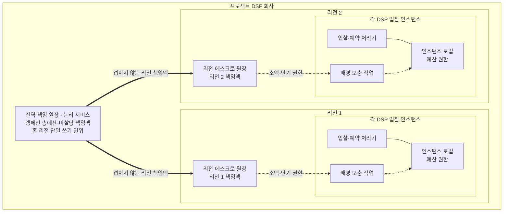

# ADR-001 분산 캠페인 예산 예약

상태: 승인

근거: [아키텍처 중요 요구사항](../../requirements/quality.md), [아키텍처 동인](../drivers.md)

## 1. 결정

두 리전의 프로젝트 DSP는 **계층형 에스크로 예산**을 사용한다.

전역 예산 원장이 캠페인 예산을 리전 원장에 겹치지 않게 할당하고, 리전 원장은 다시 DSP 인스턴스에 소액·단기 사용 권한을 할당한다. DSP는 받은 권한 안에서 로컬 예약하므로 일반 입찰 경로에서 원장을 호출하지 않는다.



굵은 실선은 격리와 멱등 활성화로 보호하는 책임 이전, 점선은 입찰 경로 밖의 권한 보충이다. 입찰·예약 처리기는 로컬 권한에만 의존한다. 전역 책임 원장은 논리적 단일 권위이며 홈 리전 안에서는 Multi-AZ로 배치한다.

전역 원장은 홈 리전의 단일 쓰기 권위와 다른 리전의 비동기 복구 사본으로 구성한다. 홈 리전 장애 때 새 책임 이전은 중단하지만 각 리전은 기존 책임액으로 계속 입찰한다. 불확실한 전역 예산은 자동 승격해 재사용하지 않고 지역 활성화 증거와 대조한 뒤 보수적으로 복구한다.

## 2. 맥락과 우선순위

여러 리전과 DSP 인스턴스가 같은 캠페인으로 동시에 입찰한다. 다음 두 조건을 함께 지켜야 한다.

1. `확정 지출 + 유효한 잠재 지출 <= 캠페인 총예산`
2. 정상 500 RPS에서 진입 네트워크와 경매 전체의 p99가 50ms 이하다.

충돌 시 우선순위는 다음과 같다.

| 순위 | 특성 | 원칙 |
|---|---|---|
| 최우선 | 과금 정합성 | 초과 지출과 중복 과금을 허용하지 않는다. |
| 최우선 | 지연시간 | 정상·보호 요청의 p99 50ms를 지킨다. |
| 후순위 | 동시성 | 앞선 두 조건을 침해하면 입찰 기회를 줄인다. |
| 후순위 | 장애 회복 | 불확실한 예산을 즉시 재사용하지 않고 부분 중단과 예산 잠금을 허용한다. |

SSP는 별도 회사이며 경매·낙찰·렌더링의 권위자다. 프로젝트 DSP만 캠페인 예산을 소유한다. 양쪽은 저장소와 트랜잭션을 공유하지 않는다.

## 3. 검토한 후보

### 후보 1. 다중 리전 강한 원장에 매 예약 동기 기록

캠페인별로 분할·복제된 원장에 모든 잠재 지출을 동기 기록한 뒤 입찰한다. 정합성을 가장 직접적으로 설명할 수 있지만 매 입찰이 리전 간 합의 비용을 지고, 인기 캠페인의 쓰기가 직렬화된다.

### 후보 2. 캠페인 홈 리전 원장

캠페인마다 쓰기 권한 리전을 하나 두고 반대 리전에 비동기 복제한다. 정상 쓰기는 후보 1보다 빠르지만 다른 리전의 DSP는 홈 리전을 호출해야 한다. 홈 리전 장애 때 최신 상태를 증명할 수 없으면 해당 캠페인의 입찰을 중단해야 한다.

### 후보 3. 계층형 에스크로 예산

전역 원장, 리전 원장, DSP 로컬 메모리 순으로 서로 겹치지 않는 예산 권한을 미리 이전한다. 일반 입찰은 로컬에서 처리한다. 초과 지출 없이 리전 간 왕복과 인기 캠페인의 중앙 경합을 제거하지만 권한 분할·보충·회수와 대조가 복잡하다.

### 후보 4. 이벤트 기반 잠정 지출과 배치 원장

DSP가 투영된 잔액을 보고 입찰하고 예약 이벤트를 스트림 처리한 뒤 원장을 묶음 갱신한다. 원장 부하와 지연은 줄지만 동시 요청과 반영 지연만큼 초과 지출할 수 있다. 동기 승인을 추가하면 후보 1·2로, 사전 한도를 추가하면 후보 3으로 수렴한다.

## 4. 비교

| 후보 | 과금 정합성 | 지연시간 | 동시성 | 장애 시 보호 | 주요 대가 |
|---|---|---|---|---|---|
| 1. 다중 리전 강한 원장 | 가장 단순하게 보장 | 매 예약의 리전 간 합의가 위험 | 캠페인 간 병렬, 인기 캠페인 직렬 | 안전한 정족수가 없으면 해당 셀 중단 | 정상 경로가 합의 비용 부담 |
| 2. 홈 리전 원장 | 불확실할 때 중단하여 보장 | 로컬 캠페인은 유리, 원격 캠페인은 불리 | 캠페인별 병렬 | 장애 캠페인만 중단 가능 | 홈 리전 호출과 승격 절차 |
| 3. 계층형 에스크로 | 독점 권한 합계로 보장 | 일반 예약은 로컬 처리 | 같은 캠페인도 권한별 병렬 | 기존 권한 안에서 부분 지속 | 파편화, 회수 지연, 구현 복잡도 |
| 4. 이벤트·배치 원장 | 초과 지출 가능 | 로그 기록만 기다려 유리 | 스트림 분할로 높음 | 처리는 지속되나 정합성 위험 누적 | 안전 여유액과 사후 보정 필요 |

후보 4는 초과 지출 0건과 충돌하여 제외한다. 후보 1은 모든 요청에 리전 간 합의 비용을 부과하고, 후보 2는 캠페인 위치에 따라 원격 호출이 남는다. 후보 3만 두 최우선 조건을 구조적으로 함께 보호한다.

## 5. 예산 불변식

```text
전역 미할당액
+ 모든 리전의 책임 봉투
= 캠페인 총예산
```

```text
리전 미발급액
+ DSP 잔여 권한
+ 잠재 지출
+ 확정 지출
+ 불확실해 격리한 금액
= 해당 리전 책임 봉투
```

확정 지출은 리전 책임 봉투 밖으로 빠져나가 전역 원장을 실시간 갱신하지 않는다. 이미 소비한 금액으로 봉투 안에서 분류만 바뀌며, 전역에는 미사용임을 증명한 금액만 반환한다.

```text
DSP의 미사용 권한
+ 유효한 잠재 지출
+ 반영 대기 금액
= DSP가 책임지는 금액
```

금액 한 단위는 같은 순간에 한 상태에만 속한다. 여기서 책임 금액은 아직 상위 계층이 회수하거나 확정 지출로 바꾸지 않은 금액 전체다.

- 상위 계층은 자기 잔액에서 먼저 차감·격리한 뒤 하위 계층에 권한을 발급한다.
- 하위 계층은 발급이 복구 가능하게 확인된 뒤에만 권한을 사용한다.
- 사용 내역 전달이 늦어져도 권한 총량은 늘어나지 않는다.
- 이벤트 처리와 배치는 권한을 새로 만들지 않으며 집계·대조·리필 판단만 한다.

## 6. 정상 처리

1. DSP는 캠페인별 로컬 권한에서 노출 금액을 원자적으로 예약한다.
2. 예약과 발급 권한을 연결하는 불투명한 증표를 입찰 응답에 포함한다. SSP는 이를 해석하지 않고 통지 때 돌려준다.
3. 로컬 권한이 충분하면 원장 호출 없이 입찰을 반환하고 예약 사건은 비동기로 전달한다. 전달 전에 DSP가 죽어도 리전 원장은 해당 DSP의 전체 책임 금액을 회수하지 않는다.
4. 잔액이 하한선에 도달하면 리전 원장에 비동기로 보충을 요청한다.
5. 리전 권한이 부족하면 리전 원장이 전역 원장에 추가 할당을 요청한다.
6. 보충이 늦어 권한이 소진되면 해당 캠페인을 `NO_BID`하고 경매 요청을 기다리게 하지 않는다.
7. `lurl`·`burl` 접수는 응답 전에 복구 가능하게 보존하고, 모든 사건은 멱등 반영한다.

## 7. 장애 계약

| 장애 | 동작 | 감수하는 손실 |
|---|---|---|
| DSP 인스턴스 | 리스가 끝나면 새 예약을 막고, 사용 여부가 불확실한 권한은 최대 잠재 지출 기한까지 격리한다. | 해당 인스턴스 권한의 일시적 미사용 |
| 리전 원장 | DSP는 이미 받은 유효한 권한 안에서만 계속 입찰한다. | 새 권한 보충 중단 |
| 전역 원장 | 각 리전은 기존 권한을 소진할 때까지 계속 입찰한다. | 캠페인별 점진적 `NO_BID` 증가 |
| 리전 전체 | 다른 리전은 자기 권한으로 계속 입찰하고 장애 리전 권한은 즉시 재할당하지 않는다. | 장애 리전에 묶인 예산 활용률 저하 |
| 이벤트 처리 | 원장과 권한은 유지하고 이벤트를 적체했다가 재처리한다. | 지출 가시성과 보충 판단 지연 |

리스 만료는 신규 예약 권한만 끝낸다. 이미 만든 예약은 `lurl`, `burl`, 예약 후 95초 만료 중 하나로 종결될 때까지 보호한다.

## 8. 결과

### 얻는 점

- 일반 입찰에서 원장 네트워크 왕복을 제거한다.
- 같은 캠페인도 리전과 DSP 권한별로 병렬 처리한다.
- 전역 원장이나 리전 하나의 장애가 즉시 전체 DSP 중단으로 전파되지 않는다.
- 장애 손실을 광고주 초과 지출이 아니라 제한된 예산 잠금과 입찰 기회 감소로 바꾼다.

### 감수하는 점

- 리전·DSP별 예산 파편화로 전체 잔액이 있어도 일부 요청이 `NO_BID`할 수 있다.
- 권한 크기, 보충 시점, 리스, 세대 차단과 보수적 회수를 구현해야 한다.
- 실시간 지출 가시성과 페이싱에는 비동기 반영 지연이 생긴다.
- 단순 중앙 원장보다 상태 전이와 장애 시험이 많다.

## 9. 검증 조건

- 두 리전과 여러 DSP가 동시에 예약해도 캠페인 총예산을 넘지 않는다.
- 각 계층이 발급·보유·사용한 권한의 합이 상위 계층의 한도를 넘지 않는다.
- 정상 500 RPS에서 호출자 관측 p99 50ms 이하를 지킨다.
- 순간 1,000 RPS에서 최소 400 RPS의 p99 50ms를 보호한다.
- DSP·리전 원장·전역 원장·리전 하나의 장애를 각각 주입해 전체 중단과 예산 위반이 없음을 확인한다.
- 장애 권한은 미사용임을 증명하거나 마지막 잠재 지출 가능 시간이 끝나기 전에 재할당되지 않는다.
- 중복 `lurl`·`burl`, 재처리와 순서 변경이 금액에 한 번만 영향을 준다.

## 10. 후속 작업

- [ADR-002](ADR-002-multi-region-ledger-topology.md)는 리전별 독립 원장을 선택했다.
- [ADR-003](ADR-003-regional-budget-allocation.md)은 초기 리전 책임액·전역 예비액과 리전 요청형 이전을 선택했다.
- [ADR-005](ADR-005-durable-budget-events.md)는 독립 지역 기록, 내구 접수 증거와 멱등 금액 사건 수렴을 선택했다.
- [ADR-008](ADR-008-global-responsibility-ledger-store.md)은 전역 책임 원장의 PostgreSQL 단일 쓰기 권위와 보수적 복구를 선택했다.
- 권한 크기, 리스 기간, 보충 하한선과 파편화 상한은 상세 설계·검증에서 정한다.
