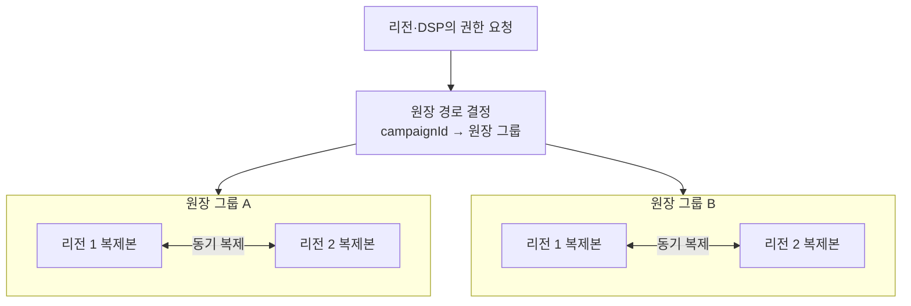
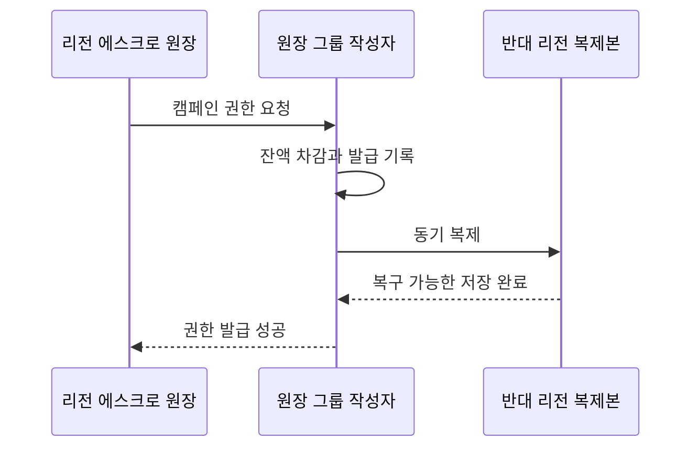
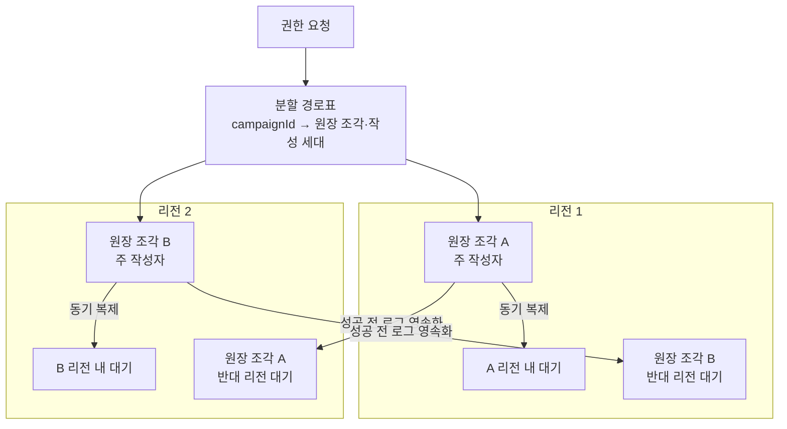

# ADR-002 다중 리전 원장 구조

상태: 검토 중 — 후보 1·2 작성

근거: [ADR-001 분산 캠페인 예산 예약](ADR-001-distributed-budget-reservation.md), [아키텍처 중요 요구사항](../asr.md)

## 1. 결정할 문제

전역·리전 원장을 두 리전에 어떻게 분할·복제하고 쓰기 권한을 차단하여 다음 조건을 함께 지킬지 결정한다.

1. 같은 캠페인 예산 권한을 중복 발급하지 않는다.
2. 성공한 권한 발급은 리전 장애에도 유실하지 않는다.
3. 원장 장애가 일반 입찰을 즉시 중단시키지 않는다.
4. 인스턴스·AZ·리전 하나의 장애를 전체 원장 장애로 확대하지 않는다.

원장 제품, 분할 방식, 복제 성공 기준과 장애 전환을 함께 결정한다. DSP 권한의 크기·리스·보충 정책은 이 ADR의 범위가 아니다.

## 2. 공통 평가 기준

| 기준 | 질문 |
|---|---|
| 중복 발급 방지 | 네트워크 단절과 이전 작성자 복구 때도 작성자가 하나인가? |
| RPO 0 | 성공한 권한 발급이 리전 하나와 함께 사라지지 않는가? |
| 부분 장애 격리 | 원장 그룹 하나의 장애가 다른 캠페인과 일반 입찰을 멈추지 않는가? |
| 보충 지연 | 리전·DSP 권한 보충이 입찰 기회를 과도하게 줄이지 않는가? |
| 운영 가능성 | 합의 알고리즘을 직접 구현하지 않고 설명·시험할 수 있는가? |

## 3. 후보 1 — 합의형 분할 원장

캠페인을 여러 원장 그룹으로 나누고 각 그룹을 두 리전에 동기 복제한다. 전역·리전 권한 발급은 두 리전에 복구 가능하게 저장된 뒤 성공한다.



원장 그룹은 여러 캠페인을 담당한다. 서로 다른 그룹은 독립적으로 처리하여 캠페인 경합과 장애 범위를 제한한다.

```text
hash(campaignId) → 원장 그룹
```

### 3.1 권한 발급



- 전역 원장 차감과 권한 발급 기록은 하나의 원자적 상태 전이다.
- 반대 리전 저장을 확인하기 전에는 성공으로 응답하지 않는다.
- 발급 식별자로 재시도를 멱등 처리한다.
- 합의 비용은 일반 입찰이 아니라 권한 보충 경로에서만 지불한다.

### 3.2 장애 동작

| 장애 | 동작 | 영향 |
|---|---|---|
| 원장 인스턴스 | 같은 리전의 복제본으로 교체 | 해당 그룹의 일시적 지연 |
| 원장 그룹 | 다른 그룹은 계속 처리 | 해당 캠페인들의 보충 중단 |
| 원장 전체 쓰기 | 새 권한 발급만 중단 | 기존 리전·DSP 권한으로 일반 입찰 지속 |
| 리전 단절 | 안전한 단일 작성자를 증명할 수 없으면 새 발급 중단 | 권한 소진 캠페인부터 `NO_BID` 증가 |

### 3.3 두 리전의 한계

두 리전은 단절 시 상대가 장애인지 통신만 끊긴 것인지 구분할 수 없다. 양쪽이 모두 작성자를 승격하면 같은 예산을 중복 발급한다.

따라서 후보 1 안에서도 다음 하나를 선택해야 한다.

#### 안전 중단

- 두 데이터 리전만 사용한다.
- 단일 작성자를 증명할 수 없으면 새 권한 발급을 중단한다.
- 기존 에스크로 권한으로 입찰을 계속하므로 즉시 전체 중단되지는 않는다.

#### 독립 투표자·차단 권한

- 예산 데이터를 갖지 않는 독립 주체가 한쪽에만 새 작성 세대를 부여한다.
- 생존 리전은 안전하게 권한 발급을 재개할 수 있다.
- 데이터 리전은 두 곳이지만 세 번째 장애 영역에 의존한다.

제품의 자동 전환 기능을 사용하더라도 어떤 방식인지 확인해야 하며, 이를 합의 알고리즘으로 직접 구현하지 않는다.

### 3.4 평가

| 평가 축 | 결과 | 남는 대가 |
|---|---|---|
| 중복 발급 방지 | 강함 | 단일 작성자를 증명할 수 없으면 중단 |
| 리전 RPO 0 | 강함 | 권한 발급마다 리전 간 동기 저장 |
| 일반 입찰 지연 | 강함 | 합의가 입찰 경로 밖에 있음 |
| 보충 지연 | 보통 | 리전 간 왕복이 필요 |
| 동시성·격리 | 강함 | 인기 캠페인은 해당 그룹 안에서 직렬화 |
| 리전 장애 가용성 | 조건부 | 자동 전환에는 독립 차단 권한 필요 |
| 운영 복잡도 | 높음 | 분할·복제·전환을 지원하는 저장소 필요 |

후보 1은 유효하다. 다만 `두 리전에서 안전 중단`과 `독립 차단 권한을 둔 자동 전환` 중 무엇을 감수할지는 다른 후보와 비교한 뒤 결정한다.

## 4. 후보 2 — 분할 RDB 주·대기 원장

캠페인을 여러 RDB 원장 조각으로 나누고 각 조각에 하나의 주 작성자와 리전 내·반대 리전 대기 복제본을 둔다. 데이터베이스는 트랜잭션과 복제를 담당하고, 애플리케이션과 운영 계층이 경로 결정·승격·이전 작성자 차단을 명시적으로 담당한다.



조각 A와 B의 주 작성자를 서로 다른 리전에 배치하여 정상 부하와 장애 영향을 분산한다. 캠페인 하나의 예산은 항상 한 조각 안에 두며 조각 간 예산 트랜잭션은 만들지 않는다.

### 4.1 권한 발급

1. 경로표에서 캠페인의 원장 조각과 현재 작성 세대를 찾는다.
2. 주 RDB에서 잔액 조건부 차감과 발급 식별자 기록을 한 트랜잭션으로 수행한다.
3. 반대 리전 대기 복제본에 트랜잭션 로그가 영속화될 때까지 기다린다.
4. 두 리전 보존을 확인한 뒤 권한 발급 성공을 반환한다.

리전 내 대기 복제본은 인스턴스·AZ 장애의 빠른 전환을 담당하고, 반대 리전 복제본은 리전 RPO 0을 담당한다. 단순 비동기 복제만 사용하면 성공 직후 주 리전이 사라질 때 권한 발급 기록을 잃으므로 요구사항을 만족하지 못한다.

### 4.2 쓰기 권한 차단

RDB 복제만으로는 이전 주 작성자의 쓰기를 막을 수 없다. 승격은 다음 순서를 지켜야 한다.


- 모든 권한 발급은 경로표의 작성 세대와 일치해야 한다.
- 이전 작성자는 연결 자격·쓰기 리스·저장소 조건 중 하나로 실제 쓰기가 차단되어야 한다.
- 차단 성공을 증명할 수 없으면 해당 조각의 새 권한 발급을 중단한다.
- 경로표와 차단 권한도 단일 인스턴스에 두지 않는다.

세대 번호만 요청에 넣고 이전 데이터베이스가 이를 검증하지 않으면 차단이 아니다. 오래된 주 작성자가 실제 트랜잭션을 수행할 수 없게 만드는 저장소 수준의 장치가 필요하다.

### 4.3 장애 동작

| 장애 | 동작 | 영향 |
|---|---|---|
| 주 RDB 인스턴스 | 리전 내 대기 복제본으로 전환 | 해당 조각의 짧은 보충 중단 |
| 주 AZ | 다른 AZ의 리전 내 대기로 전환 | 해당 조각만 영향 |
| 주 리전 | 이전 작성자를 차단한 뒤 반대 리전 복제본 승격 | 차단을 증명할 때까지 해당 조각 보충 중단 |
| 경로표 장애 | 캐시한 세대의 기존 요청만 제한적으로 처리하거나 안전 중단 | 새 경로·승격 반영 중단 |
| 리전 단절 | 작성 권한을 가진 쪽만 계속 쓰고 다른 쪽은 승격 금지 | 단일 작성자를 증명할 수 없는 조각 중단 |

각 조각의 주 리전을 분산했으므로 한 리전 장애가 발생해도 반대 리전이 주 작성자인 조각은 계속 처리한다. 장애 리전이 주 작성자였던 조각만 차단·승격 절차를 거친다.

### 4.4 평가

| 평가 축 | 결과 | 남는 대가 |
|---|---|---|
| 중복 발급 방지 | 차단이 정확하면 강함 | 차단·경로표 오류가 곧 정합성 오류가 됨 |
| 리전 RPO 0 | 강함 | 성공 전 반대 리전 로그 영속화 필요 |
| 일반 입찰 지연 | 강함 | RDB 경로는 권한 보충에만 사용 |
| 보충 지연 | 보통 | 리전 간 로그 영속화 왕복 필요 |
| 동시성·격리 | 강함 | 조각 분할과 재분배를 직접 운영 |
| 리전 장애 가용성 | 조건부 | 명시적 차단을 증명해야 승격 가능 |
| 운영 복잡도 | 매우 높음 | 경로표·재분할·복제 지연·승격을 직접 책임 |

후보 2는 익숙한 RDB 트랜잭션을 사용하고 데이터 배치와 장애 범위를 세밀하게 통제할 수 있다. 반면 합의형 저장소가 제공하던 단일 작성자 보장을 애플리케이션과 운영 절차가 떠안는다. 합의 알고리즘을 직접 구현하지 않더라도 분산 데이터베이스 운영 책임은 크게 줄지 않는다.

## 5. 후보 1과 후보 2의 현재 차이

| 항목 | 후보 1 합의형 분할 원장 | 후보 2 분할 RDB 주·대기 원장 |
|---|---|---|
| 단일 작성자 | 저장소의 합의·리더 선출에 위임 | 경로표·세대·차단 절차로 구성 |
| 분할·재배치 | 저장소 기능에 주로 위임 | 애플리케이션과 운영이 관리 |
| 장애 전환 | 제품 정족수 규칙을 따름 | 명시적 차단 뒤 조각별 승격 |
| 정상 리전 복제 비용 | 권한 보충마다 발생 | 권한 보충마다 발생 |
| 구현 통제력 | 상대적으로 낮음 | 높음 |
| 정합성 구현 위험 | 상대적으로 낮음 | 차단과 경로표만큼 높음 |

두 후보의 물리적 비용은 비슷하다. 모두 권한 발급 성공 전에 반대 리전 저장을 기다려야 한다. 핵심 차이는 그 복잡성을 검증된 저장소에 맡길지, RDB 조각과 운영 계층에서 직접 조립할지다.

## 6. 다음 비교

후보 1·2와 같은 기준으로 `리전별 원장 소유권 분할과 비동기 복제`를 검토한다.

후보를 모두 검토하기 전에는 저장소 제품이나 장애 전환 방식을 확정하지 않는다.
