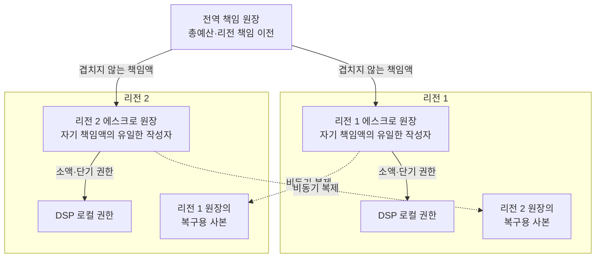

# ADR-002 다중 리전 원장 구조

상태: 승인

근거: [ADR-001 분산 캠페인 예산 예약](ADR-001-distributed-budget-reservation.md), [아키텍처 중요 요구사항](../asr.md)

## 1. 결정

전역 책임 원장과 리전별 독립 에스크로 원장을 결합한다.

- 전역 책임 원장은 캠페인 총예산을 겹치지 않는 리전 책임액으로 나눈다.
- 전역↔리전 책임 이전은 강하게 보존하고 단절 시 중단한다.
- 각 리전은 자기 책임액의 유일한 작성자다.
- 리전 원장의 세부 발급 기록은 반대 리전에 비동기 복제한다.
- 리전 장애 시 불확실한 책임액을 다른 리전에 즉시 재할당하지 않는다.
- 일반 입찰은 ADR-001에 따라 DSP 로컬 권한에서 처리한다.



비동기 화살표는 상대 리전의 책임액을 수정하지 않는다. 상대 리전에는 복구용 사본만 만들며 두 리전이 같은 책임액을 동시에 소비하지 않는다.

## 2. 보호할 사실의 등급

모든 내부 기록을 같은 강도로 복제하지 않는다.

### RPO 0

- 캠페인 총예산과 확정 지출
- 전역 미할당액과 리전별 책임액
- 전역↔리전 책임 이전
- DSP가 성공으로 접수한 `burl`과 캠페인 금액 효과

### 유실 가능하지만 보수적으로 복구

- 리전에서 DSP로 발급한 개별 권한 기록
- DSP 로컬의 미사용 권한과 아직 전달하지 않은 잠재 지출
- 실시간 집계와 페이싱용 투영 상태

세부 기록이 불확실하면 상위 책임액을 재사용하지 않는다. 이 정책은 초과지출 대신 예산 잠금과 입찰 기회 감소를 선택한다.

## 3. 불변식

```text
전역 미할당액
+ 리전 1 책임액
+ 리전 2 책임액
+ 캠페인 확정 지출
= 캠페인 총예산
```

- 금액 한 단위는 같은 순간에 한 책임 영역에만 속한다.
- 리전은 자기 책임액보다 많은 DSP 권한을 발급하지 않는다.
- 세부 사용량이 늦거나 유실되어도 리전 책임액은 늘어나지 않는다.
- 책임액 이전은 출발 리전의 사용을 먼저 막고 이전 사실을 복구 가능하게 보존한 뒤 도착 리전에 활성화한다.

## 4. 정상 처리

1. DSP는 로컬 권한으로 입찰 금액을 예약한다.
2. DSP 권한이 부족하면 같은 리전 원장에 보충을 요청한다.
3. 리전 원장은 자기 책임액 안에서만 권한을 발급한다.
4. 발급 세부 기록은 반대 리전에 비동기로 복제한다.
5. 리전 책임액 자체가 부족할 때만 전역 책임 이전을 요청한다.
6. 전역 책임 이전은 두 리전에 복구 가능하게 보존한 뒤 성공한다.

따라서 일반 입찰과 DSP 권한 보충은 리전 간 왕복을 기다리지 않고, 드문 리전 책임 재분배만 강한 조정을 사용한다.

## 5. 장애 계약

| 장애 | 동작 | 감수하는 손실 |
|---|---|---|
| DSP 인스턴스 | 해당 DSP 책임액을 격리하고 리스·예약 기한 뒤 남은 금액만 반환 | 소액 권한의 일시적 잠금 |
| 리전 원장 인스턴스·AZ | 같은 리전의 복제본으로 복구 | 해당 리전 보충의 일시 지연 |
| 리전 전체 | 다른 리전은 자기 책임액으로 계속 입찰하고 장애 리전 책임액은 동결 | 장애 리전 예산 활용 중단 |
| 리전 간 단절 | 양쪽이 자기 책임액만 사용하고 전역 재분배 중단 | 리전별 예산 불균형 |
| 전역 책임 원장 | 기존 리전 책임액으로 계속 처리하고 새 재분배 중단 | 책임액 소진 캠페인의 `NO_BID` 증가 |

장애 리전의 세부 기록이 불완전하면 다음 순서로 복구한다.

```text
리전 책임액 동결
→ 새 DSP 권한 발급 기한 종료
→ 기존 잠재 지출의 95초 종결 대기
→ RPO 0 과금 사실과 복구 이벤트 대조
→ 미사용임을 증명한 금액만 반환
```

확인되지 않은 금액을 광고주 지출로 만들지 않고, 확인되지 않은 상태로 다른 리전에 재발급하지도 않는다.

## 6. 검토한 대안

### 후보 1. 합의형 분할 원장

모든 권한 발급을 분할 원장에 기록하고 반대 리전 보존을 기다린다. 단일 작성자와 복제를 저장소에 맡기지만 모든 보충에 리전 간 왕복이 필요하다.

### 후보 2. 분할 RDB 주·대기 원장

RDB 조각별 주 작성자와 반대 리전 대기를 두고 경로표·작성 세대·차단 절차를 직접 운영한다. 통제력은 높지만 분산 원장 운영 책임과 정합성 오류 위험이 가장 크다.

### 후보 3. 리전별 독립 원장과 비동기 복제

리전 책임액을 강하게 분리하고 세부 발급은 각 리전에서 처리한다. 세부 기록 유실 시 상위 책임액을 동결하여 총예산을 지킨다.

## 7. 비교와 선택 근거

| 기준 | 후보 1 합의형 | 후보 2 분할 RDB | 후보 3 리전 독립 |
|---|---|---|---|
| 캠페인 예산 상한 | 강함 | 차단이 정확하면 강함 | 책임액 분리로 강함 |
| 모든 내부 발급 RPO 0 | 강함 | 강함 | 보장하지 않음 |
| 일반 입찰 지연 | 로컬 | 로컬 | 로컬 |
| DSP 권한 보충 | 리전 간 동기 | 리전 간 동기 | 리전 내부 |
| 리전 장애 격리 | 정족수에 의존 | 조각별 차단에 의존 | 다른 리전이 자기 몫으로 지속 |
| 예산 활용률 | 높음 | 높음 | 장애·불균형 시 낮음 |
| 운영 복잡도 | 높음 | 가장 높음 | 보수적 복구가 필요하지만 상대적으로 낮음 |

후보 3을 선택한다.

ADR-001은 원장 호출을 줄이기 위해 계층형 에스크로를 선택했다. 모든 하위 권한 발급을 다시 리전 간 동기 복제하면 그 장점이 줄어든다. 후보 3은 광고주 예산 상한과 외부에 성공을 알린 금액 사실을 강하게 보호하면서 내부 세부 기록에는 보수적 복구를 적용한다.

## 8. 결과

### 얻는 점

- 일반 입찰과 DSP 권한 보충에서 리전 간 왕복을 제거한다.
- 리전 단절 중에도 두 리전이 각자 할당받은 범위에서 계속 처리한다.
- 한 리전의 장애를 다른 리전의 초과지출이나 즉시 중단으로 전파하지 않는다.
- 합의형 데이터베이스나 자체 분할 원장에 모든 세부 상태를 맡기지 않는다.

### 감수하는 점

- 리전별 예산 파편화로 총 잔액이 있어도 한 리전에서 `NO_BID`할 수 있다.
- 장애 리전 책임액이 최대 리스·예약 기한 동안 묶인다.
- 실시간 지출 가시성과 페이싱 상태가 늦을 수 있다.
- 책임 이전, 동결, 대조와 보수적 회수 상태를 구현해야 한다.

## 9. 검증 조건

- 두 리전이 단절된 상태에서 동시에 발급해도 캠페인 총예산을 넘지 않는다.
- 전역 미할당액·리전 책임액·확정 지출의 합이 항상 총예산과 같다.
- 내부 발급 기록 유실 뒤 불확실한 책임액을 조기 재할당하지 않는다.
- 한 리전 장애 중 다른 리전은 자기 책임액으로 입찰을 계속한다.
- 전역↔리전 책임 이전의 중복·응답 유실이 책임액을 늘리지 않는다.
- 성공한 `burl`과 캠페인 금액 효과는 리전 장애 뒤에도 복구한다.

## 10. 후속 결정

1. 리전·DSP 권한 크기, 리스 기간, 보충 하한선과 파편화 상한
2. 리전 책임 이전·동결·회수의 상태 전이와 저장소
3. 예약 증표, `lurl`·`burl`, 95초 만료와 장애 복구
4. 이벤트 로그, 실시간 집계와 배치 대조
