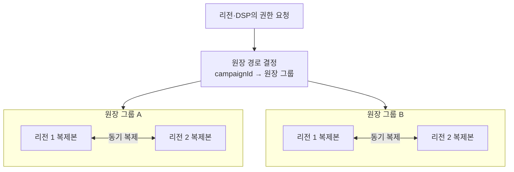
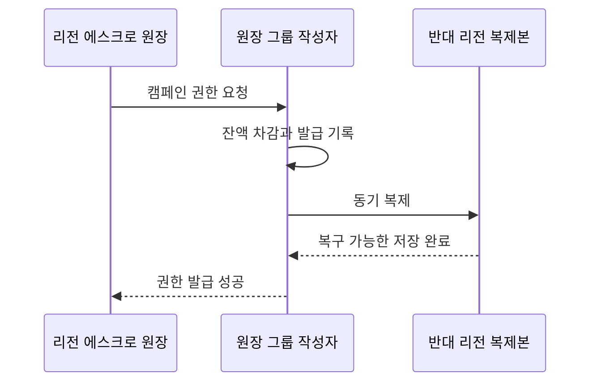

# ADR-002 다중 리전 원장 구조

상태: 검토 중 — 후보 1 작성

근거: [ADR-001 분산 캠페인 예산 예약](ADR-001-distributed-budget-reservation.md), [아키텍처 중요 요구사항](../asr.md)

## 1. 결정할 문제

전역·리전 원장을 두 리전에 어떻게 분할·복제하고 쓰기 권한을 차단하여 다음 조건을 함께 지킬지 결정한다.

1. 같은 캠페인 예산 권한을 중복 발급하지 않는다.
2. 성공한 권한 발급은 리전 장애에도 유실하지 않는다.
3. 원장 장애가 일반 입찰을 즉시 중단시키지 않는다.
4. 인스턴스·AZ·리전 하나의 장애를 전체 원장 장애로 확대하지 않는다.

원장 제품, 분할 방식, 복제 성공 기준과 장애 전환을 함께 결정한다. DSP 권한의 크기·리스·보충 정책은 이 ADR의 범위가 아니다.

## 2. 공통 평가 기준

| 기준 | 질문 |
|---|---|
| 중복 발급 방지 | 네트워크 단절과 이전 작성자 복구 때도 작성자가 하나인가? |
| RPO 0 | 성공한 권한 발급이 리전 하나와 함께 사라지지 않는가? |
| 부분 장애 격리 | 원장 그룹 하나의 장애가 다른 캠페인과 일반 입찰을 멈추지 않는가? |
| 보충 지연 | 리전·DSP 권한 보충이 입찰 기회를 과도하게 줄이지 않는가? |
| 운영 가능성 | 합의 알고리즘을 직접 구현하지 않고 설명·시험할 수 있는가? |

## 3. 후보 1 — 합의형 분할 원장

캠페인을 여러 원장 그룹으로 나누고 각 그룹을 두 리전에 동기 복제한다. 전역·리전 권한 발급은 두 리전에 복구 가능하게 저장된 뒤 성공한다.



원장 그룹은 여러 캠페인을 담당한다. 서로 다른 그룹은 독립적으로 처리하여 캠페인 경합과 장애 범위를 제한한다.

```text
hash(campaignId) → 원장 그룹
```

### 3.1 권한 발급



- 전역 원장 차감과 권한 발급 기록은 하나의 원자적 상태 전이다.
- 반대 리전 저장을 확인하기 전에는 성공으로 응답하지 않는다.
- 발급 식별자로 재시도를 멱등 처리한다.
- 합의 비용은 일반 입찰이 아니라 권한 보충 경로에서만 지불한다.

### 3.2 장애 동작

| 장애 | 동작 | 영향 |
|---|---|---|
| 원장 인스턴스 | 같은 리전의 복제본으로 교체 | 해당 그룹의 일시적 지연 |
| 원장 그룹 | 다른 그룹은 계속 처리 | 해당 캠페인들의 보충 중단 |
| 원장 전체 쓰기 | 새 권한 발급만 중단 | 기존 리전·DSP 권한으로 일반 입찰 지속 |
| 리전 단절 | 안전한 단일 작성자를 증명할 수 없으면 새 발급 중단 | 권한 소진 캠페인부터 `NO_BID` 증가 |

### 3.3 두 리전의 한계

두 리전은 단절 시 상대가 장애인지 통신만 끊긴 것인지 구분할 수 없다. 양쪽이 모두 작성자를 승격하면 같은 예산을 중복 발급한다.

따라서 후보 1 안에서도 다음 하나를 선택해야 한다.

#### 안전 중단

- 두 데이터 리전만 사용한다.
- 단일 작성자를 증명할 수 없으면 새 권한 발급을 중단한다.
- 기존 에스크로 권한으로 입찰을 계속하므로 즉시 전체 중단되지는 않는다.

#### 독립 투표자·차단 권한

- 예산 데이터를 갖지 않는 독립 주체가 한쪽에만 새 작성 세대를 부여한다.
- 생존 리전은 안전하게 권한 발급을 재개할 수 있다.
- 데이터 리전은 두 곳이지만 세 번째 장애 영역에 의존한다.

제품의 자동 전환 기능을 사용하더라도 어떤 방식인지 확인해야 하며, 이를 합의 알고리즘으로 직접 구현하지 않는다.

### 3.4 평가

| 평가 축 | 결과 | 남는 대가 |
|---|---|---|
| 중복 발급 방지 | 강함 | 단일 작성자를 증명할 수 없으면 중단 |
| 리전 RPO 0 | 강함 | 권한 발급마다 리전 간 동기 저장 |
| 일반 입찰 지연 | 강함 | 합의가 입찰 경로 밖에 있음 |
| 보충 지연 | 보통 | 리전 간 왕복이 필요 |
| 동시성·격리 | 강함 | 인기 캠페인은 해당 그룹 안에서 직렬화 |
| 리전 장애 가용성 | 조건부 | 자동 전환에는 독립 차단 권한 필요 |
| 운영 복잡도 | 높음 | 분할·복제·전환을 지원하는 저장소 필요 |

후보 1은 유효하다. 다만 `두 리전에서 안전 중단`과 `독립 차단 권한을 둔 자동 전환` 중 무엇을 감수할지는 다른 후보와 비교한 뒤 결정한다.

## 4. 다음 비교

후보 1과 같은 기준으로 다음 구조를 검토한다.

1. 분할 RDB 원장의 주·대기 복제와 명시적 차단
2. 리전별 원장 소유권 분할과 비동기 복제

후보를 모두 검토하기 전에는 저장소 제품이나 장애 전환 방식을 확정하지 않는다.
