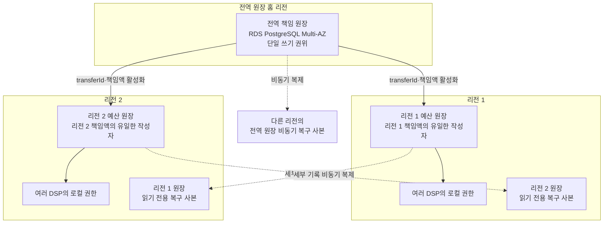

# ADR-002 다중 리전 원장 구조

상태: 승인

근거: [ADR-001 분산 캠페인 예산 예약](ADR-001-distributed-budget-reservation.md), [아키텍처 중요 요구사항](../../requirements/quality.md)

## 1. 결정

전역 책임 원장은 **한 홈 리전의 단일 쓰기 권위**로 운영하고, 각 리전 예산 원장은 자기 책임액만 독립적으로 쓴다.

- 전역 책임 원장은 RDS PostgreSQL Multi-AZ DB 인스턴스를 사용한다.
- 다른 리전에 비동기 복구 사본을 두지만 자동 승격하지 않는다.
- 전역 원장과 각 리전 원장은 서로 다른 물리 저장소·장애 경계다.
- 책임 이전은 전역 원장의 이전 기록과 대상 리전 원장의 활성화 증거를 같은 `transferId`로 연결한다.
- 전역 원장이나 홈 리전이 불확실하면 새 이전을 중단한다. 각 리전은 이미 받은 책임액으로 계속 입찰한다.
- 리전 원장의 세부 기록은 반대 리전에 비동기 복제하며, 불확실한 책임액은 재사용하지 않는다.



전역 원장의 장애는 입찰 장애가 아니다. 새 책임 이전만 중단하고 두 리전은 자기 책임액 안에서 계속 처리한다.

## 2. 보호 수준

### 반드시 지킬 비즈니스 불변식

- 같은 예산을 두 리전에 동시에 활성화하지 않는다.
- 불확실한 이전과 책임액을 미사용 예산으로 되돌리지 않는다.
- 전역 원장을 복구할 때 지역 활성화 증거보다 많은 예산을 재발급하지 않는다.

### 저장 수준

- 홈 리전의 인스턴스·AZ 장애: Multi-AZ 동기 대기 복제본으로 보호한다.
- 홈 리전 전체 장애: 전역 원장 쓰기를 중단하며 비동기 복구 사본은 원시 데이터 RPO 0을 보장하지 않는다.
- 리전 원장 세부 기록: 반대 리전 복구 사본이 늦거나 유실될 수 있다.

원시 기록의 유실 가능성과 초과 지출 허용은 같은 말이 아니다. 기록이 부족하면 재발급하지 않고 더 큰 금액을 동결해 비즈니스 불변식을 보존한다.

## 3. 불변식

```text
전역 예비액
+ 리전 1 책임 봉투
+ 리전 2 책임 봉투
+ 이전 중 격리액
= 캠페인 총예산
```

- 금액 한 단위는 같은 순간에 한 책임 영역에만 속한다.
- 리전은 자기 책임 봉투보다 많은 DSP 권한을 발급하지 않는다.
- 확정 지출은 리전 봉투 안의 분류 변경이며 전역 원장에 실시간 반영하지 않는다.
- 책임 이전은 전역 원장에서 먼저 격리하고 대상 리전이 같은 `transferId`를 한 번만 활성화한다.
- 응답이 유실되면 기존 이전·활성화 결과를 조회하며 새 이전으로 추정하지 않는다.

## 4. 정상 처리

1. 리전 원장이 고유한 `transferId`로 추가 책임액을 요청한다.
2. 전역 원장은 한 트랜잭션에서 예비액을 차감하고 이전 중 격리액과 이전 기록을 만든다.
3. 대상 리전 원장은 `transferId`를 멱등 확인해 책임액을 활성화하고 증거를 보존한다.
4. 전역 원장은 활성화 증거를 확인하고 이전 중 격리액을 해당 리전 책임 봉투로 바꾼다.
5. 어느 단계에서 응답이 유실돼도 같은 `transferId`로 재개한다.

전역 원장과 리전 원장을 분산 트랜잭션으로 묶지 않는다. 중간 상태에서는 금액을 사용할 수 없게 격리하며, 완료가 늦어지는 대가를 감수한다.

## 5. 장애와 복구

| 장애 | 동작 | 감수하는 손실 |
|---|---|---|
| 전역 원장 인스턴스·AZ | Multi-AZ 대기 복제본으로 자동 전환 | 새 이전의 일시 지연 |
| 전역 홈 리전 | 새 이전 중단, 자동 승격 금지 | 책임액 소진 캠페인의 `NO_BID` 증가 |
| 리전 원장 인스턴스·AZ | 같은 리전의 고가용 복제본으로 복구 | 해당 리전 보충의 일시 지연 |
| 리전 전체 | 다른 리전은 자기 책임액으로 지속, 장애 리전 책임액 동결 | 장애 리전 예산 활용 중단 |
| 이전 응답 유실 | 같은 `transferId`의 전역 기록과 지역 활성화 증거 조회 | 책임액 활성화 지연 |

홈 리전이 영구 소실되면 다음 순서로 쓰기 권위를 복구한다.

```text
전역 이전 중단과 새 원장 차단
→ 비동기 복구 사본 확보
→ 생존한 지역 활성화 증거 수집
→ 확인할 수 없는 리전·이전 금액을 최대 범위로 동결
→ 불변식 검증
→ 새 단일 쓰기 세대 발급
→ 책임 이전 재개
```

복구 사본의 예비액을 그대로 신뢰하지 않는다. 어느 리전의 최신 증거를 확인할 수 없으면 그 리전에 속할 수 있는 금액 전체를 동결한다. 복구가 느리거나 예산이 장시간 묶일 수 있지만 중복 책임은 만들지 않는다.

## 6. 검토한 대안

| 대안 | 장점 | 탈락 이유 |
|---|---|---|
| 관리형 다중 리전 강한 원장 | RPO 0, 두 리전 쓰기와 자동 장애 생존 | 전역 이전은 중단 가능하므로 현재 요구보다 강하며 핵심 복구 문제를 제품에 위임 |
| 두 리전 RDB를 애플리케이션이 동시 갱신 | 제품 의존이 적어 보임 | 합의·차단·부분 커밋을 애플리케이션이 떠안아 정합성 위험이 큼 |
| 홈 리전 단일 쓰기 원장과 보수적 복구 | 단순한 정상 경로, 장애 중 기존 지역 책임액으로 지속 | 전역 이전 중단, 수동 차단·대조와 예산 동결 필요 |

홈 리전 단일 쓰기 원장과 보수적 복구를 선택한다. 관리형 다중 리전 합의가 필요할 만큼 전역 이전 가용성이 중요해지면 Aurora DSQL 같은 강한 원장으로 교체할 수 있다.

## 7. 결과

### 얻는 점

- 합의 데이터베이스를 직접 구현하지 않고 단일 쓰기 권위를 명확히 한다.
- 전역 원장 장애가 입찰 Hot Path와 기존 리전 책임액 사용으로 전파되지 않는다.
- 멱등 이전, 격리, 차단과 재구성이라는 애플리케이션의 분산 정합성 문제를 검증할 수 있다.
- 관리형 다중 리전 원장보다 배포와 비용을 단순화한다.

### 감수하는 점

- 홈 리전 장애 중 새 책임 이전을 수행하지 못한다.
- 비동기 복구 사본에는 원시 데이터 유실 구간이 있을 수 있다.
- 자동 승격 대신 차단·대조·보수적 동결 절차가 필요하다.
- 복구 뒤에도 증명되지 않은 예산은 장시간 사용하지 못할 수 있다.

## 8. 검증 조건

- 전역 이전 요청·응답을 중복·유실해도 같은 `transferId`의 금액 효과는 한 번이다.
- 전역 기록 뒤와 지역 활성화 뒤에 각각 장애를 주입해도 같은 금액이 두 리전에 활성화되지 않는다.
- 홈 리전 장애 중 새 이전은 중단되고 두 리전은 기존 책임액으로 계속 입찰한다.
- 오래된 비동기 복구 사본으로 복구해도 지역 증거가 없는 금액을 재발급하지 않는다.
- 한 지역 원장의 최신 증거를 읽을 수 없으면 해당 최대 책임액을 동결한다.
- 새 쓰기 세대가 발급된 뒤 이전 세대 원장은 쓰기를 재개하지 못한다.

## 9. 후속 작업

- [ADR-003](ADR-003-regional-budget-allocation.md)은 이전 중 격리와 지역 멱등 활성화 절차를 따른다.
- [ADR-008](ADR-008-global-responsibility-ledger-store.md)은 전역 원장의 PostgreSQL 배치와 대안을 기록한다.
- 리전 예산 원장의 저장 기술과 복구 배치는 별도 결정으로 남긴다.
