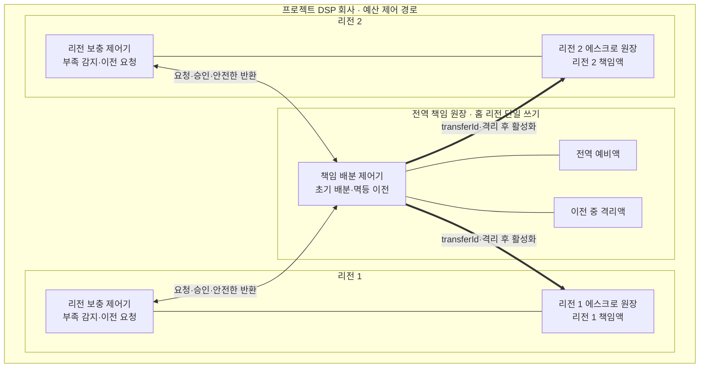

# ADR-003 리전 예산 배분과 이전

상태: 승인

근거: [ADR-001 분산 캠페인 예산 예약](ADR-001-distributed-budget-reservation.md), [ADR-002 다중 리전 원장 구조](ADR-002-multi-region-ledger-topology.md)

## 1. 결정

캠페인을 시작할 때 전역 책임 원장이 예산을 **두 리전의 초기 책임액과 전역 예비액**으로 나눈다. 실행 중 추가 책임액은 리전 원장이 요청하고, 전역 책임 원장이 입찰 경로 밖에서 승인한다.

- 리전 원장은 자기 책임액이 부족해질 때만 추가 이전을 요청한다.
- 전역 책임 원장은 먼저 전역 예비액에서 이전한다.
- 다른 리전의 책임액은 그 리전이 사용을 중단하고 반환을 확정한 뒤에만 이전한다.
- 리전끼리 직접 예산을 이전하지 않는다.
- 각 리전은 자기 책임액만 독립적으로 페이싱한다. 이전받은 책임액은 남은 캠페인 기간에 걸쳐 DSP 리스로 공급한다.
- 책임 이전은 입찰 경로 밖에서 수행한다. 이전을 기다리는 대신 기존 책임액이 없으면 `NO_BID`한다.
- 전역 원장이나 리전 간 연결이 불확실하면 새 이전을 중단한다.

여기서 비동기란 입찰이 이전 완료를 기다리지 않는다는 뜻이다. 전역 격리와 지역 활성화는 각 저장소에서 원자적으로 처리하고, 둘 사이의 불확실한 중간 상태에서는 금액을 사용하지 않는다.



전역 제어기는 책임액의 유일한 배분 권위이고, 리전 제어기는 자기 리전의 부족을 감지해 요청하는 주체다. 리전 간 직접 연결은 없으며 모든 화살표는 입찰 경로 밖의 제어 의존성이다.

## 2. 불변식

```text
전역 예비액
+ 리전 1 책임 봉투
+ 리전 2 책임 봉투
+ 이전 중 격리액
= 캠페인 총예산
```

- 금액 한 단위는 같은 순간에 한 책임 영역에만 속한다.
- 이전 중인 금액은 출발지와 도착지 어느 쪽도 사용할 수 없다.
- 도착 리전은 이전 승인을 복구 가능하게 확인한 뒤 책임액을 활성화한다.
- 같은 이전 요청을 반복해도 금액 효과는 한 번만 발생한다.
- 확정 지출은 리전 책임 봉투 안에 남으며 전역 예비액 계산에 실시간 합산하지 않는다.

## 3. 정상 처리

1. 캠페인 시작 시 전역 책임 원장이 초기 책임액과 예비액을 기록한다.
2. 리전 원장은 자기 책임액 안에서 DSP 권한을 발급한다.
3. 책임액이 부족해지면 리전 원장이 전역 원장에 고유한 이전 ID로 요청한다.
4. 전역 원장은 예비액 차감·이전 중 격리·이전 기록을 한 트랜잭션으로 커밋한다.
5. 대상 리전은 같은 `transferId`를 멱등 활성화하고 증거를 보존한다.
6. 전역 원장은 활성화 증거를 확인해 이전 중 격리액을 해당 리전 책임 봉투로 바꾼다.
7. 예비액이 부족하면 다른 리전이 미사용 책임액을 반환한 경우에만 다시 이전한다.

초기 비율, 예비액 비율, 요청 임계치와 이전 단위는 운영 설정이며 이 ADR에서 고정하지 않는다.

## 4. 장애 계약

| 장애 | 동작 | 감수하는 손실 |
|---|---|---|
| 전역 원장 또는 리전 간 연결 | 새 이전을 멈추고 각 리전은 기존 책임액만 사용 | 책임액 소진 캠페인의 `NO_BID` |
| 이전 요청·응답 유실 | 같은 이전 ID로 재시도하여 기존 결과를 반환 | 책임액 보충 지연 |
| 출발지 반환 후 도착지 활성화 전 장애 | 이전 중 격리액으로 보존하고 복구 후 계속 처리 | 해당 금액의 일시적 잠금 |
| 리전 전체 장애 | 장애 리전 책임액을 동결하고 정상 리전은 자기 책임액으로 지속 | 장애 리전에 남은 예산의 활용 중단 |
| 전역 홈 리전 영구 소실 | 자동 승격하지 않고 지역 활성화 증거를 대조하며 불확실한 금액은 동결 | 전역 이전의 장기 중단과 예산 미사용 |

불확실한 금액을 다른 리전에 먼저 주지 않는다. 가용성 저하는 허용하지만 캠페인 총예산 초과는 허용하지 않는다.

## 5. 검토한 대안

| 대안 | 장점 | 탈락 이유 |
|---|---|---|
| 고정 배분, 실행 중 이전 없음 | 가장 단순하고 장애 영향이 작음 | 리전별 트래픽 편차가 곧 예산 파편화와 입찰 손실이 됨 |
| 중앙 예측기가 능동 재배분 | 예산 활용률과 페이싱을 세밀하게 최적화 가능 | 별도 제어 시스템과 예측 정확성이 필요해 기술 프로젝트의 핵심 범위를 벗어남 |
| 리전 요청형 이전 | 입찰 경로를 건드리지 않고 실제 부족에만 대응 | 보충 지연과 일시적 `NO_BID`를 감수해야 함 |

리전 요청형 이전을 선택한다. 과금 정합성과 입찰 지연을 보호하면서, 중앙 예측 시스템 없이 다중 리전의 예산 파편화를 완화할 수 있다.

## 6. 결과

### 얻는 점

- 입찰 경로에 전역 원장 호출이 생기지 않는다.
- 한 리전이나 전역 원장의 장애가 다른 리전의 기존 책임액 사용을 막지 않는다.
- 중복 요청과 중간 장애에도 같은 예산이 두 리전에 활성화되지 않는다.
- 수요 예측보다 분산 정합성과 장애 격리 구현에 프로젝트 범위를 집중한다.

### 감수하는 점

- 책임액 보충이 늦으면 전체 예산이 남아 있어도 `NO_BID`할 수 있다.
- 리전 간 트래픽 편차로 예산 활용률이 낮아질 수 있다.
- 반환·격리·활성화와 멱등 재시도 상태를 구현해야 한다.

## 7. 검증 조건

- 두 리전이 동시에 추가 책임액을 요청해도 책임액과 확정 지출의 합이 총예산을 넘지 않는다.
- 요청·응답을 중복하거나 유실해도 하나의 이전이 한 번만 반영된다.
- 이전 도중 어느 지점에서 장애가 나도 같은 금액을 두 리전이 사용하지 않는다.
- 전역 원장과 리전 간 연결을 끊어도 각 리전은 기존 책임액으로 입찰을 계속한다.
- 책임액이 소진된 리전은 이전 완료를 입찰 요청에서 기다리지 않고 `NO_BID`한다.

## 8. 후속 작업

- [ADR-004](ADR-004-auction-execution-path.md)는 기한·상한·DSP별 격리가 있는 병렬 경매 실행 경로를 선택했다.
- [ADR-005](ADR-005-durable-budget-events.md)는 표준 OpenRTB 통지, DSP 내부 멱등 기록과 리스 단위 정산을 선택했다.
- [ADR-008](ADR-008-global-responsibility-ledger-store.md)은 전역 원장의 PostgreSQL 단일 쓰기 권위와 자동 승격 금지를 선택했다.
- 초기 배분율, 예비액 비율, 이전 단위와 임계치는 상세 설계와 부하 시험으로 정한다.
