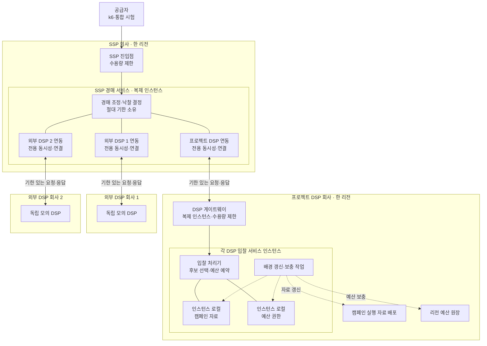

# ADR-004 경매 실행 경로와 과부하 격리

상태: 승인

근거: [아키텍처 중요 요구사항](../asr.md), [ADR-001 분산 캠페인 예산 예약](ADR-001-distributed-budget-reservation.md)

## 1. 결정

경매를 **기한이 전파되는 제한된 병렬 실행 경로**로 구성한다.

- SSP는 처리 중 작업 수에 상한을 두고, 기한 안에 처리할 수 없는 요청을 대기시키지 않고 기술 실패로 거절한다.
- SSP는 프로젝트 DSP와 두 외부 DSP를 병렬 호출한다.
- DSP 회사별로 동시성, 연결과 시간 제한을 분리한다. 한 DSP의 지연은 그 DSP의 입찰만 제외한다.
- 재시도는 경매 경로에서 하지 않는다.
- 프로젝트 DSP는 요청 시점의 로컬 캠페인 자료와 로컬 예산 권한만 사용한다.
- 캠페인 자료 갱신, 예산 보충, 사건 전달과 집계는 경매 경로와 실행 자원을 분리한다.
- 50ms는 호출자 관측 목표이고 `tmax=180ms`는 절대 무효화 상한이다. 내부 단계는 50ms 안에서 남은 기한만 사용한다.

실선은 경매 경로의 의존성, 점선은 경매와 자원을 공유하지 않는 배경 의존성이다. 같은 구성을 두 리전에 반복 배치하며 리전 진입과 전환 방식은 ADR-006에서 정한다.

이 결정은 스레드, 비동기 입출력 또는 가상 스레드 중 하나를 고정하지 않는다. 어떤 구현을 사용하더라도 같은 기한·상한·격리 계약을 지켜야 한다.

## 2. 시간과 자원 계약

1. SSP는 요청을 받을 때 단조 시계 기준의 절대 기한을 만든다.
2. 각 DSP 호출에는 전체 기한보다 이른 하위 기한과 현재 남은 시간을 전달한다.
3. DSP 응답은 하위 기한이 끝나면 취소하고 이후 도착한 입찰을 무시한다.
4. SSP는 기한 안에 도착한 유효 입찰만으로 낙찰을 결정한다.
5. 공유 대기열, 공유 연결 고갈 또는 한 DSP의 지연이 다른 DSP의 실행 자원을 소비하지 못하게 한다.
6. 프로젝트 DSP의 로컬 자료가 준비되지 않았으면 기술 실패로 종료한다. 정상 자료는 있지만 적격 캠페인이나 로컬 예산 권한이 없으면 `NO_BID`하며, 어느 경우에도 외부 저장소를 기다리지 않는다.

내부 단계별 시간, 동시 처리 수, 연결 수와 차단 임계치는 부하 시험으로 정하며 이 ADR에서 숫자를 고정하지 않는다.

## 3. 과부하 계약

| 상황 | 동작 | 보호 대상 |
|---|---|---|
| SSP 처리 한도 초과 | 진입점에서 초과 요청을 즉시 기술 실패로 거절 | 수용한 요청의 p99 50ms |
| DSP 회사별 한도 초과 | 해당 DSP 호출만 생략하거나 실패 처리 | 다른 DSP와 SSP 경매 |
| 프로젝트 DSP 한도 초과 | 게이트웨이 또는 DSP 진입점에서 조기 거절 | 수용한 입찰의 지연과 예산 정합성 |
| 배경 작업 적체 | 제한된 별도 대기열에 보존하고 경매 자원을 점유하지 않음 | 입찰 CPU·메모리·연결 |
| 부하 감소 | 새 요청 수용을 자동 회복하되 적체를 한꺼번에 방출하지 않음 | 30초 이내 정상 회복 |

과부하에서 모든 요청의 성공을 목표로 하지 않는다. 최소 400 RPS의 보호 요청을 정확하고 50ms 안에 처리하고 초과분을 명시적으로 포기한다.

## 4. 검토한 대안

| 대안 | 장점 | 탈락 이유 |
|---|---|---|
| 공유 실행 자원과 대기열 | 구현이 단순하고 평상시 자원 활용률이 높음 | 느린 DSP와 초과 요청이 대기열·연결·스레드를 점유해 전체 지연으로 전파됨 |
| 제한 없는 비동기 병렬 호출 | 호출 대기 중 스레드 사용을 줄이고 높은 동시성을 얻기 쉬움 | 실행 중 작업과 메모리에 상한이 없어 과부하를 제거하지 못하고 실패를 증폭할 수 있음 |
| 기한·상한·DSP별 격리가 있는 병렬 경로 | 지연 전파와 자원 고갈을 경계별로 제한 | 일부 입찰과 초과 요청을 포기하며 상한 조정이 필요함 |

기한·상한·DSP별 격리가 있는 병렬 경로를 선택한다. 처리량 극대화보다 정확성과 보호 요청의 지연을 우선한다.

## 5. 결과

### 얻는 점

- 외부 DSP 하나의 지연이 전체 경매의 지연으로 번지는 것을 막는다.
- 과부하가 긴 대기열과 시간 초과 폭주로 바뀌기 전에 차단한다.
- 프로젝트 DSP의 입찰은 네트워크와 저장소 장애에서 분리된다.
- HTTP/JSON을 다른 표현으로 바꾸거나 실행 기술을 교체해도 같은 경계를 유지할 수 있다.

### 감수하는 점

- 아직 처리 능력이 남아 있어도 보수적인 상한 때문에 요청을 거절할 수 있다.
- DSP별 연결·동시성·기한과 배경 작업 자원을 따로 운영해야 한다.
- 느리지만 높은 가격의 입찰을 기다리지 않아 경매 수익 기회를 잃을 수 있다.
- 잘못 조정한 상한은 처리량 저하 또는 지연 악화를 만든다.

## 6. 검증 조건

- 500 RPS를 10분간 처리할 때 기술 실패·누락·잘못된 낙찰 없이 호출자 관측 p99가 50ms 이하다.
- 외부 DSP 하나를 지연·실패시켜도 다른 DSP로 경매를 계속하고 p99 50ms를 지킨다.
- 1,000 RPS에서 최소 400 RPS를 p99 50ms 안에 처리하고 초과 요청을 명시적으로 거절한다.
- 부하를 100 RPS로 낮춘 뒤 30초 안에 정상 수용률과 지연으로 회복한다.
- 180ms 뒤 도착한 DSP 응답이 낙찰 결과에 영향을 주지 않는다.
- 경매와 배경 작업의 대기열·처리 중 작업·연결·CPU·메모리를 분리해 관측할 수 있다.

## 7. 후속 작업

- [ADR-005](ADR-005-durable-budget-events.md)는 독립 발신함·수신함과 멱등 금액 사건 처리를 선택했다.
- [ADR-006](ADR-006-multi-region-service-topology.md)은 두 리전 능동 실행과 리전별 독립 장애 격리를 선택했다.
- 단계별 시간 예산, 동시성 상한, 연결 수와 차단·회복 임계치는 상세 설계와 부하 시험으로 정한다.
