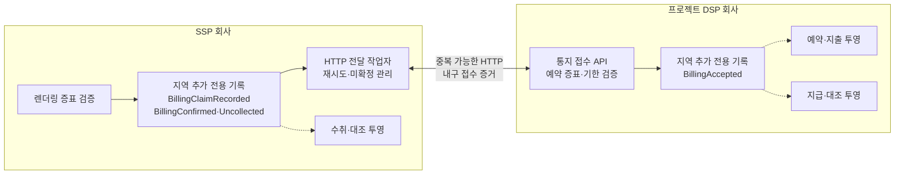
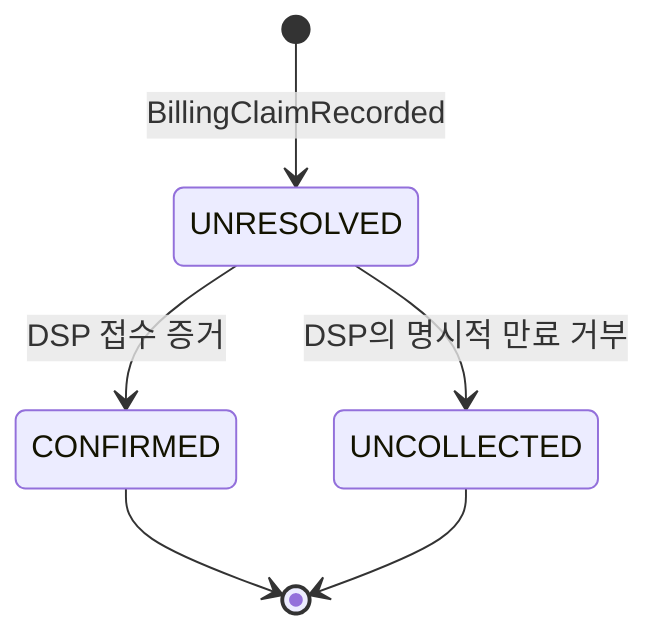
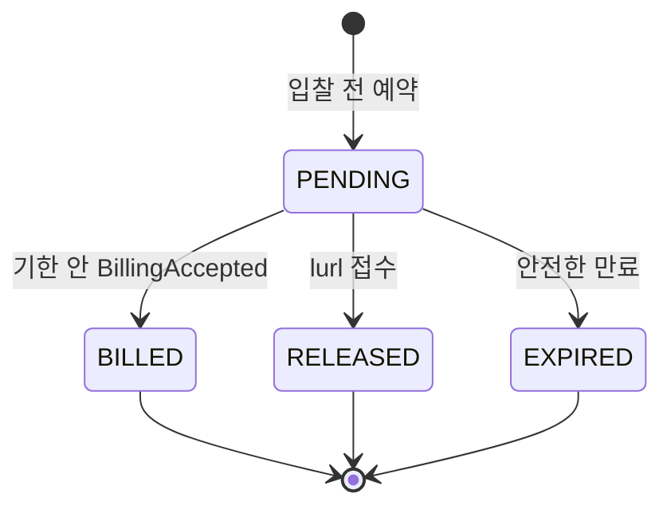

# ADR-005 독립 장부의 금액 사건 수렴

상태: 승인

근거: [아키텍처 중요 요구사항](../../requirements/quality.md), [ADR-001 분산 캠페인 예산 예약](ADR-001-distributed-budget-reservation.md)

## 1. 결정

SSP와 프로젝트 DSP는 금액 장부를 공유하지 않는다. 각자 지역 추가 전용 기록에 자기 책임의 사건을 남기고, **멱등 HTTP 통지와 내구 접수 증거, 재시도와 사후 대조**로 하나의 경제적 결과에 수렴한다.

- SSP는 유효한 렌더링을 확인하면 `BillingClaimRecorded`를 해당 리전 기록에 추가한다. 이 사건 자체가 `burl` 전달 책임을 뜻한다.
- DSP는 `burl`을 기한 안에 처음 접수하면 `BillingAccepted`를 해당 리전 기록에 추가하고 내구 접수 증거를 반환한다.
- SSP는 DSP의 접수 증거를 받으면 `BillingConfirmed`를 추가한다. DSP가 명시적으로 만료를 거부하면 `BillingUncollected`를 추가한다.
- 응답 없음과 시간 초과는 상대 결과를 모르는 `UNRESOLVED`이지 미과금의 증거가 아니다. SSP는 같은 `eventId`로 재시도한다.
- DSP는 같은 `eventId`에 최초 결과를 반복 반환한다. 기한 안에 이미 접수한 사건은 기한 뒤 재시도에도 기존 성공 결과를 반환하고, 접수된 적 없는 기한 뒤 사건만 거부한다.
- SSP와 DSP의 지역 기록은 리전 간 실시간 합의를 하지 않는다. 각 회사의 전역 집계는 지역 사건을 비동기로 병합하고 `eventId`로 중복을 제거한다.
- 업체 간 정확히 한 번 전달이나 분산 트랜잭션을 가정하지 않는다. 중복 전달은 허용하지만 캠페인 금액 효과는 한 번만 허용한다.
- 리전 재해 중 아직 복제되지 않았거나 영구 전달하지 못한 SSP 청구의 손실은 SSP가 부담한다. 광고주에게 중복 또는 기한 뒤 과금하지 않는다.
- `nurl`은 낙찰 사실이고 금액을 바꾸지 않는다. `lurl` 유실은 DSP의 95초 만료가 안전하게 대체한다.

지역 기록은 회사별 권위다. 두 회사는 저장소와 메시지 기반 시설을 공유하지 않으며 외부 경계에는 DSP가 공개한 HTTP 주소만 사용한다.

## 2. 사건과 상태

금액 원본은 수정 가능한 상태 레코드가 아니라 불변 사건이다.

| 회사 | 사건 | 의미 |
|---|---|---|
| SSP | `BillingClaimRecorded` | 렌더링을 과금 가능한 청구 근거로 인정하고 `burl` 전달 책임을 가짐 |
| DSP | `BillingAccepted` | 청구를 기한 안에 접수하고 캠페인 예약을 확정할 근거를 가짐 |
| SSP | `BillingConfirmed` | DSP의 내구 접수 증거를 받음 |
| SSP | `BillingUncollected` | DSP가 접수되지 않은 만료 사건임을 명시적으로 확인함 |

현재 상태는 사건을 투영해서 만든다. 투영은 지연되거나 다시 만들 수 있으며 금액 원본이 아니다.

DSP 예약의 금액 효과는 다음 단방향 전이를 유지한다.

`BillingAccepted`의 최초 내구 접수 시각이 95초 경계를 결정한다. 접수 사건의 투영이 늦었다면 `BILLED`가 우선한다. 만료 작업은 기한까지 접수된 지역 사건을 처리했다는 기준점을 확인하지 못하면 예약을 조기에 반환하지 않는다.

입찰 응답의 불투명 예약 증표에는 예약·캠페인 식별자, 금액, 만료 시각과 리스 세대를 검증할 인증 정보를 포함한다. 원래 DSP 인스턴스가 사라져도 같은 회사의 다른 인스턴스가 검증할 수 있어야 한다.

## 3. 장애 계약

| 장애 시점 | 결과와 회복 |
|---|---|
| SSP 지역 기록 전 장애 | 성공을 반환하지 않으며 클라이언트가 같은 렌더링 증표로 재시도 |
| SSP 기록 뒤 응답 유실 | 같은 `eventId`를 지역에서 멱등 처리하거나 다른 리전에 중복 기록하고 전역 투영에서 제거 |
| `burl` 전달 전 SSP 인스턴스 장애 | 지역 기록을 읽는 다른 작업자가 재전달 |
| DSP 기록 전 장애 | 성공 응답이 없으므로 SSP가 재전달 |
| DSP 기록 뒤 응답 유실 | DSP가 기존 내구 접수 증거를 반복 반환 |
| 투영 처리기 장애 | 지역 사건에서 예약·지출·수취·지급 투영을 재생 |
| 리전 일시 중단 | 다른 리전은 독립 처리하고 중단 리전 기록은 복구 뒤 재개 |
| 영구 단절·미복제 사건 | 양사 대조에서 차이를 드러내고 광고주에게 추측 과금하지 않음 |

시간 초과만으로 `CONFIRMED` 또는 `UNCOLLECTED`를 만들지 않는다. 네트워크가 회복되면 동일 요청은 DSP에 이미 있는 최초 결과를 돌려받는다. 영구적으로 결과를 확인할 수 없는 사건은 자동으로 반대 결과를 만들지 않고 대조 대상으로 남긴다.

## 4. 검토한 대안

| 대안 | 장점 | 탈락 이유 |
|---|---|---|
| 공유 장부·업체 간 분산 트랜잭션 | 순간적으로 하나의 상태처럼 보임 | 회사 책임과 장애를 결합하고 지연·운영 복잡도가 과도함 |
| 두 리전의 금액 사건을 매번 강하게 동기화 | 리전 재해에서도 최근 사건을 보존 | 지역 자율성과 확장성을 낮추며 현재 손실 정책보다 강한 보장 |
| 독립 지역 사건과 멱등 HTTP·대조 | 회사·리전 책임을 격리하고 한 번의 금액 효과로 수렴 | 일시적 불균형, 중복 전달과 사후 대조가 필요함 |

독립 지역 사건과 멱등 HTTP·대조를 선택한다. 실시간 장부 일치보다 회사별 책임, 지역 격리와 모순 없는 최종 금액 효과를 우선한다.

## 5. 결과

### 얻는 점

- SSP와 DSP가 각자 자기 사실과 장애를 소유한다.
- 리전 간 실시간 금액 상태 공유가 경매나 통지 처리의 선행 조건이 아니다.
- 인스턴스 장애와 응답 유실 뒤에도 지역 사건을 재생하고 통지를 재시도할 수 있다.
- 중복 전달과 다른 리전 재접수가 캠페인 금액을 두 번 바꾸지 않는다.
- 차이를 사건 단위로 설명하고 보정할 수 있다.

### 감수하는 점

- 양사와 리전별 장부는 일시적으로 다르다.
- 리전 재해에서 아직 비동기 복제되지 않은 사건을 잃을 수 있다.
- 미확정 사건, 재시도, 중복 제거와 대조 투영을 운영해야 한다.
- 영구적으로 확인하지 못한 청구는 SSP 수익 손실이 될 수 있다.

## 6. 검증 조건

- `lurl`·`burl`과 응답을 중복·유실시켜도 캠페인 금액 효과가 한 번만 발생한다.
- DSP가 기한 안에 접수한 사건은 기한 뒤 재시도에도 동일한 접수 증거를 반환한다.
- DSP가 접수하지 않은 기한 뒤 사건은 캠페인 금액을 변경하지 않는다.
- 응답 없음만으로 SSP가 `BillingUncollected`를 만들지 않는다.
- 지역 기록과 투영 처리기를 중단한 뒤 원본 사건에서 전달·지출·대조 상태를 복구한다.
- 같은 사건이 두 SSP 리전에 기록돼도 전역 투영과 DSP 금액 효과는 한 건이다.
- 정상 흐름에서는 `BillingConfirmed`와 `BillingAccepted`의 사건 ID·금액 합계가 일치한다.
- 불일치는 사건 ID, 회사별 최종 증거와 손실 귀속으로 설명할 수 있다.

## 7. 후속 작업

- ADR-006은 두 리전의 독립 실행과 지역 기록 배치를 반영한다.
- 저장 기술은 리전 내부 내구 append, 사건 재생, 멱등 키, 지역 고가용과 비동기 병합 능력으로 비교한다.
- 사건 형식, 접수 증거, 재시도 간격, 보존 기간과 대조 주기는 상세 설계에서 정한다.
