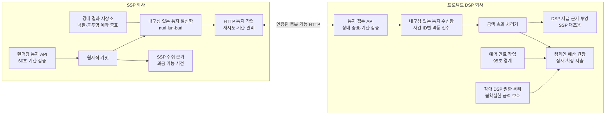
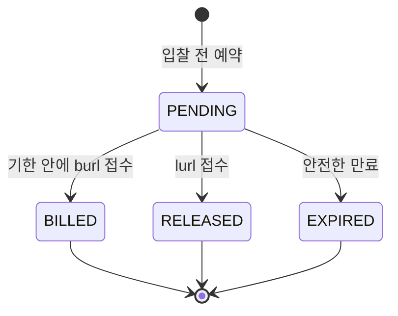

# ADR-005 금액 사건의 내구성과 복구

상태: 승인

근거: [아키텍처 중요 요구사항](../../requirements/quality.md), [ADR-001 분산 캠페인 예산 예약](ADR-001-distributed-budget-reservation.md)

## 1. 결정

SSP와 프로젝트 DSP 사이의 금액 사건을 **독립된 발신함·수신함과 멱등 HTTP 통지**로 연결한다.

이 결정에서 외부 금액 사건은 잠재 지출을 해제하는 `lurl`과 확정하는 `burl`이다. `nurl`은 금액을 바꾸지 않는 경매 결과 사건이며, 95초 만료는 DSP가 잠재 지출을 해제하기 위해 자체 발생시키는 내부 종결 사건이다.

- SSP는 DSP 입찰 응답에 포함된 공개 계약 주소로 `nurl`·`lurl`·`burl`을 HTTP 호출한다. 양사가 공유하는 메시지 브로커는 두지 않는다.
- SSP는 과금 가능 사실과 `burl` 발신 책임을 하나의 저장 트랜잭션으로 만든다. 둘 중 하나만 존재하는 상태를 허용하지 않는다.
- SSP는 프로젝트 DSP가 성공으로 접수할 때까지 `lurl`·`burl`을 HTTP로 재전달한다.
- 프로젝트 DSP는 통지에 성공 응답하기 전에 `eventId` 고유 제약이 있는 내구성 있는 수신함에 기록한다. 중복 요청에는 최초 접수 결과를 반환한다.
- SSP가 성공으로 접수한 과금 가능 사실과 `burl` 발신 책임, DSP가 성공으로 접수한 `burl`은 리전 하나를 잃어도 복구하도록 RPO 0으로 보존한다.
- 수신함의 사건과 캠페인 금액 효과는 같은 회사 내부에서 멱등하게 반영한다.
- 전달은 여러 번 일어날 수 있지만 예약 해제 또는 과금 확정은 한 번만 일어난다.
- SSP와 프로젝트 DSP는 저장소나 분산 트랜잭션을 공유하지 않는다.
- 예약 뒤 95초 안에 유효한 `burl`이 내구성 있게 접수되지 않으면 예약을 해제하고 이후 금액 변경을 거부한다.
- `burl` 기한은 원장 반영 시각이 아니라 DSP 수신함의 최초 내구 접수 시각으로 판정한다.
- `burl`은 실제 송금이 아니라 양사가 각자 수취·지급 근거를 만드는 과금 가능 통지다. 청구서와 실제 송금은 범위 밖이다.

SSP 발신함과 DSP 수신함은 서로 다른 회사의 독립 저장소다. 외부 경계에는 HTTP만 사용한다. 네트워크 전달의 정확히 한 번을 가정하지 않고, 내구성 있는 재시도와 금액 효과의 멱등성으로 한 번의 결과를 만든다.

## 2. 금액 상태 계약

| 입력 | DSP의 금액 효과 |
|---|---|
| 입찰 예약 | 로컬 예산 권한에서 잠재 지출을 격리하고 검증 가능한 불투명 증표 생성 |
| `nurl` | 낙찰 사실만 기록하고 금액은 잠재 상태 유지 |
| `lurl` | 유효한 잠재 지출을 한 번 해제 |
| `burl` | 유효한 잠재 지출을 한 번 확정 지출로 전환 |
| 예약 후 95초 경과 | 결과가 없는 잠재 지출을 한 번 해제 |
| 95초 뒤 `burl` 또는 모순 사건 | 기록·격리하되 금액을 다시 변경하지 않음 |

`burl`은 프로젝트 DSP가 리전 장애 뒤에도 복구 가능하게 접수한 시점에 과금 사실로 인정한다. 실제 원장 투영이 뒤따르더라도 이미 격리된 잠재 지출 안에서만 확정되므로 캠페인 총예산을 넘지 않는다.

예약 상태는 다음 단방향 전이만 허용한다.

종결 상태는 다시 변경하지 않는다. `burl`이 기한 안에 수신함에 저장됐지만 원장 반영이 늦어진 경우에는 `BILLED`가 우선한다. 만료 작업은 해당 기한까지 내구 접수된 통지가 모두 처리됐다는 기준점을 확인한 뒤에만 `EXPIRED`로 전이한다. 확인할 수 없으면 예산을 조기에 반환하지 않고 잠근다.

입찰 응답의 불투명 예약 증표에는 최소한 예약·캠페인 식별자, 금액, 만료 시각과 리스 세대를 검증할 수 있는 인증 정보를 포함한다. SSP는 증표를 해석하거나 변경하지 않고 통지에 돌려준다. 원래 DSP 인스턴스가 사라져도 다른 인스턴스가 같은 예약을 검증할 수 있어야 한다.

SSP의 과금 가능 사건은 DSP로부터 받을 금액의 근거이고 DSP가 접수한 `burl`은 SSP에 지급할 금액과 광고주 캠페인 지출의 근거다. 양사는 같은 사건 ID와 금액을 독립적으로 집계하고 정상 기한 안에 접수된 결과를 시험에서 대조한다. 이 대조는 실시간 합의나 업체 간 분산 트랜잭션이 아니다.

## 3. 장애 복구 계약

- SSP는 렌더링 사실과 통지를 같은 내구성 경계에 기록한 뒤 접수 성공을 반환한다.
- DSP는 사건 ID와 예약 ID를 기준으로 중복을 제거하고 접수 사실을 잃지 않은 뒤 성공을 반환한다.
- 응답이 유실되면 SSP가 같은 사건을 재전달하고 DSP는 기존 접수 결과를 반환한다.
- 원래 DSP 인스턴스가 사라져도 불투명 증표와 상위 예산 권한을 이용해 다른 인스턴스가 사건을 검증한다.
- 개별 예약 기록이 유실되면 해당 DSP에 발급한 상위 권한을 격리한다. 마지막 예약 가능 시각부터 95초가 지나고 미사용임을 증명한 금액만 반환한다.
- 사건 처리기가 중단되어도 수신함에 접수한 사건은 재처리하며, 처리 적체가 예산 안전 한도를 넘으면 새 입찰을 중단한다.
- `burl`이 95초 안에 DSP에 내구 접수되지 못하면 DSP는 캠페인 금액을 확정하지 않는다. SSP 수취 근거와 DSP 지급 근거의 차이는 대조 결과로 남기고 광고주 예산을 뒤늦게 변경하지 않는다.

## 4. 검토한 대안

| 대안 | 장점 | 탈락 이유 |
|---|---|---|
| 통지 후 응답만 확인 | 구현이 가장 단순하고 저장 비용이 작음 | 양쪽 장애와 응답 유실 때 과금 사실 또는 해제 사실을 잃음 |
| SSP와 DSP의 동기 분산 트랜잭션 | 한 번의 원자적 결과처럼 보임 | 서로 다른 회사가 저장소와 장애를 공유하며 지연·결합도가 과도함 |
| 독립 발신함·수신함과 멱등 HTTP | 회사 경계를 유지하면서 유실과 중복을 복구 | 중복 전달, 적체, 대조와 만료 처리가 필요함 |

독립 발신함·수신함과 멱등 HTTP를 선택한다. 업체 간 정확히 한 번 전달 대신 각 회사가 성공으로 인정한 과금 사실의 RPO 0과 한 번의 금액 효과를 보장한다.

## 5. 결과

### 얻는 점

- 네트워크·인스턴스 장애 뒤에도 과금 가능 사건을 재전달하고 복구할 수 있다.
- SSP와 DSP가 각자 자기 사실과 저장소의 권위를 유지한다.
- 공유 메시지 기반 시설 없이 DSP가 공개한 계약 주소만 사용한다.
- 중복·응답 유실·처리 주체 변경이 금액을 두 번 바꾸지 않는다.
- 통지 반영과 만료가 경쟁해도 최초 내구 접수 시각과 단방향 상태 전이로 한 결과만 만든다.
- 입찰 경로에 업체 간 저장 트랜잭션을 추가하지 않는다.

### 감수하는 점

- 통지는 최소 한 번 전달되므로 중복을 정상 입력으로 처리해야 한다.
- 발신함·수신함·재시도·만료·격리 상태를 운영해야 한다.
- 장애 때 불확실한 예산을 즉시 재사용하지 못해 입찰 기회를 잃을 수 있다.
- 금액 원장과 실시간 조회 투영 사이에 짧은 지연이 생길 수 있다.

## 6. 검증 조건

- `lurl`·`burl` 요청과 응답을 중복·유실시켜도 금액 효과가 한 번만 발생한다.
- 과금 사실과 `burl` 발신함 중 하나만 생성되는 상태가 0건이다.
- 정상 기한 안에 접수된 `burl`은 사건 ID별 SSP 수취 근거와 DSP 지급 근거의 건수·금액 합계가 일치한다.
- DSP가 접수 성공을 반환한 `burl`은 인스턴스·AZ·리전 장애 뒤에도 복구된다.
- 처리 인스턴스가 바뀌어도 95초 안의 유효한 증표는 같은 예약으로 처리된다.
- 95초 직전에 수신함에 저장하고 원장 반영을 지연시켜도 예약을 해제하거나 다시 할당하지 않는다.
- 95초 뒤 고아 잠재 지출과 금액 변경이 0건이다.
- 모순된 `lurl`·`burl`은 자동으로 원장을 다시 변경하지 않는다.
- 통지 적체가 안전 한도를 넘으면 프로젝트 DSP만 새 입찰을 중단하고 SSP는 외부 DSP 경매를 계속한다.

## 7. 후속 작업

- ADR-006은 두 리전의 진입·전환과 서비스 장애 격리를 결정한다.
- 저장 제품은 원자적 발신함 생성, 사건 ID 고유 제약, 조건부 상태 전이, 장애 후 재처리와 성공 과금 사실의 복구 능력을 비교해 정한다.
- 사건 형식, 재시도 간격, 수신함 보존 기간, 처리 기준점과 만료 실행 주기는 상세 설계에서 정한다.
