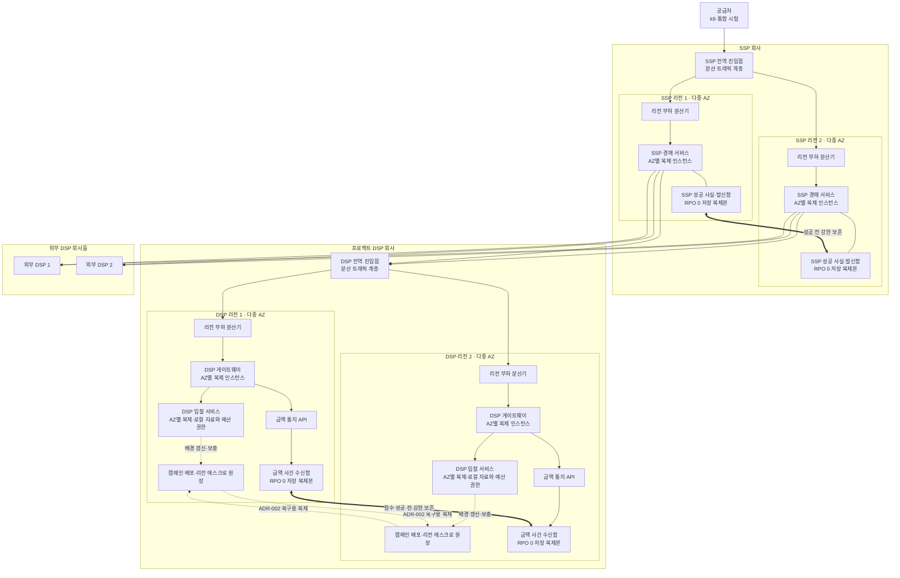

# ADR-006 다중 리전 서비스 배치와 장애 격리

상태: 승인

근거: [아키텍처 중요 요구사항](../../requirements/quality.md), [ADR-002 다중 리전 원장 구조](ADR-002-multi-region-ledger-topology.md), [ADR-004 경매 실행 경로](ADR-004-auction-execution-path.md), [ADR-005 금액 사건의 내구성과 복구](ADR-005-durable-budget-events.md)

## 1. 결정

SSP와 프로젝트 DSP를 각각 **두 리전의 능동 실행 구조**로 배치한다.

- 두 회사는 전역 진입점, 리전 부하 분산기와 저장소를 공유하지 않는다.
- 전역 진입점은 분산 트래픽 계층으로 두며 단일 인스턴스로 구현하지 않는다.
- 각 리전의 SSP, DSP 게이트웨이와 DSP 입찰 서비스는 둘 이상의 AZ에 복제한다.
- 경매 계산, DSP 호출과 예산 예약은 선택된 리전 안에서 처리한다.
- 외부에 성공을 반환할 SSP 경매·통지 사실과 DSP 과금 접수 사실만 리전 장애에도 남는 RPO 0 저장 경계를 통과한다.
- RPO 0 저장 경계가 리전 단절로 강한 보존을 증명하지 못하면 차단된 쪽은 새 성공을 반환하지 않는다. 양쪽 성공보다 단일 금액 사실을 우선한다.
- 프로젝트 DSP의 전역 진입점은 정상 리전을 우선하고 새 연결만 건강한 리전으로 보낸다. 경매 도중 다른 리전으로 재시도하지 않는다.
- 프로젝트 DSP 리전이 응답하지 않으면 SSP는 그 DSP만 제외하고 외부 DSP 경매를 계속한다.
- 리전 장애 때 정상 리전은 자기 예산 책임액과 복구 가능한 금액 사실만 사용한다. 장애 리전의 불확실한 책임액을 즉시 넘겨받지 않는다.

굵은 실선은 외부에 성공을 알리기 전에 RPO 0으로 보존하는 사실, 일반 실선은 서비스 호출, 점선은 경매 경로 밖의 갱신·보충·복구다. SSP와 프로젝트 DSP는 독립된 회사 경계이며 외부 DSP는 프로젝트 DSP 게이트웨이를 사용하지 않는다.

## 2. 장애 계약

| 장애 | 구조적 대응 | 허용하는 영향 |
|---|---|---|
| 애플리케이션 인스턴스 | 리전 부하 분산기가 제거하고 같은 AZ·다른 AZ 복제본 사용 | 진행 중 요청 실패, 10초 이내 회복 |
| AZ 하나 | 남은 AZ의 복제본으로 처리 | 일시적 용량 감소, 30초 이내 회복 |
| SSP 리전 | SSP 전역 진입점이 새 요청을 정상 리전으로 전달 | 장애 리전의 진행 중 경매 실패 |
| DSP 게이트웨이·리전 | DSP 전역 진입점이 새 연결을 정상 리전으로 전달하고 실패한 호출은 SSP가 해당 DSP만 제외 | 프로젝트 DSP 입찰 기회 감소 |
| DSP 리전 원장 | 해당 리전은 기존 로컬 권한만 사용하고 보충 중단 | 책임액 소진 캠페인의 `NO_BID` |
| 리전 간 단절 | 금액 사실 저장소는 차단된 한쪽의 새 성공 접수를 중지하고, 입찰은 안전한 로컬 권한 범위에서만 처리 | 책임 이전·복구 복제 중단, 일부 성공 응답 중지 |
| 외부 DSP | SSP의 해당 연동만 차단 | 해당 회사 입찰 제외 |

장애 전환은 새 요청의 경로를 바꾼다. 이미 시작한 경매를 다른 리전에서 이어받거나 같은 요청을 재실행하지 않는다.

## 3. 검토한 대안

| 대안 | 장점 | 탈락 이유 |
|---|---|---|
| 능동·대기 리전 | 쓰기 위치와 운영이 단순함 | 평상시 대기 자원을 검증하지 못하고 전환 지연과 전체 용량 급변이 큼 |
| 능동·능동과 리전 간 공유 경매 상태 | 어느 리전에서도 같은 작업을 이어받기 쉬움 | 경매 경로가 리전 간 지연·단절과 공유 저장소 장애에 결합됨 |
| 능동·능동과 리전별 독립 실행 | 리전 장애를 부분 영향으로 제한하고 정상 경로가 리전 내부에 머묾 | 진행 중 요청을 넘겨받지 않으며 상태·예산이 리전별로 파편화됨 |

능동·능동과 리전별 독립 실행을 선택한다. 진행 중 요청의 무손실 전환보다 50ms 경로, 금액 정합성과 다른 리전의 지속을 우선한다.

## 4. 결과

### 얻는 점

- SSP·DSP 게이트웨이·입찰 서비스의 단일 인스턴스와 단일 AZ 장애를 제거한다.
- 한 회사나 한 리전의 장애가 외부 DSP와 다른 리전 전체로 전파되는 것을 막는다.
- 경매 계산·DSP 호출·예산 예약이 리전 간 네트워크를 기다리지 않는다.
- 두 리전을 평상시에도 사용하므로 장애 전환 경로를 지속적으로 검증할 수 있다.

### 감수하는 점

- 리전 장애 순간의 진행 중 요청은 실패할 수 있다.
- 전역 경로 전환과 연결 재수립 동안 일부 요청이 프로젝트 DSP를 제외할 수 있다.
- SSP가 경매 성공을 반환하는 경로에는 RPO 0 사실 보존 비용이 포함된다.
- 리전별 용량, 배포, 상태 복제와 예산 파편화를 함께 운영해야 한다.
- 정상 리전이 장애 리전의 불확실한 예산을 즉시 사용할 수 없다.

## 5. 검증 조건

- 400 RPS에서 SSP·DSP 게이트웨이·DSP 인스턴스를 각각 중단해 전체 중단 없이 10초 안에 성공률 99.9%와 p99 50ms를 회복한다.
- AZ 하나를 중단해 다른 AZ가 처리하고 30초 안에 성공률 99.9%와 p99 50ms를 회복한다.
- 리전 하나를 중단해 다른 리전의 SSP 경매와 안전한 프로젝트 DSP 입찰이 계속되고 전역 성공률이 0%가 되지 않는다.
- 프로젝트 DSP 리전 장애 중에도 SSP가 외부 DSP 경매를 계속한다.
- 장애 전환 중 늦은 DSP 응답, 중복 경매, 예산 초과와 중복 과금이 발생하지 않는다.
- 리전 간 연결을 끊어도 양쪽이 자기 예산 책임액보다 많이 입찰하지 않는다.
- SSP의 RPO 0 사실 보존을 포함한 500 RPS 시험에서 호출자 관측 p99 50ms를 지킨다.

## 6. 상세 설계로 남기는 항목

- 전역 트래픽 제품, DNS·연결 유지와 상태 확인 간격
- 리전·AZ별 인스턴스 수, 자동 확장과 최소 용량
- 리전 선택 규칙, 연결 배수와 전환 임계치
- 복제 제품, 저장소별 RPO·RTO 구현과 배포 절차
