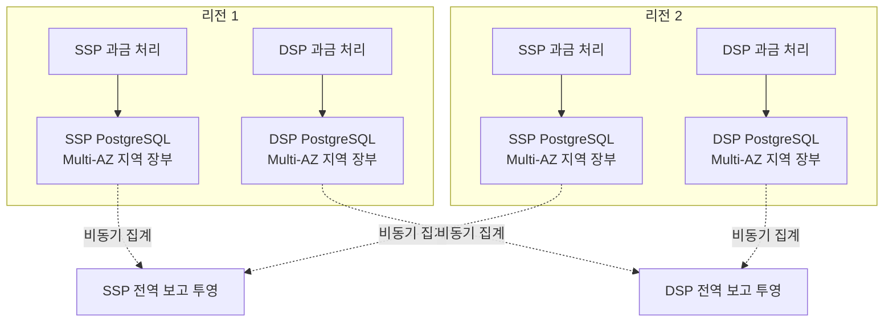

# ADR-007 지역 금액 사건 장부 저장소

상태: 승인

근거: [ADR-005 독립 장부의 금액 사건 수렴](ADR-005-durable-budget-events.md), [데이터 접근·보존 기준](../views/data.md)

## 1. 결정

SSP와 프로젝트 DSP의 지역 금액 사건 장부에 **PostgreSQL**을 사용한다. 운영 기준 배치는 회사·리전마다 독립된 **Amazon RDS for PostgreSQL Multi-AZ DB 인스턴스**다.

- SSP와 DSP는 데이터베이스를 공유하지 않는다.
- 두 리전도 쓰기 성공을 서로 기다리지 않고 자기 사건만 기록한다.
- DSP의 `burl`과 예약 증표는 입찰을 처리한 귀속 리전을 식별한다. 중복 요청은 다른 리전으로 넘기지 않는다.
- DSP는 유효한 통지 사건의 PostgreSQL 동기 커밋이 끝난 뒤 본문 없는 일반 HTTP 성공을 반환한다. 응답에 사설 접수 증거를 넣지 않는다.
- 사건 행은 수정하지 않는다. 상태와 전달 진행도는 사건에서 다시 만들 수 있는 투영으로 분리한다.
- 리전 순번은 재생 위치일 뿐 전역 사건 순서를 뜻하지 않으며 중간 번호 누락을 허용한다.

## 2. 장부 계약

PostgreSQL을 일반 업무 상태 저장소가 아니라 **불변 사건과 최초 결정의 권위**로 사용한다.

| 계약 | 구현 기준 |
|---|---|
| 최초 결과 고정 | DSP 내부 사건 ID 고유 제약으로 `RECORDED`와 `EXPIRED` 중 하나만 삽입 |
| 중복 통지 처리 | 충돌 시 기존 사건과 요청 지문이 같으면 금액을 다시 바꾸지 않고 일반 HTTP 성공, 다르면 오류로 거부 |
| SSP 사건 중복 방지 | SSP 내부 식별자로 청구 근거와 전달 결과를 각각 한 번만 기록 |
| 내구 응답 | 트랜잭션 커밋 성공 뒤에만 본문 없는 일반 HTTP 성공 반환 |
| 재생 | 리전 순번과 발생 시각으로 사건을 순차 조회하고 투영 기준점을 별도 보존 |
| 전달 재시도 | `BillingClaimRecorded`를 원본으로 전달 투영을 만들며 작업자 장애 후 다시 시작 |
| 보존 | 발생 시각 기준 파티션으로 장기 보존·보관·삭제 범위를 제한 |

DSP의 기한 판정과 최초 사건 삽입은 하나의 트랜잭션에서 저장소 시각을 사용한다. 경쟁 요청은 고유 제약에서 직렬화되며, 패자는 기존 사건을 확인해 금액을 다시 바꾸지 않는다. SSP는 이 내부 결과를 해석하지 않는다.

지역 금액 사건 장부는 `burl`마다 지역 예산 원장을 갱신하지 않는다. 리스 정산기가 사건을 `lease_id`별로 집계하고 모든 잠재 지출 기한이 끝난 리스에 대해 확정 소비와 반환액을 만든다. 지역 예산 원장은 `lease_id`와 정산 세대로 결과를 멱등 적용한다.

## 3. 대안 비교

| 후보 | 적합한 점 | 현재 선택하지 않은 이유 |
|---|---|---|
| PostgreSQL | 고유 제약·트랜잭션·즉시 조회·재생·집계를 한 저장소에서 제공 | 연결 수, 파티션·인덱스와 장애 전환을 운영해야 함 |
| DynamoDB | 조건부 쓰기와 관리형 지역 고가용, 수평 확장 | 장기 순차 재생과 집계를 위해 Streams 밖의 추가 구조가 필요함 |
| Kafka | 순서 있는 append, 장기 재생과 소비자 분리에 강함 | HTTP 중복 요청에 기존 결정을 즉시 반환할 조회 상태가 별도로 필요함 |

현재 최대 렌더링 통지 부하는 초당 약 2,000건이다. 제품의 이론적 한계로 선택하지 않고, 이 부하에서 장부 계약을 가장 적은 구성요소로 구현하는 PostgreSQL을 선택한다. 실제 용량은 구현 뒤 측정한다.

## 4. 고가용과 장애 계약

RDS Multi-AZ DB 인스턴스는 같은 리전의 다른 AZ에 동기 대기 복제본을 유지한다. 주 인스턴스 장애 중에는 해당 지역 금액 접수를 실패시킨다. 같은 통지 URL이 재호출되면 복구 뒤 처리하지만 외부 SSP의 재시도를 보장으로 가정하지 않는다.

- 장애 전환 중에도 경매 Hot Path는 지역 금액 장부를 호출하지 않는다.
- 다른 리전은 자기 장부로 계속 처리한다.
- 중단된 리전 소유 사건은 다른 리전이 접수·거부를 대신 결정하지 않는다. SSP가 재시도하면 복구 뒤 처리하고, 재시도가 없으면 예약 만료와 리스 정산으로 안전하게 종결한다.
- 장애 전환 뒤 기존 사건을 기준으로 전달과 투영을 재개한다.
- 지역 전체 재해로 비동기 집계 전 사건을 잃으면 ADR-005의 회사별 손실 정책을 따른다.
- DNS 전환과 연결 단절을 전제로 연결 풀 재생성과 제한된 재시도를 시험한다.

읽기 확장과 3노드 구성이 필요하지 않으므로 RDS Multi-AZ DB 클러스터와 Aurora는 현재 선택하지 않는다. 장애 전환 시간이나 쓰기 지연이 검증 조건을 만족하지 못할 때만 재검토한다.

## 5. 결과

### 얻는 점

- 최초 과금 사건과 멱등 금액 효과를 한 트랜잭션 경계에서 설명할 수 있다.
- 별도 메시지 로그나 멱등 조회 저장소 없이 전달 재시도와 투영 재생을 구현한다.
- 회사별 통지·지출 보고를 SQL로 시작하고 규모가 커질 때 비동기 분석 저장소를 추가할 수 있다.
- 로컬 개발과 클라우드 시험에 같은 PostgreSQL 의미를 사용한다.

### 감수하는 점

- 리전마다 단일 쓰기 주 인스턴스를 사용한다.
- Multi-AZ 동기 복제로 쓰기 지연이 늘고 장애 전환 동안 접수가 중단된다.
- 일 2천만 슬롯의 장기 보존량에 맞춰 파티션·인덱스·보관 정책을 관리해야 한다.
- 회사 2개와 리전 2개를 물리적으로 재현하면 네 개의 독립 배포가 필요하다.

## 6. 검증 조건

- 같은 통지 URL을 동시에 접수해도 결정 행과 금액 효과는 하나다.
- 95초 경계 전후 요청이 경쟁해도 `RECORDED`와 `EXPIRED`가 함께 남지 않는다.
- 커밋 직후 애플리케이션을 종료해도 성공 응답한 사건을 재생할 수 있다.
- 작업자 종료·재시작과 중복 처리 뒤에도 리스 정산 결과가 한 번이다.
- 목표 통지 부하에서 커밋 지연, 연결 풀 대기, WAL·저장장치 병목과 파티션 증가 영향을 측정한다.
- 강제 Multi-AZ 장애 전환 중 다른 리전은 계속 처리하고, 복구 리전은 중복 없이 재개한다.

## 7. 근거 자료

- [PostgreSQL `INSERT ... ON CONFLICT`](https://www.postgresql.org/docs/current/sql-insert.html)
- [Amazon RDS PostgreSQL Multi-AZ 동기 대기 복제](https://docs.aws.amazon.com/AmazonRDS/latest/UserGuide/Concepts.MultiAZSingleStandby.html)
- [Amazon RDS Multi-AZ DB 인스턴스 장애 전환](https://docs.aws.amazon.com/AmazonRDS/latest/UserGuide/Concepts.MultiAZ.Failover.html)
- [DynamoDB 조건부 `PutItem`](https://docs.aws.amazon.com/amazondynamodb/latest/APIReference/API_PutItem.html)
- [DynamoDB Streams 보존 기간](https://docs.aws.amazon.com/amazondynamodb/latest/developerguide/HowItWorks.CoreComponents.html)
- [Apache Kafka 설계와 트랜잭션](https://kafka.apache.org/documentation/#design)
