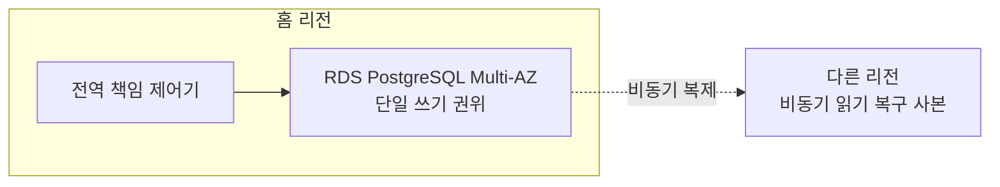

# ADR-008 전역 책임 원장 저장소

상태: 승인

근거: [ADR-002 다중 리전 원장 구조](ADR-002-multi-region-ledger-topology.md), [ADR-003 리전 예산 배분과 이전](ADR-003-regional-budget-allocation.md)

## 1. 결정

전역 책임 원장은 홈 리전의 **Amazon RDS for PostgreSQL Multi-AZ DB 인스턴스**에 둔다. 다른 리전에는 비동기 읽기 복구 사본을 두며 자동 승격하지 않는다.

- 캠페인 예비액 갱신과 이전 기록 생성을 한 PostgreSQL 트랜잭션으로 커밋한다.
- `transferId`에 고유 제약을 두고 중복 요청에는 저장된 결과를 반환한다.
- 쓰기 세대를 보존하고 이전 종단점·자격 증명을 기반 시설에서 차단하여 복구 뒤 이전 세대 작성자의 재등장을 막는다.
- 홈 리전 장애 시 전역 이전을 중단하고 지역 활성화 증거를 대조한 뒤에만 새 쓰기 권위를 연다.

## 2. 선택 근거

전역 책임 이전은 저빈도이며 입찰 Hot Path 밖에 있다. 리전 장애 중에도 반드시 계속 쓸 필요가 없으므로 다중 리전 능동 쓰기보다 단순한 단일 권위와 안전한 중단을 우선한다.

| 후보 | 장점 | 현재 판단 |
|---|---|---|
| RDS PostgreSQL Multi-AZ + 비동기 복구 | 트랜잭션·멱등 기록이 단순하고 차단·복구 과정을 직접 검증 | **선택** |
| Aurora DSQL 다중 리전 | 강한 다중 리전 쓰기, RPO 0과 자동 복구 | 현재 필요한 전역 이전 가용성보다 강하고 핵심 장애 처리를 제품에 위임 |
| DynamoDB MRSC | RPO 0과 관리형 정족수 | 다중 항목 트랜잭션을 지원하지 않아 이전 기록 모델이 복잡해짐 |
| 직접 운영하는 분산 SQL | 배치와 합의 정책을 세밀하게 통제 | 개인 프로젝트가 데이터베이스 운영 프로젝트로 확대됨 |

## 3. 결과

### 얻는 점

- PostgreSQL 트랜잭션과 고유 제약으로 책임 이전을 명확히 구현한다.
- 인스턴스·AZ 장애는 관리형 Multi-AZ에 맡기고 리전 장애 계약에 집중한다.
- 자동 승격의 위험, 차단, 멱등 재개와 보수적 재구성을 포트폴리오에서 설명할 수 있다.

### 감수하는 점

- 홈 리전 장애 중 새 책임 이전은 불가능하다.
- 다른 리전 복구 사본은 원시 데이터 RPO 0이 아니다.
- 복구에는 지역 증거 대조와 새 쓰기 세대 발급이 필요하다.
- 책임 이전 가용성이 비즈니스 핵심으로 올라가면 저장소를 재선택해야 한다.

## 4. 검증 조건

- 같은 `transferId`의 동시 요청이 예비액을 한 번만 차감한다.
- 예비액 차감과 이전 기록 중 하나만 커밋되는 상태가 없다.
- 강제 Multi-AZ 장애 전환 뒤에도 성공 응답한 이전 기록이 남는다.
- 홈 리전 단절 중 전역 쓰기가 실패하고 지역 입찰은 계속된다.
- 지연된 복구 사본으로 복구할 때 자동 승격하지 않고 불확실한 금액을 동결한다.
- 새 쓰기 세대 이후 이전 세대 요청은 거부된다.

## 5. 근거 자료

- [Amazon RDS PostgreSQL Multi-AZ 동기 대기 복제](https://docs.aws.amazon.com/AmazonRDS/latest/UserGuide/Concepts.MultiAZSingleStandby.html)
- [Amazon RDS PostgreSQL 읽기 복제본의 비동기 복제](https://docs.aws.amazon.com/AmazonRDS/latest/UserGuide/USER_PostgreSQL.Replication.ReadReplicas.html)
- [Aurora DSQL 다중 리전 강한 일관성](https://docs.aws.amazon.com/aurora-dsql/latest/userguide/disaster-recovery-resiliency.html)
- [DynamoDB MRSC의 트랜잭션 제약](https://docs.aws.amazon.com/amazondynamodb/latest/developerguide/bp-global-table-design.html)
