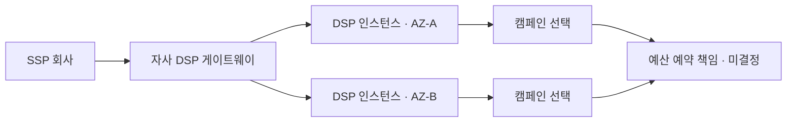
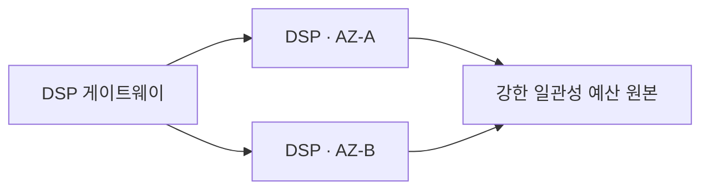
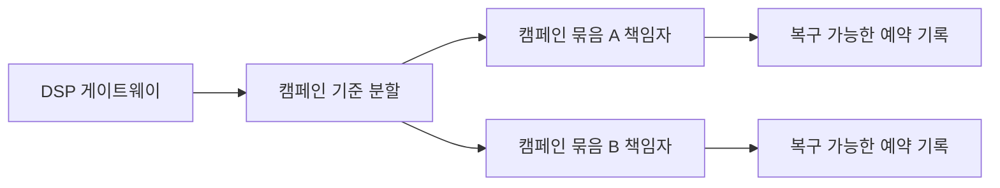
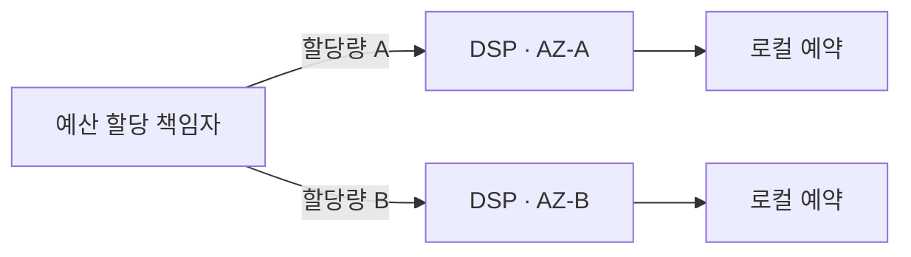
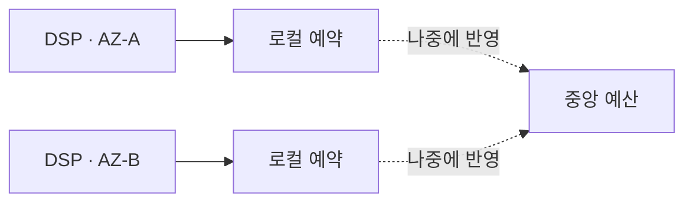

# 분산 예산 예약 설계

상태: 대안 분석 초안, 미결정

근거: [요구사항](../../requirements/product-domain-requirements.md), [검증 기준](../../requirements/workload-data-verification.md), [ASR](../asr.md), [아키텍처 동인](../architecture-drivers.md)

이 문서는 자사 DSP의 예산 예약 후보를 비교한다. 선택 전 분석을 보존하며 최종 결정은 ADR에 기록한다.

## 1. 설계 문제

500 RPS·p99 50ms의 입찰 경로에서 여러 AZ의 DSP 인스턴스가 같은 캠페인 총예산을 예약해야 한다. 동시 입찰에도 초과 지출은 0건이어야 하고 성공한 예약은 인스턴스·AZ 장애 뒤에도 유실되면 안 된다.

예산 상태를 확신할 수 없으면 입찰하지 않는다. 금액 정합성과 정상 요청의 지연을 지키기 위해 일부 광고 기회는 포기할 수 있다.

## 2. 특성과 긴장

| 특성 | 기준 | 긴장 |
|---|---|---|
| 지연 | 500 RPS에서 p99 50ms | 원격 조정과 동기 보존이 시간을 사용한다. |
| 정합성 | 캠페인 총예산 초과 0건 | 로컬 판단과 오래된 복제본을 제한한다. |
| 내구성 | 성공한 예약의 RPO 0 | 성공 전에 장애 영역 밖에 보존해야 한다. |
| 가용성 | 인스턴스·AZ 장애에도 전체 중단 없음 | 예산이 불확실한 인스턴스는 입찰할 수 없다. |
| 확장성 | 여러 인스턴스가 같은 캠페인 처리 | 인기 캠페인에 쓰기 경합이 집중된다. |

우선순위는 `금액 정합성·내구성 → 정상 요청의 지연 → 자사 입찰 기회`다.

## 3. 확정된 경계

- SSP와 자사 DSP는 서로 다른 회사이며 저장소를 공유하지 않는다.
- 자사 DSP 인스턴스는 하나의 논리적 캠페인 예산을 사용한다.
- 슬롯별 잠재 지출을 만든 뒤에만 입찰이 성공한다.
- 잠재 지출은 `lurl`, `burl` 또는 예약 후 95초 만료로 끝난다.

## 4. 후보 구조

### 대안 A. 공유 원본에 조건부 예약

모든 인스턴스가 하나의 논리적 예산 원본에 조건부 갱신을 요청하고, 원본이 총예산 불변식과 멱등성을 판정한다.

### 대안 B. 캠페인별 단일 처리 책임자

캠페인 식별자로 요청을 분할하고 같은 캠페인의 예약은 한 책임자가 순서대로 결정한다. 다른 캠페인 묶음은 병렬 처리한다.

### 대안 C. 인스턴스별 예산 선할당

중앙 책임자가 캠페인 예산 일부를 인스턴스에 할당한다. 각 인스턴스는 할당 범위 안에서 로컬 예약하고 부족하면 추가 할당을 요청한다.

### 대안 D. 로컬 예약 후 비동기 조정

각 인스턴스가 로컬 잔액으로 먼저 입찰하고 나중에 중앙 상태를 갱신한다.

## 5. 초기 비교

| 대안 | 강점 | 주요 위험 | 현재 판정 |
|---|---|---|---|
| A. 공유 원본 | 불변식과 멱등성의 책임이 단순하다. | 모든 입찰의 원격 쓰기, 인기 캠페인 경합, 원본 장애 영향 | 분석 대상 |
| B. 단일 책임자 | 캠페인별 쓰기 순서를 만들고 수평 분할할 수 있다. | 책임자 탐색·전환, 중복 책임자, 인기 캠페인 한계 | 분석 대상 |
| C. 예산 선할당 | 대부분 로컬 예약이어서 빠르고 할당 합계 안에서는 안전하다. | 예산 조각화, 장애 할당 회수, 페이싱 결합 | 분석 대상 |
| D. 비동기 조정 | 입찰 경로가 가장 단순하고 빠르다. | 여러 인스턴스가 같은 잔액을 써 초과 지출할 수 있다. | 요구사항과 충돌 |

D는 초과 지출 0건을 만족하지 못하므로 단독 후보에서 제외하되 성능 비교 기준으로 남긴다.

## 6. 공통 검증 시나리오

1. 같은 캠페인에 예약 요청이 동시에 집중된다.
2. 예약 성공 응답 직후 DSP 인스턴스가 중단된다.
3. AZ가 단절되고 두 AZ가 자신을 정상으로 판단한다.
4. 예약 책임자나 저장 경로가 느려진다.
5. 1,000 RPS에서 최소 400 RPS의 p99 50ms를 보호한다.
6. 입찰 응답 유실, 중복 `lurl`·`burl`, 95초 뒤 `burl`이 발생한다.

각 시나리오에서 초과 지출 가능성, 성공 경계, 원격 왕복과 대기, 장애 전파, 복구 책임, 인기 캠페인 한계, 95초 수명주기와 페이싱 영향을 비교한다.

## 7. 결정 경계

아직 데이터베이스 제품, 금액 자료형, 분할 수, 합의 방식, 페이싱 계산식과 통지 제품은 결정하지 않는다.

다음 검토에서 A·B·C를 정상 예약, 동시 경합, 인스턴스 장애와 AZ 단절 순으로 압박한다. 선택이 생기면 ADR에는 선택, 거부한 대안, 감수한 단점과 검증 방법만 남기고 공식 아키텍처 도식에는 선택된 구조만 반영한다.
