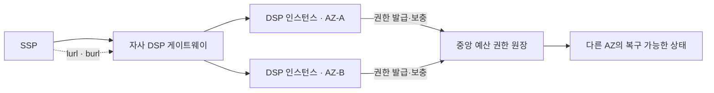
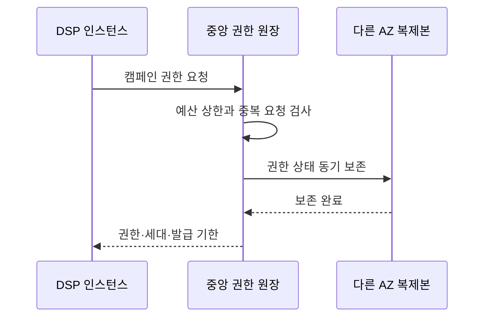
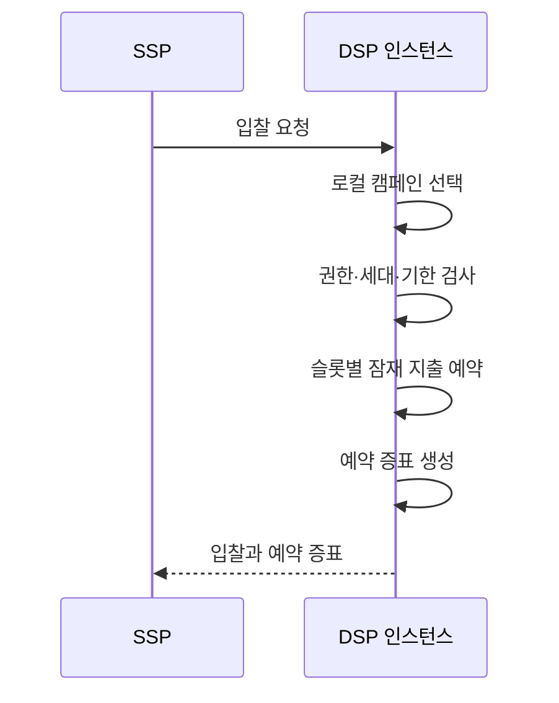
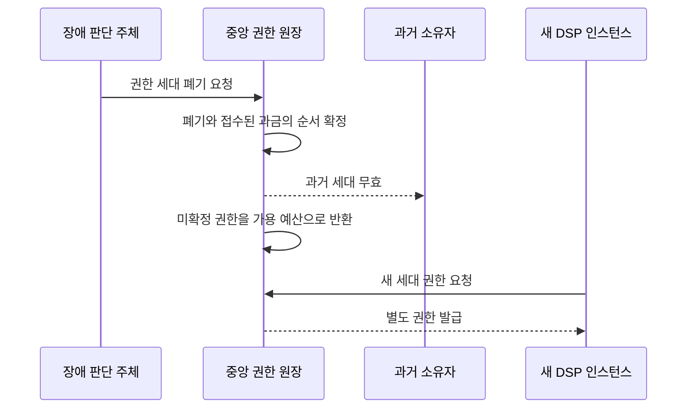

# 캠페인 예산 예약 구조

상태: 현재 설계 초안

결정: [ADR-001 분산 캠페인 예산 예약](../decisions/ADR-001-distributed-budget-reservation.md)

이 문서는 선택한 예산 권한 선할당 모델의 현재 구조와 정상·장애 흐름을 설명한다. 제품과 조정값은 아직 정하지 않는다.

## 1. 구성과 책임



| 구성 요소 | 책임 |
|---|---|
| DSP 인스턴스 | 캠페인 선택, 로컬 권한 소비, 잠재 지출과 예약 증표 생성 |
| 중앙 권한 원장 | 캠페인 총예산, 권한 발급·폐기·반환, 확정 지출과 업체 손실의 멱등 기록 |
| DSP 게이트웨이 | 요청 분산과 실패 인스턴스 격리. 예산 원본은 소유하지 않는다. |
| SSP | 낙찰과 렌더링 근거를 보존하고 예약 증표를 통지에 연결한다. |

중앙 권한 원장은 다른 AZ의 장애 뒤에도 복구 가능해야 한다. DSP 인스턴스의 로컬 상태는 경매 경로를 빠르게 하지만 캠페인 총예산의 원본이 아니다.

## 2. 권한과 예약

권한은 최소한 다음 정보를 가진다.

```text
allocationId
campaignId
ownerId
generation
grantedAmount
remainingAmount
issueUntil
state
```

예약 증표는 다른 DSP 인스턴스가 원래 예약을 검증할 수 있도록 최소한 다음 정보를 연결한다.

```text
reservationId
allocationId
campaignId
generation
auctionId와 slotId
amount
issuedAt과 billableUntil
무결성 검증값
```

구체적인 표현과 서명 방식은 신뢰 경계 설계에서 정한다. 외부가 제공한 캠페인·금액·시각은 원본으로 사용하지 않는다.

## 3. 권한 발급과 보충



권한 발급은 캠페인별로 원자적이다. 동일한 요청을 재시도해도 권한이 중복 발급되지 않는다. DSP 인스턴스는 권한이 바닥난 뒤 기다리지 않고 하한선에서 비동기로 보충한다. 보충이 끝나기 전에 권한이 소진되면 해당 캠페인을 `NO_BID`한다.

## 4. 정상 입찰



한 요청의 여러 슬롯이 같은 캠페인을 선택하면 필요한 금액의 합을 로컬 권한에서 원자적으로 검사한다. 예약 실패 뒤 오래 대기하거나 중앙 보충을 경매 경로에서 기다리지 않는다.

SSP가 응답을 받지 못했다면 외부에 인정된 입찰은 없다. SSP가 응답을 받아 낙찰 근거로 보존한 경우 예약 증표가 장애 뒤 개별 예약을 확인하는 근거가 된다.

## 5. 통지와 금액 상태

- `nurl`은 예약을 유지하며 금액을 바꾸지 않는다.
- 만료 전 `lurl`은 살아 있는 권한 소유자에서 예약 금액을 다시 사용할 수 있게 한다.
- 만료 전 `burl`은 어느 DSP 인스턴스에서든 증표를 검증한 뒤 중앙 원장에 멱등하게 확정한다.
- 사건이 없으면 예약 후 95초에 로컬 잠재 지출을 끝낸다.
- 중복 사건은 최초 금액 효과를 재사용하고 모순된 사건은 격리한다.

과금 확정은 중앙 권한의 남은 금액을 줄이고 캠페인 확정 지출을 같은 금액만큼 늘리는 하나의 상태 전이다.

```text
확정 지출 + 활성 권한의 남은 금액
```

이 합은 과금 확정 전후에 증가하지 않는다.

## 6. 인스턴스·AZ 장애



과거 소유자가 실제로 죽었는지는 금액 안전성의 기준이 아니다. 중앙에서 폐기한 세대인지가 기준이다. 과거 소유자가 다시 살아나도 폐기된 세대로 유효한 신규 예약을 발급할 수 없다.

폐기보다 먼저 중앙에 복구 가능하게 접수된 `burl`은 캠페인 과금으로 확정한다. 폐기가 먼저라면 미확정 예약을 캠페인 과금에서 취소하고 반환한다. 이후 원래 과금 기한 안에 도착한 유효한 과금 후보는 캠페인에 다시 청구하지 않고 자사 DSP의 손실로 한 번만 기록한다. 기한을 넘긴 통지는 기존 계약대로 기록만 남긴다.

이 정책은 장애 시 초과 지출과 장시간 예산 잠금을 피하는 대신 오판을 포함한 장애 구간의 비용을 자사 DSP가 부담한다.

## 7. 보존과 로그

전체 구조를 이벤트 소싱으로 만들 필요는 없다.

- 중앙 원장은 권한의 현재 상태와 캠페인 금액을 트랜잭션으로 보존한다.
- 권한 발급·폐기·반환, 과금 확정과 업체 손실은 멱등 식별자가 있는 변경 이력으로 남긴다.
- 로컬 예약 로그와 스냅샷은 인스턴스 재시작을 빠르게 하지만 예산 안전성의 유일한 근거로 삼지 않는다.
- 기록되지 않고 유실된 로컬 예약은 권한 상한과 SSP가 보존한 예약 증표로 안전하게 분류한다.

필수 변경 이력은 다음과 같다.

```text
RIGHT_GRANTED
RIGHT_REVOKED
RIGHT_RETURNED
BILL_CONFIRMED
HOUSE_LOSS_RECORDED
```

## 8. 아직 정하지 않은 조정값

- 권한의 최초 크기와 최대 크기
- 비동기 보충을 시작할 하한선
- 신규 예약 발급 기한과 장애 판정 간격
- 캠페인 페이싱에 따라 권한 크기를 줄이고 늘리는 규칙

이 값은 정상 부하, 단일 캠페인 집중, 중앙 원장 지연, 인스턴스·AZ 장애 시험으로 정한다. 값을 바꾸어도 권한 선할당과 로컬 예약이라는 ADR의 결정은 바뀌지 않는다.
