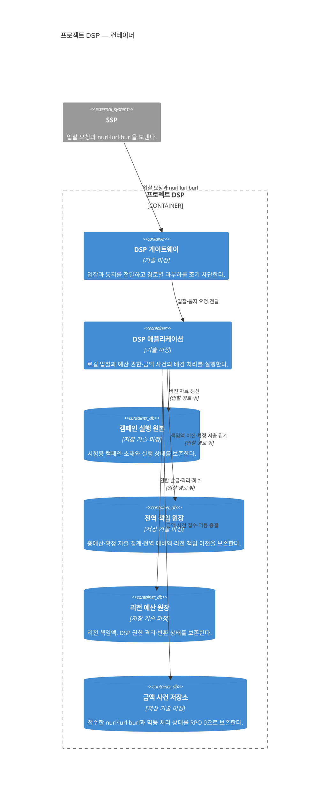

# 프로젝트 DSP 컨테이너

상태: 실행 경계 확정·저장 경계 검토안·기술 미정

범위는 프로젝트 DSP 소프트웨어 시스템 하나다. 입찰과 예산 책임은 같은 DSP 애플리케이션 프로세스에 둔다. 리전·AZ·복제는 [DSP 배포 관점](dsp-deployment.md)에서 다룬다.

도식의 데이터 저장소는 필요한 논리 책임을 나타낸다. 각각을 독립 제품이나 독립 배포 단위로 만들지는 [데이터 관점](data.md)의 미결 경계를 해소한 뒤 정한다.

## 컨테이너 책임

| 컨테이너 | 책임 | 확정하지 않은 내부 경계 |
|---|---|---|
| DSP 게이트웨이 | 입찰·통지 경로 분류, 인스턴스 분산과 경로별 과부하 차단 | 경로 선택·상태 확인·용량 예약 구현 |
| DSP 애플리케이션 | 로컬 후보 선택·페이싱·가격 결정·예산 예약, 캠페인 갱신, 권한 제어, 통지 접수와 예약 종결 | 내부 컴포넌트와 실행 자원 격리 방식 |
| 캠페인 실행 원본 | 캠페인·소재와 실행 상태의 배포 원본 | 저장 제품과 배포 방식 |
| 전역 책임 원장 | 총예산, 확정 지출 집계, 전역 예비액과 겹치지 않는 리전 책임 | 저장 제품과 합의·차단 구현 |
| 리전 예산 원장 | 자기 리전 책임액, DSP 권한·격리·반환 상태 | 저장 제품과 복구 사본 구현 |
| 금액 사건 저장소 | `nurl`·`lurl`·`burl`, 멱등 접수·처리 상태와 복구 가능한 금액 근거 | 저장 제품과 스키마 |

DSP 애플리케이션의 입찰 경로는 요청마다 저장소를 호출하지 않는다. 캠페인 자료와 예산 권한을 미리 받아 로컬에서 사용한다. 배경 예산 처리가 느려지거나 중단되어도 이미 발급한 권한의 범위를 침해하지 않으며, 새 권한이 없으면 `NO_BID`한다.

입찰과 예산 책임은 같은 프로세스 안에서 실행 자원만 격리한다. 별도 프로세스는 현재 아키텍처에 포함하지 않는다. 구현 후 경합이나 장애 전파가 실제 한계로 확인될 때만 새로운 ADR로 재검토한다.

금액 사건 저장소는 DSP가 접수 성공을 반환한 사건의 원본이다. 리전 예산 원장은 권한 책임 상태의 원본이며 금액 사건을 멱등 반영해 예약을 종결한다. 둘의 제품·트랜잭션 결합 여부는 기술 선택에서 정한다.
