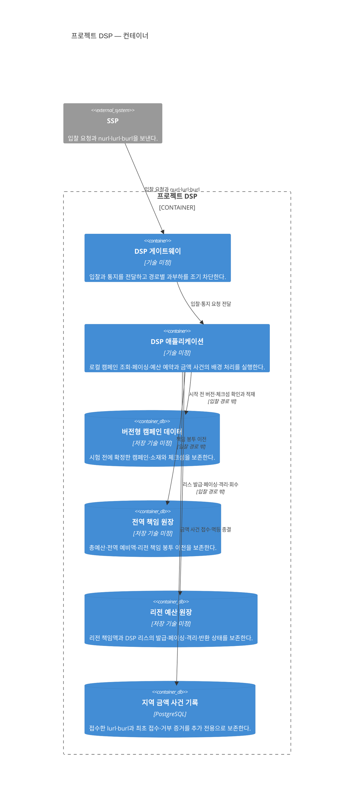

# 프로젝트 DSP 컨테이너

상태: 컨테이너·데이터 경계와 지역 금액 장부 기술 확정

범위는 프로젝트 DSP 소프트웨어 시스템 하나다. 입찰과 예산 책임은 같은 DSP 애플리케이션 프로세스에 둔다. 리전·AZ·복제는 [DSP 배포 관점](dsp-deployment.md)에서 다룬다.

전역 책임 원장과 리전 예산 원장은 별도 물리 저장소 배포 경계다. 캠페인은 버전 자료로 시작 전에 적재하고, 페이싱은 리전 원장의 리스 발급과 DSP 로컬 권한으로 처리한다. 세부 근거는 [데이터 관점](data.md)에 있다.

## 컨테이너 책임

| 컨테이너 | 책임 | 확정하지 않은 내부 경계 |
|---|---|---|
| DSP 게이트웨이 | 입찰·통지 경로 분류, 인스턴스 분산과 경로별 과부하 차단 | 경로 선택·상태 확인·용량 예약 구현 |
| DSP 애플리케이션 | 로컬 후보 선택·페이싱·가격 결정·예산 예약, 캠페인 자료 적재, 권한 제어, 통지 접수와 예약 종결 | 내부 컴포넌트와 실행 자원 격리 방식 |
| 버전형 캠페인 데이터 | 시험 중 불변인 캠페인·소재와 실행 상태의 배포 원본 | 저장 제품과 적재 방식 |
| 전역 책임 원장 | 총예산, 전역 예비액과 겹치지 않는 리전 책임 봉투 | 저장 제품과 합의·차단 구현 |
| 리전 예산 원장 | 자기 리전 책임액, DSP 리스의 발급·페이싱·격리·반환 상태 | 저장 제품과 복구 사본 구현 |
| 지역 금액 사건 기록 | `lurl`·`burl` 접수 사건, 최초 접수·거부 결과와 재생 가능한 캠페인 지출·SSP 지급 근거 | PostgreSQL 스키마 |

DSP 애플리케이션의 입찰 경로는 요청마다 저장소를 호출하지 않는다. 캠페인 자료와 예산 권한을 미리 받아 로컬에서 사용한다. 배경 예산 처리가 느려지거나 중단되어도 이미 발급한 권한의 범위를 침해하지 않으며, 새 권한이 없으면 `NO_BID`한다.

페이싱은 독립 컨테이너가 아니다. 각 리전 원장은 자기 책임액을 기간에 맞춰 리스로 발급하고 DSP는 로컬 권한만 사용한다. 다른 리전의 개별 리스 상태를 런타임 제어에 사용하지 않는다.

입찰과 예산 책임은 같은 프로세스 안에서 실행 자원만 격리한다. 별도 프로세스는 현재 아키텍처에 포함하지 않는다. 구현 후 경합이나 장애 전파가 실제 한계로 확인될 때만 새로운 ADR로 재검토한다.

지역 금액 사건 기록은 DSP가 반환한 최초 접수·만료 거부 결과의 원본이다. 리전 예산 원장은 권한 책임 상태의 원본이며 사건을 비동기로 멱등 반영해 예약을 종결한다. 두 저장 경계는 사건 append를 원장 투영과 하나의 동기 트랜잭션으로 묶지 않는다. 정상 기한 안에 접수한 `burl`은 캠페인 확정 지출과 SSP 지급 근거가 되며, 실제 청구·송금은 구현하지 않는다.

확정 지출은 리전 책임 봉투 안에서 비동기로 투영한다. 전역 책임 원장은 확정 지출을 실시간으로 모으지 않고 리전 간 겹치지 않는 책임 봉투와 예비액만 소유한다.

`nurl`은 낙찰 사실만 알리며 예약 금액을 바꾸지 않는다. 따라서 금액 사건 원본에 포함하지 않고 추적·분석용 경매 결과 자료로 취급한다.
