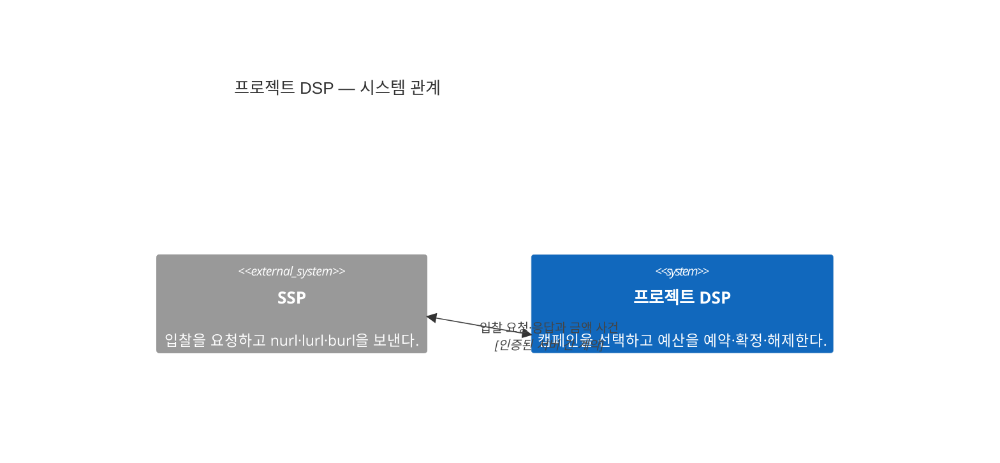

# 프로젝트 DSP 시스템 관계

상태: 구조 확정·기술 미정

```mermaid
C4Context
    title 프로젝트 DSP — 시스템 관계

    System_Ext(ssp, "SSP", "입찰을 요청하고 nurl·lurl·burl을 보낸다.")
    System(project_dsp, "프로젝트 DSP", "캠페인을 선택하고 예산을 예약·확정·해제한다.")

    BiRel(ssp, project_dsp, "입찰 요청·응답과 금액 사건", "인증된 서버 간 계약")

    UpdateLayoutConfig($c4ShapeInRow="2", $c4BoundaryInRow="1")
```

프로젝트 DSP는 캠페인 예산의 유일한 권위자다. SSP의 경매·렌더링 사실은 검증하되 SSP 저장소를 공유하거나 직접 조회하지 않는다.
