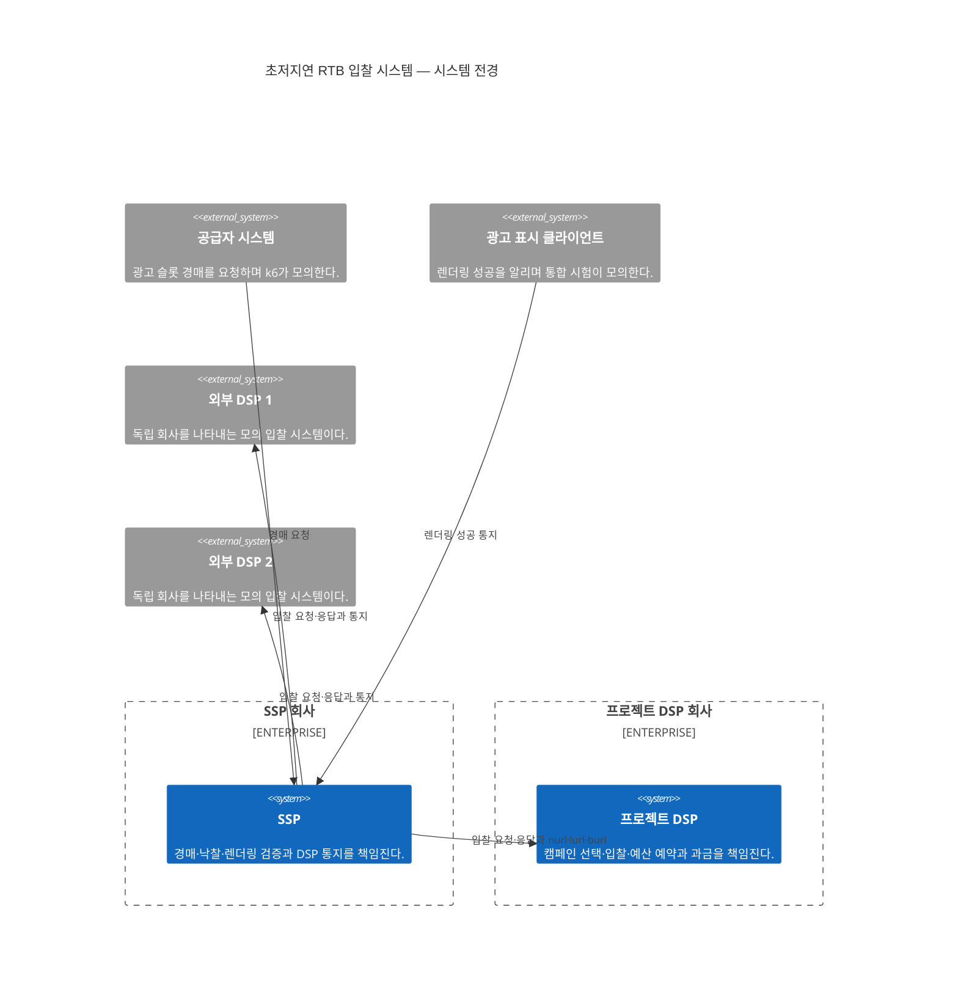

# 시스템 전경

상태: 구조 확정·기술 미정

두 개의 구현 대상 소프트웨어 시스템과 외부 시스템의 전체 관계를 보여준다. 특정 시스템 하나를 중심으로 한 Level 1 도식은 별도 문서에 있다.

- SSP와 프로젝트 DSP는 모두 구현 범위지만 서로 다른 회사·소프트웨어 시스템이다.
- 외부 DSP는 프로젝트 DSP 게이트웨이를 사용하지 않는다.
- 공급자 애플리케이션, 광고 표시 클라이언트와 외부 DSP 내부는 구현하지 않는다.
