# SSP 애플리케이션 컴포넌트

상태: 경계 검토 완료·기술 미정

범위는 [SSP 컨테이너](ssp-containers.md)의 `SSP 애플리케이션` 하나다. 화살표는 처리 순서가 아니라 출발 요소가 도착 요소를 사용하는 의존 관계다. 호출의 반환값은 역방향 화살표로 반복하지 않는다.

## C4 Level 3

```mermaid
%%{init: {"flowchart": {"defaultRenderer": "elk"}}}%%
flowchart LR
    subgraph SUPPLY["공급 측"]
        direction TB
        SUPPLIER["공급자 시스템<br/>[Software System]"]
        CLIENT["광고 표시 클라이언트<br/>[Software System]"]
        SUPPLIER -->|"광고 응답·증표 전달"| CLIENT
    end

    subgraph SSP["SSP [Software System]"]
        direction TB
        subgraph APP["SSP 애플리케이션 [Container: Java 21]"]
            direction TB
            API["경매·렌더링 API<br/>HTTP 계약 검증과 요청 전달"]

            IDEMP["경매 중복 방지<br/>요청 키·지문과 최초 결과 재사용"]
            AUCTION["경매 실행<br/>전체 기한과 DSP 병렬 호출 조정"]
            BILLING["렌더링 확인·청구 처리<br/>유효 렌더링의 청구 근거 생성"]

            ENGINE["낙찰 결정<br/>입찰 검증과 1가격 낙찰 결정"]
            PROOF["렌더링 증표 발급·검증<br/>상태 없는 증표의 무결성·기한 검증"]

            BID["DSP 입찰 요청<br/>DSP별 OpenRTB 통신과 자원 격리"]
            NOTICE["DSP 경매·과금 통지<br/>경매 통지와 내구 과금 통지 전달"]
            REPOSITORY["청구·통지 기록 저장<br/>청구 생명주기 사건의 멱등 추가·재생"]

            API -->|"중복 판정"| IDEMP
            IDEMP -->|"최초 경매만 실행"| AUCTION
            API -->|"렌더링 판정"| BILLING
            AUCTION -->|"낙찰 결정"| ENGINE
            AUCTION -->|"증표 발급"| PROOF
            AUCTION -->|"DSP별 입찰 호출"| BID
            AUCTION -->|"nurl·lurl 전달 요청"| NOTICE
            BILLING -->|"증표 검증"| PROOF
            BILLING -->|"청구 근거 추가"| REPOSITORY
            NOTICE -->|"미전달 burl 조회·전달 결과 추가"| REPOSITORY
        end

        STORE[("리전별 SSP 청구 기록 DB<br/>[Container: PostgreSQL]<br/>리전별 독립 저장")]
        REPOSITORY -->|"사건 추가·재생"| STORE
    end

    DSPS["DSP 회사들<br/>프로젝트 DSP · 외부 DSP<br/>[Software Systems]"]

    SUPPLIER -->|"경매 요청 / 결과·증표 수신"| API
    CLIENT -->|"렌더링 성공·증표"| API
    BID -->|"입찰 요청·응답"| DSPS
    NOTICE -->|"nurl·lurl·burl"| DSPS

    classDef component fill:#2563eb,color:#fff,stroke:#1d4ed8,stroke-width:1.5px;
    classDef external fill:#fff,color:#172033,stroke:#94a3b8,stroke-width:1.5px;
    classDef store fill:#d1fae5,color:#064e3b,stroke:#10b981,stroke-width:1.5px;
    class API,IDEMP,AUCTION,BILLING,ENGINE,PROOF,BID,NOTICE,REPOSITORY component;
    class SUPPLIER,CLIENT,DSPS external;
    class STORE store;
    style SUPPLY fill:#f1f5f9,stroke:#94a3b8,stroke-width:1.5px
    style SSP fill:#eff6ff,stroke:#2563eb,stroke-width:2px
    style APP fill:#ffffff,stroke:#3b82f6,stroke-width:1.5px,stroke-dasharray:6 4
```

## 관계 검증

| 출발 | 도착 | 의존 이유 |
|---|---|---|
| 공급자 시스템 | 경매·렌더링 API | 경매를 요청하고 응답으로 낙찰 결과와 증표를 받는다. |
| 공급자 시스템 | 광고 표시 클라이언트 | 광고 응답과 렌더링 증표를 전달한다. |
| 광고 표시 클라이언트 | 경매·렌더링 API | 렌더링 성공과 증표를 통지한다. |
| 경매·렌더링 API | 경매 중복 방지 | 검증한 공급자 요청의 중복 판정을 위임한다. |
| 경매·렌더링 API | 렌더링 확인·청구 처리 | 렌더링 판정을 위임한다. |
| 경매 중복 방지 | 경매 실행 | 요청 키를 최초 선점한 호출만 경매 실행을 요청한다. |
| 경매 실행 | 낙찰 결정 | 기한 안에 종결된 입찰의 낙찰 결정을 요청한다. |
| 경매 실행 | 렌더링 증표 발급·검증 | 낙찰 결과의 증표 발급을 요청한다. |
| 경매 실행 | DSP 입찰 요청 | 여러 DSP에 대한 개별 호출을 병렬로 시작한다. |
| 경매 실행 | DSP 경매·과금 통지 | 낙찰·패찰 통지를 요청한다. |
| 렌더링 확인·청구 처리 | 렌더링 증표 발급·검증 | 돌아온 증표의 무결성과 기한 검증을 요청한다. |
| 렌더링 확인·청구 처리 | 청구·통지 기록 저장 | 성공 응답 전에 청구 근거를 내구 기록한다. |
| DSP 입찰 요청 | DSP 회사들 | DSP 하나에 OpenRTB 입찰 요청을 보내고 응답을 받는다. |
| DSP 경매·과금 통지 | 청구·통지 기록 저장 | 미전달 과금 통지를 읽고 전달 결과를 기록한다. |
| DSP 경매·과금 통지 | DSP 회사들 | `nurl`·`lurl`·`burl`을 전달한다. |
| 청구·통지 기록 저장 | 리전별 SSP 청구 기록 DB | 청구 생명주기 사건을 멱등 추가하고 복구 시 재생한다. |

`BillingClaimRecorded`가 `burl` 전달 책임의 내구 원본이다. 렌더링 확인·청구 처리는 통지 컴포넌트를 직접 호출하지 않는다. DSP 경매·과금 통지는 저장된 미전달 청구를 읽어 작업자 장애 뒤에도 전달을 재개한다.

## 컴포넌트 경계 검증

| 컴포넌트 | 숨기는 결정·소유 규칙 | 결론 | 재검토 조건 |
|---|---|---|---|
| 경매·렌더링 API | HTTP 경로·표현·기술 검증과 내부 요청 변환 | 하나로 유지 | 측정된 경합 때문에 진입 실행 자원을 독립시킬 때 |
| 경매 중복 방지 | 공급자 요청 키·서버 지문, 로컬 단일 실행과 최초 응답 재사용 | 독립 유지 | 외부 상태를 쓰거나 중복 허용 정책으로 바꿀 때 |
| 경매 실행 | 절대 기한, DSP 호출 병렬 조정과 실패 종결 | 낙찰 결정과 분리 | 단순 전달만 남거나 별도 실행 경계가 필요할 때 |
| 낙찰 결정 | 슬롯별 입찰 유효성, 1가격과 결정적 동점 규칙 | 순수 정책으로 분리 | 규칙이 사라져 단순 비교 함수만 남을 때 |
| 렌더링 증표 발급·검증 | 버전형 이진 형식, AEAD 봉인, 로컬 키 묶음과 기한 | 독립 유지 | 증표 대신 서버 경매 상태 저장을 선택할 때 |
| 렌더링 확인·청구 처리 | 유효 렌더링만 청구 근거로 만드는 전이와 저장 선행 규칙 | 하나로 유지 | 렌더링 분석이 청구와 독립된 제품 책임이 될 때 |
| DSP 입찰 요청 | OpenRTB 변환, DSP별 연결·기한·동시성·취소 | 모든 DSP의 공통 컴포넌트 | DSP별 프로토콜·변환·배포 주기가 달라질 때 |
| DSP 경매·과금 통지 | 등록 URL 제한, OpenRTB 통지 호출과 전달 결과 분류 | 하나로 유지하되 경매·과금 자원 분리 | 과금 전달의 복구 구조가 별도 배포를 요구할 때 |
| 청구·통지 기록 저장 | PostgreSQL 스키마, 고유 제약, 청구·과금 통지 사건 추가와 재생 | 하나로 유지 | 사건별 보존·일관성·저장 기술이 달라질 때 |

## 경계 계약

- 경매·렌더링 API는 업무 규칙을 소유하지 않는다. 경매 요청과 렌더링 통지는 우선 같은 진입 실행 자원을 사용하고 경로별 지연·동시 처리·거절을 따로 관측한다. 측정된 경합이 경매 목표를 침범할 때만 자원을 격리한다.
- 경매 중복 방지는 인증된 공급자 식별자와 `providerRequestId`를 128비트 요청 키로 축약하고, 정규화한 요청의 128비트 지문으로 같은 ID의 내용 변경을 거부한다.
- 최초 호출만 DSP 경매를 실행한다. 처리 중 중복은 같은 실행에 합류하고 완료 중복은 최초 응답과 렌더링 증표를 재사용한다. 요청 키·지문·최초 결과는 5초간 제한된 로컬 메모리에 둔다.
- 확장 후에도 같은 요청 키는 한 SSP 소유자만 실행해야 한다. 소유권을 잃어 기존 로컬 상태를 확인할 수 없으면 같은 요청을 새로 실행하지 않는다. 구체적인 키 라우팅 방식은 배포 설계에서 정한다.
- 경매 실행은 전체 흐름을 조정하고, 낙찰 결정은 외부 I/O와 시계에 의존하지 않는 순수 경매 규칙을 소유한다.
- 경매 실행이 여러 DSP 호출을 병렬 조정한다. DSP 입찰 요청은 DSP 하나에 대한 통신과 회사별 격리 자원을 소유한다.
- 렌더링 증표는 `version`, `keyId`, `nonce`를 평문 헤더로 두고, `slotAuctionKey`, 낙찰 DSP·입찰·가격, 매크로를 치환한 `billingUrl`, 2초 기한을 최소 이진 페이로드로 직렬화한다. 데이터 압축은 사용하지 않는다.
- 증표 컴포넌트는 평문 헤더와 용도 식별자를 부가 인증 데이터로 묶어 AEAD로 페이로드를 봉인한다. 별도 HMAC을 덧붙이지 않으며 인증 태그 검증 전에는 복호화한 값을 업무 데이터로 사용하지 않는다.
- 두 리전은 같은 로컬 키 묶음을 가진다. 새 키를 모든 인스턴스에 검증용으로 먼저 배포하고 발급 키를 전환한 뒤, 2초의 최대 증표 수명과 배포 여유가 지나면 이전 키를 제거한다. 증표 검증은 외부 키 조회를 하지 않는다.
- `slotAuctionKey`가 청구 고유 키다. 같은 유효 증표의 지역 내 중복 청구는 저장소 고유 제약이 막고, 두 리전의 병합과 DSP의 불투명 `burl` 처리는 같은 키·URL의 금액 효과를 한 번으로 수렴시킨다.
- 렌더링 확인·청구 처리는 `BillingClaimRecorded`의 내구 기록 성공까지만 소유한다. `burl` 전달과 재개는 DSP 경매·과금 통지가 소유한다.
- DSP 경매·과금 통지는 같은 OpenRTB 전달 기술을 공유하되 즉시성 위주의 `nurl`·`lurl`과 내구성 위주의 `burl`에 별도 대기열·동시성·재시도 정책을 적용한다.
- DSP 경매·과금 통지는 DSP가 사전에 등록한 HTTPS 대상만 호출한다. 응답 URL이 임의 호스트나 내부 주소로 통신 경계를 넓히지 못하게 한다.
- 청구·통지 기록 저장은 `BillingClaimRecorded`, `BillingNoticeDelivered`, `BillingNoticeUndelivered`만 금액 관련 원본으로 다룬다. `nurl`·`lurl` 운영 로그는 이 장부에 섞지 않는다.
- SSP 저장소는 SSP가 소유하지만 애플리케이션과 별도 컨테이너다. 각 리전은 자신의 사건을 독립적으로 기록한다.

## 남은 설계 질문

1. `nurl`·`lurl`과 `burl`의 대기열·동시성·제한된 재시도 정책
2. PostgreSQL 고유 키·사건 스키마·미전달 조회와 연결 풀 구성

이 질문을 해결한 뒤 실행 모델을 작은 기술 검증으로 비교하고 라이브러리와 제품을 선택한다.
