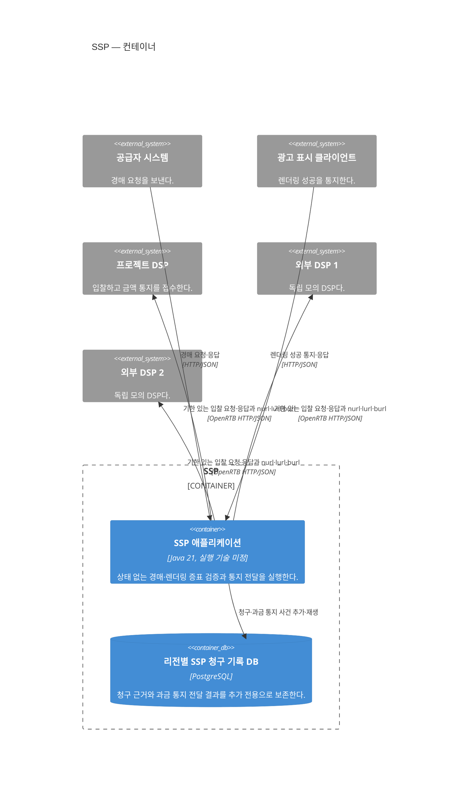

# SSP 컨테이너

상태: 실행·데이터 경계와 현재 확정 가능한 기술 반영

범위는 SSP 소프트웨어 시스템 하나다. 리전·AZ·부하 분산과 복제는 [SSP 배포 관점](ssp-deployment.md)에서 다룬다.

## 컨테이너 책임

| 컨테이너 | 책임 | 확정하지 않은 내부 경계 |
|---|---|---|
| SSP 애플리케이션 | 요청 검증, DSP별 격리·병렬 호출, 1가격 낙찰, 렌더링 증표 발급·검증과 OpenRTB 통지 호출 | 내부 실행 자원 격리 방식 |
| 리전별 SSP 청구 기록 DB | `BillingClaimRecorded`와 SSP 자체 통지 전달 결과의 보존·재생 | 스키마와 비동기 병합 구현 |

경매와 렌더링·통지는 우선 같은 프로세스 안에서 실행 자원을 격리한다. 별도 프로세스는 현재 구조에 포함하지 않으며 통지 적체가 경매의 50ms 시간 예산을 실제로 침범할 때 재검토한다.

SSP는 경매 결과를 저장하지 않고 인증된 렌더링 증표로 반환한다. 유효한 증표가 돌아오면 성공 응답 전에 지역 기록에 청구 근거를 내구 추가한다. 통지 작업은 이 기록에서 미전달 청구를 읽어 입찰 응답의 `burl`을 호출하므로 작업자 장애 뒤에도 재개할 수 있다. DSP의 내부 사건명이나 응답 본문을 요구하지 않으며, 메시지 기반 시설·저장소·청구서·송금을 공유하지 않는다.

현재 확정한 기술과 후속 선택은 [SSP 기술 기준선](../technology/ssp.md)에 정리한다. 내부 책임은 [SSP 애플리케이션 컴포넌트](ssp-components.md)에서 확장한다.
