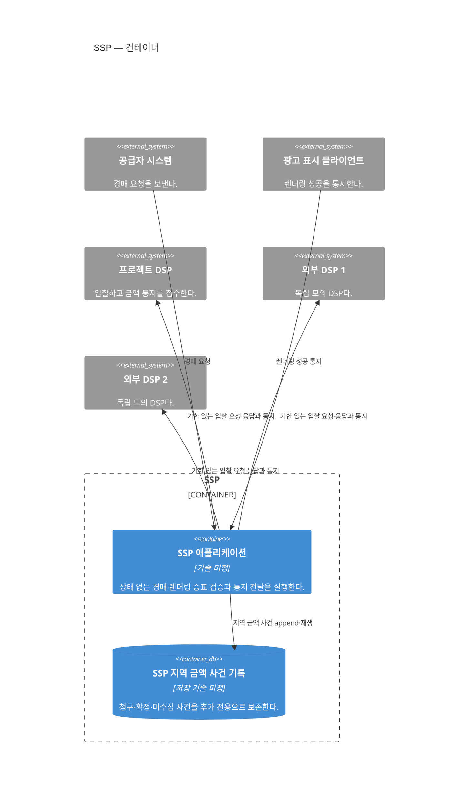

# SSP 컨테이너

상태: 실행·데이터 경계 확정·기술 미정

범위는 SSP 소프트웨어 시스템 하나다. 리전·AZ·부하 분산과 복제는 [SSP 배포 관점](ssp-deployment.md)에서 다룬다.

## 컨테이너 책임

| 컨테이너 | 책임 | 확정하지 않은 내부 경계 |
|---|---|---|
| SSP 애플리케이션 | 요청 검증, DSP별 격리·병렬 호출, 1가격 낙찰, 렌더링 증표 발급·검증과 HTTP 통지 재전달 | 내부 실행 자원 격리 방식 |
| SSP 지역 금액 사건 기록 | `BillingClaimRecorded`·`BillingConfirmed`·`BillingUncollected` 보존과 재생 | 저장 제품, 스키마와 비동기 병합 구현 |

경매와 렌더링·통지는 우선 같은 프로세스 안에서 실행 자원을 격리한다. 별도 프로세스는 현재 구조에 포함하지 않으며 통지 적체가 경매의 50ms 시간 예산을 실제로 침범할 때 재검토한다.

SSP는 경매 결과를 저장하지 않고 인증된 렌더링 증표로 반환한다. 유효한 증표가 돌아오면 지역 기록에 청구 근거를 추가하고 DSP 계약 주소를 HTTP로 호출한다. DSP와 메시지 기반 시설이나 저장소를 공유하지 않으며, 청구서·송금·매체사 지급은 이 컨테이너의 책임이 아니다.
