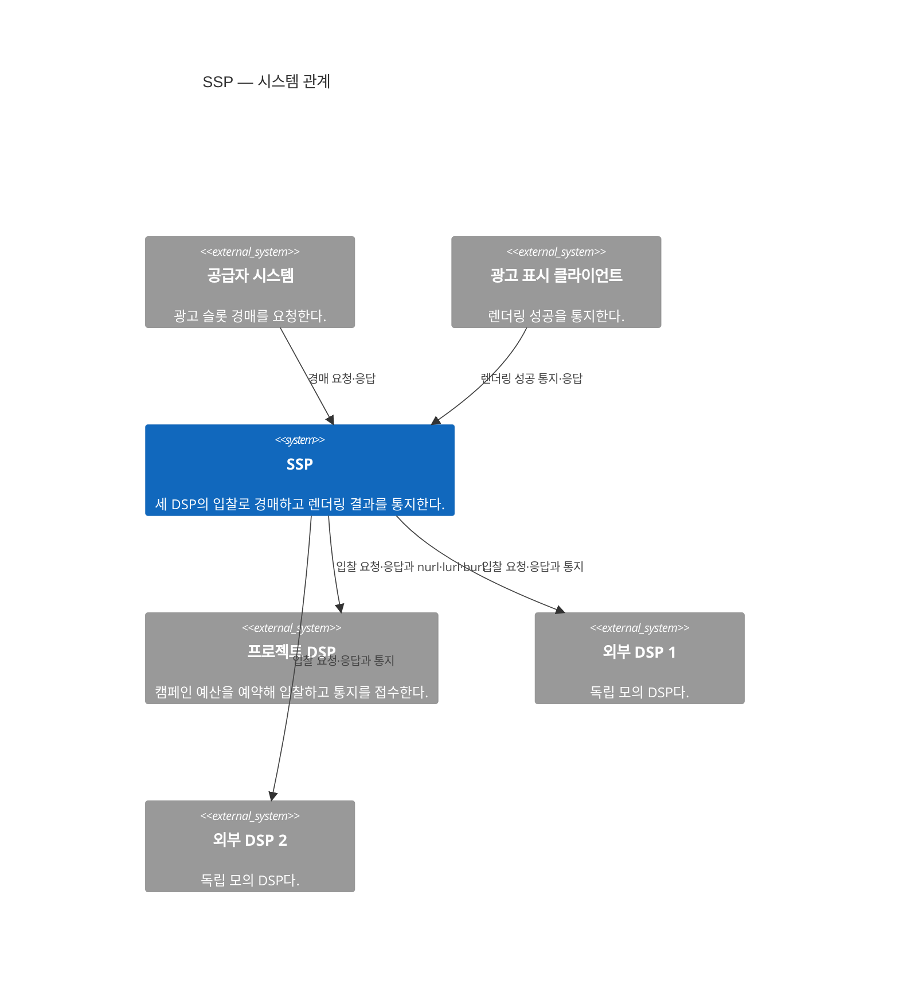

# SSP 시스템 관계

상태: 구조 확정·기술 미정

```mermaid
C4Context
    title SSP — 시스템 관계

    System_Ext(supplier, "공급자 시스템", "광고 슬롯 경매를 요청한다.")
    System_Ext(ad_client, "광고 표시 클라이언트", "렌더링 성공을 통지한다.")
    System(ssp, "SSP", "세 DSP의 입찰로 경매하고 렌더링 결과를 통지한다.")
    System_Ext(project_dsp, "프로젝트 DSP", "캠페인 예산을 예약해 입찰하고 통지를 접수한다.")
    System_Ext(external_dsp_1, "외부 DSP 1", "독립 모의 DSP다.")
    System_Ext(external_dsp_2, "외부 DSP 2", "독립 모의 DSP다.")

    Rel(supplier, ssp, "경매 요청·응답")
    Rel(ad_client, ssp, "렌더링 성공 통지·응답")
    Rel(ssp, project_dsp, "입찰 요청·응답과 nurl·lurl·burl")
    Rel(ssp, external_dsp_1, "입찰 요청·응답과 통지")
    Rel(ssp, external_dsp_2, "입찰 요청·응답과 통지")

    UpdateLayoutConfig($c4ShapeInRow="3", $c4BoundaryInRow="1")
```

SSP는 경매·낙찰·렌더링과 통지의 권위자다. DSP 내부 예산을 읽거나 광고주 캠페인 금액을 직접 변경하지 않는다.
